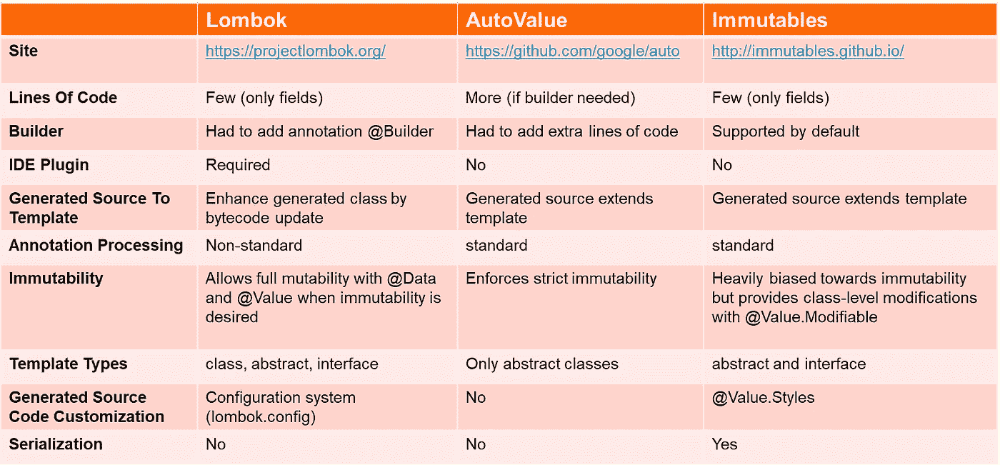

# 价值对象:为价值对象建模的设计启发法

> 原文：<https://medium.com/javarevisited/value-objects-design-heuristics-for-modelling-value-objects-4ba807e39d52?source=collection_archive---------2----------------------->

# 序言

价值对象是领域驱动设计的构建模块，在 Eric Evans DDD 中有很好的定义。这背后的想法是更深入地挖掘值对象的用途，定义建模它们的标准方法，并研究支持这种设计考虑的解决方案。

# 设计考虑

值对象是由它们的属性值定义的，并且是模型驱动的设计架构中的关键构建块之一。值对象没有概念上的同一性，它描述对象的本来面目。

> 设计启发 **#1** :如果两个值对象的属性具有相同的值，则它们相等。

[Java](/javarevisited/10-best-places-to-learn-java-online-for-free-ce5e713ab5b2) 是一种强类型语言，所以值对象的相等性在于属性值，而不是它们的引用。值对象的一个关键目的是人们必须能够共享它们，知道它的状态在被创建和传递后不会改变。

> 设计启发 **#2** :值对象本质上应该是不可变的。

将值对象视为不可变的，不要给它附加任何标识。这让我们可以自由简化设计和优化性能。但是为什么需要使它不可变，它会增加项目的价值并使事情变得更容易吗？我们需要理解这里的目的。

[Java 通过值、](https://javarevisited.blogspot.com/2012/12/does-java-pass-by-value-or-pass-by-reference.html)传递*引用，所以你得到一个引用的副本，但是被引用的对象是相同的。因此，可能发生的情况是，被调用者更改了传递给方法的引用对象的值，然后调用者可能会得到意外的结果。*

考虑下面的例子。这里，我们在 *processSavings()* 中构造了一个 account 对象，并将其传递给 *checkValid()。*在 *checkValid()中，*我们错误地更新了账户类型，最后，我们已经将账户引用传递给 *postAccount()* 进行处理。

但是，我们犯了一个错误，我们更新了账户类型，这不是我们的本意，因此储蓄账户被错误地转换为活期账户并被处理。

```
public class Account{
   String accountNumber;
   String accountType;  
   public Account(String accountNumber, String accountType){
       this.accountNumber =accountNumber;
       this.accountType=accountType;
   }   
   public String getAccountNumber(){
      return this.accountNumber;
   }
   public void setAccountNumber(String accountNumber){
      this.accountNumber=accountNumber
   }
   public String getAccountType(){
      return this.accountType;
   }
   public void setAccountType(String accountType){
      this.accountType=accountType;
   }
}
public class TestImmutability {
  public void processSavings(){
    Account account = new Account("a0123", "savings");
    checkValid(account);
    postAccount(account);
    /////.....
  }
  public boolean checkValid(Account account){
    // run valid checks
    account.setAccountType("current"); 
    return true;  
  }
}
```

在这里跟踪这样的错误可能看起来很容易，也可能不会发生，但是想想看，如果这是一个大规模的项目，具有跨模块共享和传递的复杂值对象，那么定位和修复这样的错误并不容易。

这是应该将值对象设计成不可变的的主要原因之一，这样一旦初始化，它们就不应该被改变。不变性还确保线程安全和同步数据的有效性，这有利于这种考虑。

有人可能会认为这可能会导致内存限制，因为这可能会导致内存中同一对象的太多副本可以共享。但是人们需要考虑我们在性能方面的权衡，其次，如果我们有[有效的垃圾收集](https://www.java67.com/2020/02/50-garbage-collection-interview-questions-answers-java.html)，删除和内存可用性只是时间问题。

将值对象设计为不可变的是遵循一般规则的一个例子。如果一个属性的值改变了，那么我们创建一个不同的值对象，而不是修改现有的值对象。但是也有可能值对象被设计成可变的。

> 设计启发 **#3** :出于性能原因，值对象可能是可变的。

如果它是可变的，确保它不是共享的，因为它会在模型中产生意外的结果和完整性问题。决定值对象可变实现的因素(引用 Eric Evans 的 DDD):

1.  如果值经常变化。
2.  如果对象创建或删除开销很大。
3.  如果替换会扰乱聚类。

# 设计不可变值对象

假设下面的类被定义为不可变的:

```
public class Account {
   **private final int id**;
   **private final** String **type**;
   **private final** String **currency**;
   **private final** LocalDateTime **createdDate**;
   **private final** List<Entry> **entries**; **private** Account(
    **int** id,
    String type,
    String currency,
    LocalDateTime createdDate,
    List<Entry> entries) {
     **this**.**id** = id;
     **this**.**type** = type;
     **this**.**currency** = currency;
     **this**.**createdDate** = createdDate;
     **this**.**entries** = entries;
   }

    **public int** getId() { 
      **return id;** }
    **public** String getType() { 
      **return type**; 
    }
    **public** String getCurrency() { 
      **return currency**; 
    }
    **public** LocalDateTime getCreatedDate() { 
      **return createdDate**; 
    }
    **public** List<Entry> getEntries() { 
      **return Collections.unmodifiableList(entries)**;
    }

    **public** String toString() {
      **return "Account{"** + **"id="** + **id** + **", type="** + **type** + **", currency="** + **currency** + **", createdDate="** + **createdDate** + **", entries="** + **entries** + **"}"**;
    }

    **public int** hashCode() {
      return Objects.hash(**id,type,currency,createdDate,entries)**;
    } **public boolean** equals(Object another) {
      **if** (**this** == another) **return true**;
        **return** another **instanceof** ImmutableAccount
          && **id** == another.**id** && **type**.equals(another.**type**)
          && **currency**.equals(another.**currency**)
          && **createdDate**.equals(another.**createdDate**)
          && **entries**.equals(another.**entries**);
    }}
```

这实现了我们的目标，但是如果我们仔细观察，这里有许多样板代码，如 *getter* 、*构造器*、[、 toString() 、](https://javarevisited.blogspot.com/2012/12/3-example-to-print-array-values-in-java.html)、[、 *equals()* 、](https://javarevisited.blogspot.com/2013/08/10-equals-and-hashcode-interview.html#axzz7D1K8JL8x)[、T21【hashcode()、](http://www.java67.com/2013/04/example-of-overriding-equals-hashcode-compareTo-java-method.html)。除此之外，我们还必须为每个数据类重复同样繁琐的过程，单调地为每条数据创建一个新的字段，创建 *equals()* 、 *hashCode()* 和 *toString()* 方法；并创建一个接受每个字段的构造函数。

> 设计启发 **#4** :尽可能使用值对象的自动代码生成器来处理锅炉板代码。

**Lombok** 、 **AutoValue** 、 **Immutables** 和 **Java Records** 是一些广泛使用的工具，用于处理域值对象的样板代码。但是哪一个是正确的工具呢？如果我们从高层看他们的目的，很难做出决定，因为无论如何，他们做同样的工作，但寻找精细的事实，然后做出决定。

# lombok vs AutoValue vs Immutables vs Java 记录

[Lombok](https://javarevisited.blogspot.com/2021/08/how-to-use-lombok-library-in-java.html) 、AutoValue 和 Immutables 使用标准的 java 注释处理来处理数据类的公共代码生成。让我们看一个例子。假设我们有一个值对象*帐户*，如下所示，看看它在每个帐户中是如何表示的

## 龙目岛:

```
@Value
@Builder
**public class** Account {
    **private int id**;
    **private** String **type**;
    **private** String **currency**;
    **private** LocalDateTime **createdDate**;
    **private** List<Entry> **entries**;
}
```

## 自动赋值:

```
@AutoValue
**public abstract class** Account {

    **public abstract int** id();
    **public abstract** String type();
    **public abstract** String currency();
    **public abstract** LocalDateTime createdDate();

    @AutoValue.Builder
    **public abstract static class** Builder {
        **public abstract** Builder setId(**int** id);
        **public abstract** Builder setType(String type);
        **public abstract** Builder setCurrency(String currency);
        **public abstract** Builder setCreatedDate(LocalDateTime createdDate);
        **public abstract** Account build();
    }
}
```

## 不变的:

```
@Value.Immutable
@Value.Style(jdkOnly = **true**)
**public interface** Account {
    **int** getId();
    String getType();
    String getCurrency();
    LocalDateTime getCreatedDate();
    List<Entry> getEntries();
}
```

## Java 记录:

```
public record **Account**(**int** id,
    String type,
    String currency,
    LocalDateTime createdDate,
    List<Entry> entries) {}
```

但是他们处理的方式有一些细微的不同。

1.  Lombok 使用一种非标准的方法来生成代码，也称为破解 java 编译器，这使它变得脆弱，并且可能在未来的 java evolution 中不受支持。另外，Lombok 在运行时依赖于字节码操作库，如 *asm* 。另一方面，AutoValue 和 Immutables 不使用这样的攻击和依赖，从定义的模板生成代码，并使用标准的 java 注释。
2.  AutoValue 看起来有点冗长，而 Lombok 和 Immutables 看起来简洁明了。AutoValue 也是严格不可变的，这意味着无法定义可变对象。
3.  构造函数中字段的顺序取决于 AutoValue 中的源，而在不变量中，可以定义构造函数中字段的顺序。
4.  *账户*被定义为一个接口，在不变量中只有 getters。通过将值对象声明为一个接口，我们封装了值对象，避免了任何副作用，并将其构建为模型，揭示了这是一个不可变类的明确意图，客户端将只能访问值。这是不变的 USP。Lombok 和 AutoValue 不支持。
5.  [Java 记录](https://javarevisited.blogspot.com/2022/03/how-to-use-record-in-java-example.html)超级干净。就我个人而言，我总是推荐使用这个而不是任何第三方库或工具。但是到目前为止，这还存在一些限制。[记录](https://www.java67.com/2021/08/how-to-use-record-in-java-example.html)是纯粹不可变的透明数据载体，你没有办法改变记录中的数据。Lombok 和 Immutables 定义了将类声明为可变的方法。到目前为止，Record 的另一个限制是它在 Java 14 中处于预览模式，在 Java 17 之前不可用。

> 设计启发 **#5** :设计价值对象作为接口，实现真正的不变性。

比较 Lombok、AutoValue 和 Immutables 特性的完整代码可以在这里找到:[https://github.com/rohsin47/lombok-autovalue-immutables](https://github.com/rohsin47/lombok-autovalue-immutables)

下表比较了 Lombok、AutoValue 和 Immutables 在各种参数上的特性。

[](https://javarevisited.blogspot.com/2021/08/how-to-use-lombok-library-in-java.html)

龙目岛 vs 自动价值 vs 不变

# 结论

理想情况下，值对象应该是*类型安全的*，*空安全的*，*线程安全的*， *API 不可见的*(封装的)，没有*运行时依赖，*并且应该有*可以忽略的性能成本*。

Lombok 和 Immutables 是创建不可变值对象的好选择，但是建议只使用 Lombok 的稳定特性，如@Value、@Builder 和@Data 来实现，并避免实验特性。另一方面，不变量可以实现的定制和优化的数量令人印象深刻。

诸如属性的自动空处理、确保强制属性、声明构建器、定义修饰符数据类以及 [JSON 序列化对 Jackson 绑定的支持](https://javarevisited.blogspot.com/2013/02/how-to-convert-json-string-to-java-object-jackson-example-tutorial.html)等特性使得不可变成为值对象的更好选择。

**参考文献**:

*   Eric Evans 的领域驱动设计(蓝皮书)
*   [https://www.martinfowler.com/bliki/ValueObject.html](https://www.martinfowler.com/bliki/ValueObject.html)
*   [https://immutables.github.io/immutable.html](https://immutables.github.io/immutable.html)