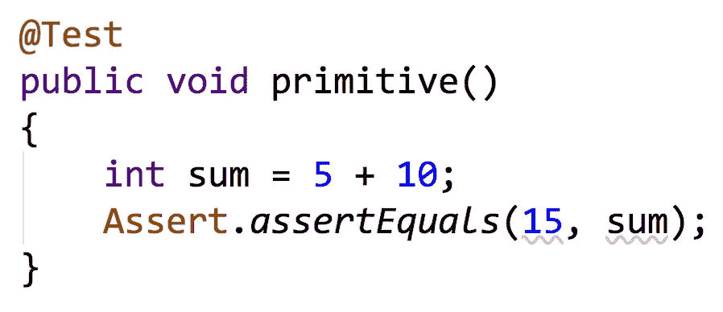
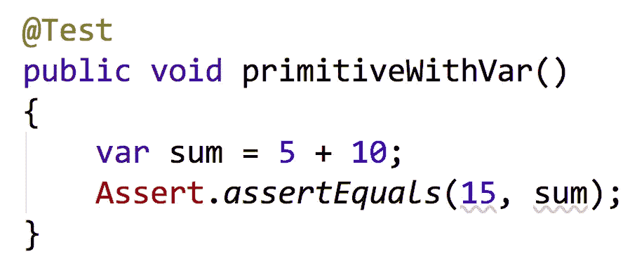
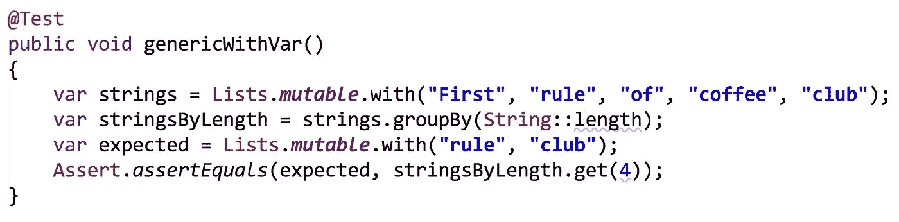

# 给我一条河

> 原文：<https://medium.com/javarevisited/var-me-a-river-8dd742d7494?source=collection_archive---------1----------------------->

仅仅因为你打字少，并不意味着它没有类型。

# 局部变量类型推理

自从 Java 10 发布以来，我们就有了本地变量类型推断(LVTI ),在 Java 中也被称为`var`关键字。关于它的有用性，以及开发人员应该在何时何地使用它，已经有了很多讨论。

这是我的简单指南。当你可以将一条代码河简化为一个水坑或池塘，并且仍然理解你正在阅读的内容时，使用`var`。代码的河流是需要你横向阅读的代码。当你使用`var`时，你必须非常小心地命名你的变量，这样它们才是描述性的，并且可能包含关于它们引用的类型的信息。

以下是使用`var`前后的一些对比示例。

# 基元

不要将`var`用于原语。永远不会。

## 示例:

之前:

之前:这里用 int 有意义。

后:在这里使用 var 没有增加任何价值，所以不要使用！

# 目标

如果你给变量起了一个有意义的名字，并且在代码的上下文中很清楚它的类型是什么，那么使用简单对象类型的`var`。如果您可以使用`var`提高代码的水平可读性，这将使阅读和浏览代码变得更加容易。

## 示例:

Before:在这里使用 IntSummaryStatistics 类型会产生大量代码。

使用 var 代替 IntSummaryStatistics 可以减少水平代码，而不会减少理解

# 通用容器

当你可以给类型一个有意义的名字，并且泛型类型很容易从变量名或上下文中确定时，使用`var`和泛型容器。

## 示例:

以前:泛型类型占据了大量的水平空间

After:用 var 替换的泛型类型可以更快地公开变量名

# 建议

局部变量类型推断(LVTI)或`var`为我们提供了选项，帮助我们提高代码的可读性。然而，这个特性并不是万灵药，如果删除显式类型信息会使代码难以理解，那么就不要使用它。编译器可以很容易地推断出类型信息，但读者并不总是很容易推断出类型信息。

为读者写你的代码，而不是为了节省打字。如果你想节省输入，我推荐使用后缀完成和 [IntelliJIDEA](https://itnext.io/top-5-intellijidea-and-android-studio-courses-for-java-and-android-programmers-afcc27309b60) 中的`.var`来自动生成左边的类型信息，然后用`var`替换类型，只要它有助于可读性而不降低可理解性。

*我是*[*Eclipse Collections*](https://github.com/eclipse/eclipse-collections)*OSS 项目在*[*Eclipse Foundation*](https://projects.eclipse.org/projects/technology.collections)*的项目负责人。* [*月食收藏*](https://github.com/eclipse/eclipse-collections) *是开投* [*投稿*](https://github.com/eclipse/eclipse-collections/blob/master/CONTRIBUTING.md) *。如果你喜欢这个库，你可以在 GitHub 上让我们知道。*