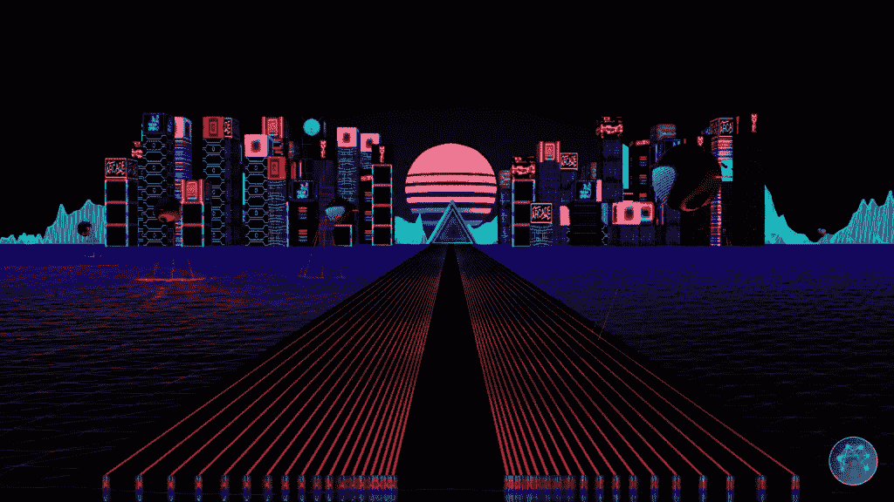
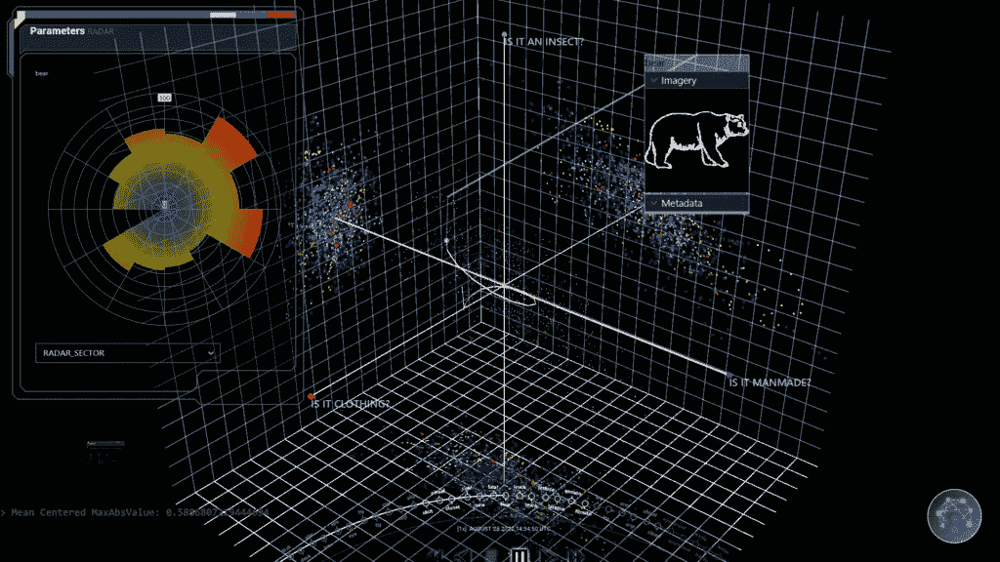
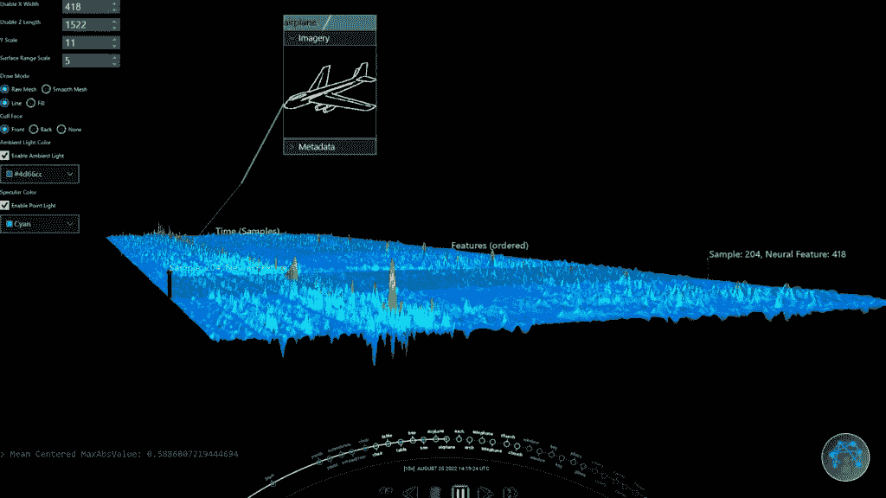

# 使用 JavaFX | Foojay.io 可视化脑机接口数据

> 原文：<https://medium.com/javarevisited/visualizing-brain-computer-interface-data-using-javafx-foojay-io-d0209da4a631?source=collection_archive---------3----------------------->

最近，**在推特上分享了一些他正在开发的 JavaFX 应用 **Trinity** 的精彩截图和视频。**

**他是约翰霍普金斯大学应用物理实验室的软件工程师，专门研究多个项目的数据可视化。JHUAPL 从事各种项目，从医疗工作、制造无人机、网络防御、脑机接口到月球防御系统。**

**引起我注意的项目是一个视觉探索工具，用于测试和评估机器学习决策和解码系统。**

**基于许多输入，Trinity 帮助评估机器学习模型是否产生正确的结果。[人工智能](/javarevisited/7-best-courses-to-learn-artificial-intelligence-in-2020-26d59d62f6fe)是一项令人着迷的技术，但你如何证明一个模型工作正常？研究人员如何深入海量数据来评估结果？**

**Trinity 允许用户通过在 3D 中可视化人工智能模型和超维数据来导航和探索数百个层。**

************

# **项目历史**

**三一是一个早期项目的副产品，神经增强算子(NEO)，所以它的名字是在矩阵宇宙中发现的。**

**一旦创建了这个工具，很明显它很容易扩展到任何需要可视化大量数据的项目中。现在，它已进一步适应于与机器学习模型一起使用，而且还可以可视化 Covid 基因分类聚类，以做出关于组织分析的决策。**

**Sean 特意选择 Java 在多线程环境中高速处理大数据集，而 JavaFX 提供了 2D 和 3D 工具来可视化这一切。**

# **使用什么数据**

**随着该工具在各种项目中的使用，我们来看一个用例:**脑机接口(BCI)** 。对于这些项目，数据是通过非侵入式(用许多电缆包裹头部)和侵入式(大脑植入)传感器收集的。**

**这些项目中的许多在 20 年前会被认为是科幻小说，但现在这项技术已经存在并正在研究中。在这个例子中，参与者戴上一个非侵入式传感器包，看着屏幕。在显示测试图像的同时，记录大脑数据。**

**从大脑中捕获超维度神经信号，解码，并映射到语义模型。语义，量化为低维输出中的分数，表明图像对观察者意味着什么。**

**例如，观看者有多强烈地感觉到图像代表了一座建筑，或者一只昆虫或者一些可食用的东西。**

**Trinity 可以将这些数据作为 JSON 文件进行处理，或者通过 ZeroMQ 处理高达 20.000 条消息/秒的实时数据。通过分析 Trinity 中的超维神经数据和模型产生的语义输出，从事该项目的科学家可以评估他们模型的有效性。**

# **可视化工具**

**下面的视频基于一个 14 分钟的实验，该实验产生了一个 100MB 的包含数据的 JSON 文件。**

**该数据集在纵向和横向上都非常密集，许多数据向量总共包含超过一百万个数据点。**

# **超曲面工具**

**第一个视频展示了用于可视化**超维输入数据**的工具。这些是在一定时间内收集的来自 BCI 的原始信号。从左到右水平排列有 418 个神经信号。“进入屏幕”的 Z 轴是时间。离你近的数据是时间戳 0，而记录的结尾是屏幕上最远的地方。**

**神经信号的大小可以是正值或负值，并以从红色(=极端)到蓝色(=中性)的颜色范围显示。大多数信号可以解释为噪声(蓝色)。**

**彩色尖峰显示了当图像出现在屏幕上时，参与者的大脑变得更加活跃。该工具是交互式的，允许研究人员更深入地观察尖峰信号。**

# **超空间工具**

**这个工具提供了一个**散点图**系统，用于可视化**转换后的模型输出**，在这种情况下是语义。对于研究人员来说，这是一个必不可少的工具，因为它显示了模型处理后的数据，以进行数据简化。**

**在这个视频中，你可以看到模型是如何通过一个解码器处理 BCI 数据，通过语义空间来解释参与者看到的图像。它允许研究人员以可视化的方式查看数据，而不是浏览许多行数据并试图在其中找到一种模式。**

**这有助于他们确定模型是否正确解码和处理数据。**

# **为什么 Java 和 JavaFX 是完美的工具**

**许多编程语言可以处理数百万个数据点，Java 允许快速处理，同时还提供了易于实现的可视化。**

**为了让 Trinity 能够流畅地可视化所有这些数据，它必须在 15 毫秒内计算出结果。只有这样，才能以每秒 60 帧的速度生成平滑的用户界面。有了 Java，两个最大的挑战迎刃而解:在“幕后”处理大量数据，同时提供最佳的用户体验！**

**生成 3D 渲染可能比传统的 2D 用户界面更难，这是一个真正需要掌握的额外维度，无论是视觉上还是代码上！JavaFX 有一个奇妙的 2D 系统和一个“像样的”3D。这不是 3D 游戏的理想解决方案，但对于 Trinity 用例来说是完美的。**

**Sean 相信，通过一些额外的“爱和关心”，一旦添加一些缺失的功能，如自定义着色器，3D 实现 [JavaFX](https://javarevisited.blogspot.com/2020/06/top-5-courses-to-learn-java-fx-in-2020.html) 可以成为更多应用程序的行业标准。**

# **三位一体用的是什么？**

**Trinity 的构建得益于 Java 社区提供的许多工具:**

*   **[Apache NetBeans](https://netbeans.apache.org/) ，一直以来，肖恩都不会停止使用它作为他的 IDE**
*   **OpenJDK 18**
*   **OpenJFX 18**
*   **专家**
*   **jlink + jpackage 的 Gradle:本地部署**
*   **[FXyz3D](https://github.com/FXyz/FXyz) : JavaFX 3D 可视化和组件库**
*   **[图表](https://github.com/HanSolo/charts):Java FX 中的科学图表库**
*   **[LitFX](https://github.com/Birdasaur/LitFX) : 3D 特效**
*   **[JeroMQ](https://github.com/zeromq/jeromq):zero MQ 的纯 Java 实现**

# **结论**

**Sean 承认他对 Java 很固执，毕竟他是 Java 冠军！**

**但是他坚定地认为，Java+JavaFX 是为数不多的组合之一，可以为他提供在他拥有的时间内完成这项工作所需的工具。**

**由于需求是关于性能和流畅的交互，用其他技术很难达到同样的效果。**

**是的，通过大量的时间和努力，你可以在浏览器中构建类似的应用程序，但这已经需要不同的框架，如 WebGL 和 Vue.js，来构建相同的用户体验。**

**考虑到数据量和每秒所需的帧数，在浏览器中运行所有这些都是不可行的。**

**正如他所说的:“网络应用可以解决更简单的问题。我生命中有限的时间，我想花在有趣的事情上，而不是网络应用！由于这个项目大部分是我用有限的预算在业余时间完成的，我选择了我能使用的最强大的工具:Java 和 JavaFX。**

***原载于 2022 年 12 月 9 日*[*https://foojay . io*](https://foojay.io/today/visualizing-brain-computer-interface-data-using-javafx/)*。***