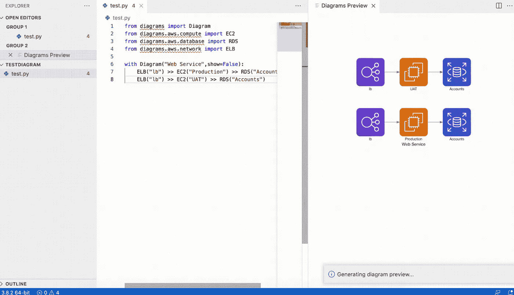

# VSCode 扩展—作为代码的架构图(图预览器)

> 原文：<https://medium.com/javarevisited/vscode-extension-architecture-diagrams-as-a-code-diagrams-previewer-5a86ca7e5a4c?source=collection_archive---------2----------------------->

尼克·莫里森在 [Unsplash](https://unsplash.com/s/photos/on-computer?utm_source=unsplash&utm_medium=referral&utm_content=creditCopyText) 上拍摄的照片

当我们记下我们的方法(无论是写提案还是文档)时，图表总是有助于将我们的信息传递给观众。

我们要么使用[draw . io](https://app.diagrams.net/)/[lucid chart](https://www.lucidchart.com/pages/landing?utm_source=google&utm_medium=cpc&utm_campaign=_chart_en_tier3_mixed_search_brand_exact_&km_CPC_CampaignId=1484560207&km_CPC_AdGroupID=60168114191&km_CPC_Keyword=lucidchart&km_CPC_MatchType=e&km_CPC_ExtensionID=&km_CPC_Network=g&km_CPC_AdPosition=&km_CPC_Creative=442433234360&km_CPC_TargetID=kwd-33511936169&km_CPC_Country=9062520&km_CPC_Device=c&km_CPC_placement=&km_CPC_target=&gclid=CjwKCAjwoduRBhA4EiwACL5RP2lRhVr2z7ic6vAAp-qXuK-xDY0jWkpTakQESV-ZLKe2QkxEltv_8BoCu2cQAvD_BwE)或任何其他在线“白板”工具来手动绘制图表——绘制各种形状，然后用线条/箭头将它们连接起来。然而，这样做的一个主要缺点是可维护性差。如果有变化，我们将需要对整个图表进行一些重新调整，以包括/删除某些组件。这可能会造成很大的干扰，尤其是当你的图表很大的时候。

你可能听说过[美人鱼](https://mermaid-js.github.io/mermaid/#/README)——使用文本和代码创建图表和可视化。然而，Mermaid 只支持流程图、序列图、甘特图、类图和其他一些像 git graph 这样还处于实验阶段的图。

[Diagrams(Diagrams as a Code)](https://diagrams.mingrammer.com/#:~:text=About%20Diagrams&text=Diagram%20as%20Code%20allows%20you,as%20Programming%20Languages%20and%20Frameworks%20.)提供了一种用简单的 Python 代码绘制云系统架构的替代方法。它支持主要的云提供商，如`[AWS](/javarevisited/5-best-aws-courses-for-beginners-and-experienced-developers-to-learn-in-2021-563212409fbd)`、`[Azure](/javarevisited/5-best-azure-fundamentals-courses-to-pass-az-900-certification-exam-in-2020-9e602aea035d)`、`[GCP](/javarevisited/5-best-courses-to-learn-google-cloud-platform-gcp-in-2021-169093a3771a)`、[、](/javarevisited/5-best-courses-to-learn-google-cloud-platform-gcp-in-2021-169093a3771a)`[Kubernetes](/javarevisited/7-free-online-courses-to-learn-kubernetes-in-2020-3b8a68ec7abc)`。它现在还支持`On-Premise`节点以及`Programming Languages`和`Frameworks`。

您需要确保安装以下项目，因为图表依赖于这些组件:

*   [Python3](https://www.python.org/downloads/) (并使用 pip 3/pipenv/poem 安装`diagrams`包)
*   [GraphViz](https://www.graphviz.org/download/)

您可以查看这个 Visual Studio 代码扩展(由我创建🤓)在这里您可以轻松地并排预览您的代码的图表— [图表预览器](https://marketplace.visualstudio.com/items?itemName=tehpeng.diagramspreviewer)。*您还可以在“要求(设置)”部分找到更详细的设置说明。*

有了这个插件，你不再需要每次都运行 python 命令(例如`python diagram.py`)来生成图表。

图表预览器示例

你可以在 kickstart 的官方网站上查看代码样本。

请随时在 Visual Studio Marketplace 上给出您的评论，或者您可以通过电子邮件亲自联系我，以便我们可以推出更好的产品来更好地为您服务！感谢您的阅读！🙇‍♀️

边注:如果你还不是中等会员，点击[这里加入](/@mariochiadev/membership)！

 [## 用我的推荐链接云加入媒体

### 作为一个媒体会员，你的会员费的一部分会给你阅读的作家，你可以完全接触到每一个故事…

medium.com](/@mariochiadev/membership)