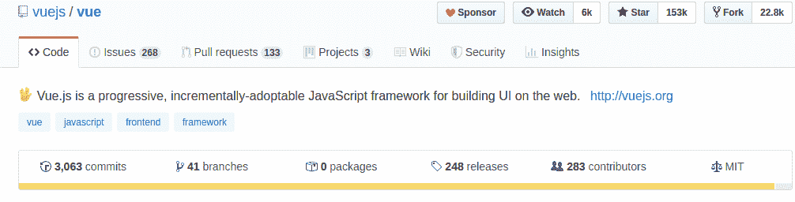
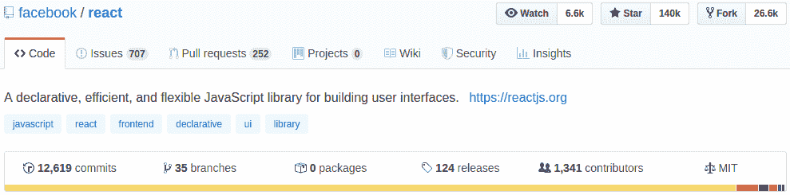

# Vue 还是 React |应该选择哪个 JavaScript 框架？银河网络链接

> 原文：<https://medium.com/javarevisited/vue-or-react-which-javascript-framework-should-you-choose-galaxy-weblinks-7c5fc1c4ac74?source=collection_archive---------0----------------------->

寻找完美的“JavaScript 框架”似乎是徒劳的。但从来都不是。有太多的框架，每一个都有使选择更加困难的特点。

无论你是想进入前端，还是从 PHP 或 C++转向 JavaScript，Vue 和 React 之间的这些比较点都是你的开始。

# 流行

JavaScript 发布框架和库的速度很快。唯一不变的是框架和库的顶层位置不断变化。

根据趋势，Vue 可能不像是人们的首选。

但是 GitHub 的明星们讲述了一个完全不同的故事。今年 6 月，VueJS 超过了 React。与 React 的 140k 恒星相比，Vue 仍然以 152k 恒星处于领先地位。

需要注意的一点是，Vue 的提交和贡献者数量较少。一个可能的解释是 Vue 是由开源社区驱动的，as React 的贡献者是脸书的员工。

# 社区支持

脸书支持做出反应，表明了社区的大力支持。到目前为止，React 有 171，000 个关于堆栈溢出的问题，而 Vue 只有 44，000 个。但是 React 的社区比 Vue 的更分散。这使得即使是常见的问题和障碍也很难找到答案。但是 Vue 从开发者那里获得了巨大的欢迎和支持。Vue 在没有任何主要品牌支持的情况下成功地创造了自己的名字。

# 学习曲线

通过 React 开发你的网站需要你对第三方库有大量的了解，因为 React 是一个库而不是一个框架。而 Vue 有像 Vue CLI 3 和 Vue UI 这样的工具，可以帮助你快速构建 MVP。Vue 被认为对开发者更友好，因为它的学习曲线很短。此外，Vue 还从 Angular 和 React 获得了灵感，这使得开发人员的过渡更加容易。

# 表演

绩效可以从多个方面来衡量。根据框架的大小来衡量，Vue 的框架比 React 小。Vue 的框架大小是 80KB，而 React 是 100KB。这也会对初始加载时间产生影响。

React 和 Vue 都使用虚拟 DOM。但是 Vue 有更好的性能和内存分配，因为它有良好的结构。需要注意的是，最终的性能还取决于应用程序的大小和代码的优化程度。

# 证明文件

Vue 的开发团队在该工具的文档中投入了大量精力。API 参考据说是业界最好的。对 Vue 的生态系统有一个详细的概述，这是 React 的文档中所没有的。创建 Vue 应用程序所需的所有信息都写得很好，并且容易访问。所有这些都对 Vue 有利。React 的文档包括基础知识和一些高级概念，但是它不能以一种容易理解的方式呈现出来。

# 用例

Vue 和 React 都被全球知名的网站和应用程序所使用。Behance，路易威登，LiveStorm 都用过 Vue。Airbnb、网飞和 PayPal 都选择了 React。这两者的清单都很长。Vue 是可扩展的，很容易集成，所以它也可以用于更大的开发项目。然而，根据行业专家的说法，对较小的项目使用 React 并不是一个明智的决定。

# 那么，什么时候选择一个？

如果您是以下内容的粉丝:

*   **灵活性**
*   **尝试大量的库和工具**
*   **大型社区支持**
*   **JavaScript 多于 HTML**
*   **React 将是您的首选。**

如果你是这样的人:

*   **正在寻找短的学习曲线**
*   **喜欢干净的代码**
*   **想要一个轻量级框架**
*   **短时间内需要一名 MVP**

选择“最适合的”框架取决于您的特定需求。随着时间的推移，您的需求会发生变化。也要为这种变化做好准备。

*原载于 2019 年 11 月 21 日 https://blog.galaxyweblinks.com**的* [*。*](https://blog.galaxyweblinks.com/vue-or-react-which-javascript-framework-should-you-choose/)