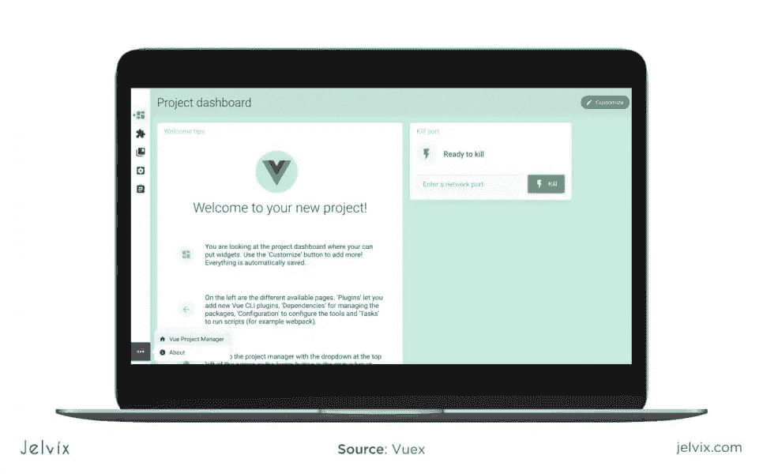
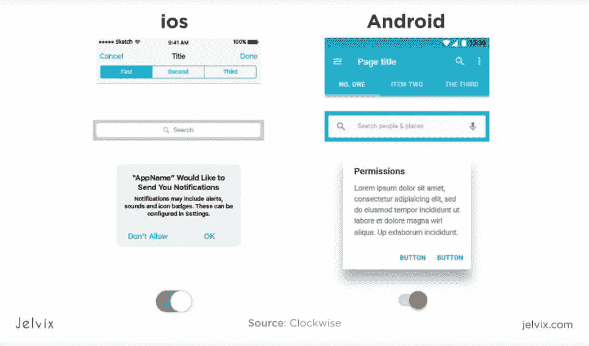
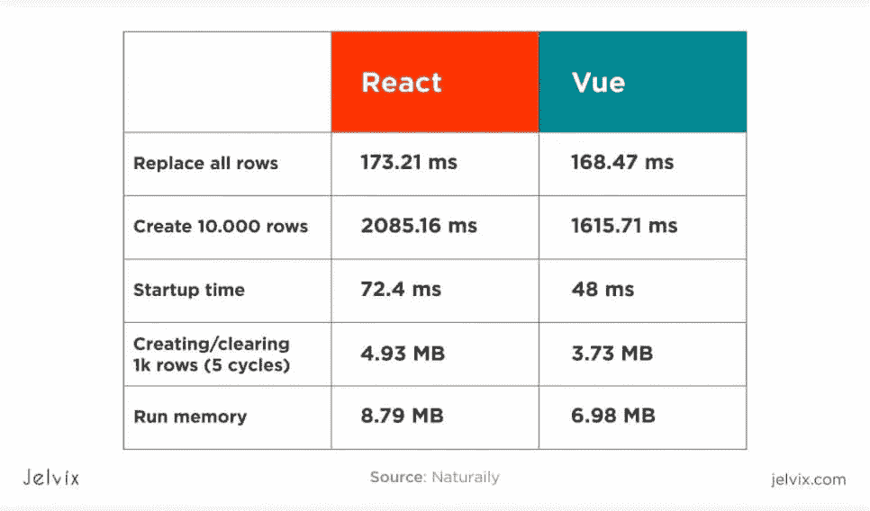
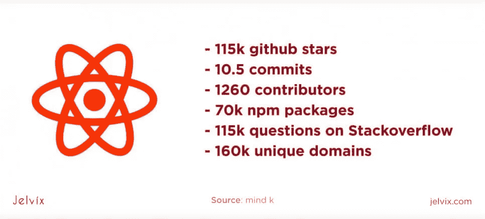
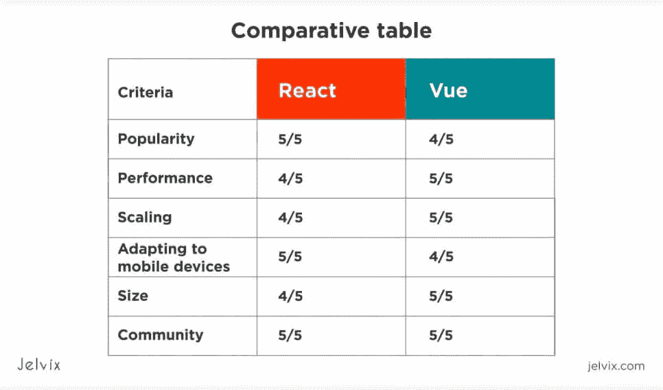
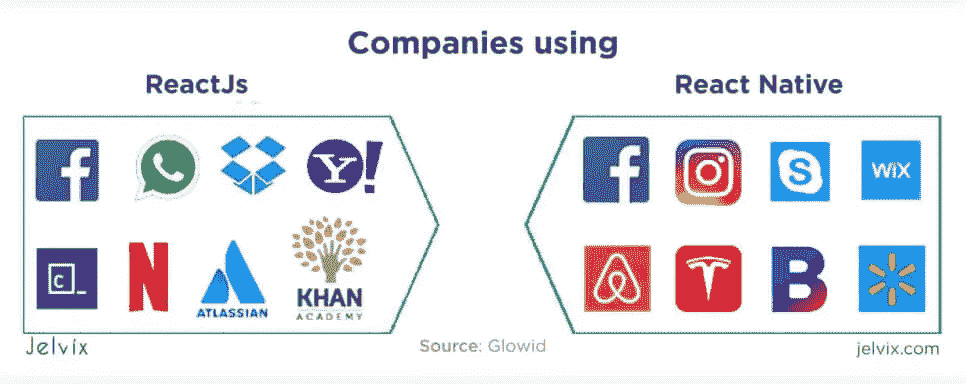
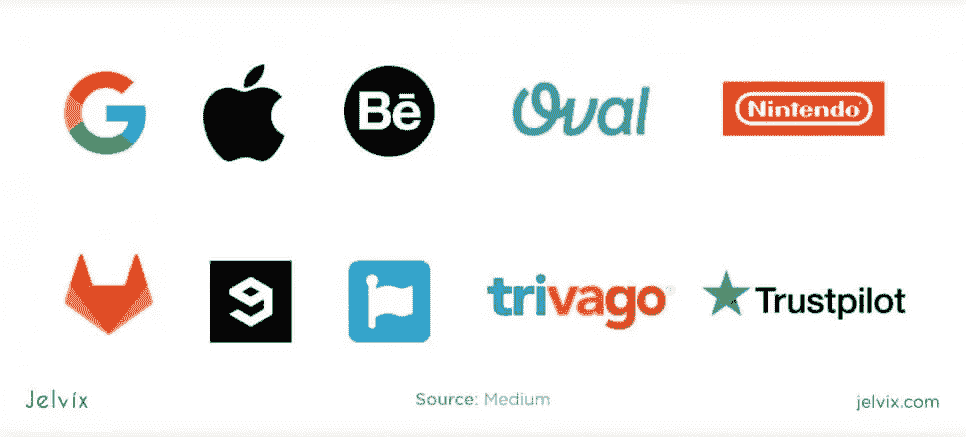
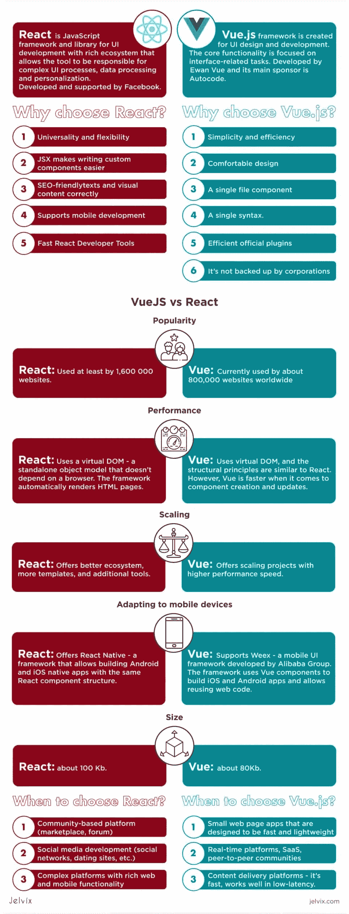

# Vue vs React:为项目选择前端框架

> 原文：<https://medium.com/javarevisited/vue-vs-react-choosing-a-front-end-framework-for-project-6cf3cbb86f50?source=collection_archive---------0----------------------->

随着每次更新，JavaScript 框架变得越来越通用。无论你如何看待它们，选择范围通常会缩小到最流行的框架——[Vue](/javarevisited/top-5-online-courses-to-learn-vue-js-in-2021-249e66b60646)、[React](/javarevisited/top-10-free-courses-to-learn-react-js-c14edbd3b35f?source=extreme_main_feed----d3a191ac6ed-----5-1--------------------561c2dc6_a2b4_41e0_b7be_1d97edbf631c--8)——它们已经成为 JS 框架的领导者好几年了。两者都使用虚拟 DOM，并由基于组件的和反应性的元素组成。

React 和 Vue 共享相同的用例，并专注于实现相似的目标——然而，它们的结构和方法却截然不同。在本文中，我们将研究两者之间的主要区别。

# Vue 与 React:应用

Vue.js 和 React 都用于 web 开发，主要用于 [web 应用](https://jelvix.com/blog/pwa-vs-native-app-benefits-for-users-and-developers)。他们当然有他们的主要优势以及缺点。选择 Vue.js 是因为它的快速性能，这就是为什么它是许多初创公司在 MVP 开发期间的首选。

React 的主要王牌是丰富的生态系统和人气。这是目前最流行的 JS 框架，有数以千计的免费工具、库和教育资源。因此，React.js 有办法容纳大型项目。如果丰富的功能比速度更重要，那么 [React](/@javinpaul/top-5-courses-to-learn-react-js-in-2019-best-of-lot-fa02cd96cdf0) 是首选。

**React 和 Vue.js 为什么要对比？**

[Vue.js](/javarevisited/10-free-vue-js-nuxt-js-online-courses-for-beginners-in-2021-a347ea2ad144) 越来越受欢迎，React 开发者开始考虑将他们的项目切换到更快、性能更好的 Vue.js(我们会看到为什么会这样)。但是， [Vue](https://javarevisited.blogspot.com/2019/08/top-5-online-courses-to-learn-vue.js-best.html) 作为一项新技术，也有自己的不足。这就是为什么我们需要仔细比较这两者，看看它们能更好地满足哪些需求。

# Vue.js 是什么？

Vue.js 框架是为 UI 设计和开发而创建的。核心功能集中在与界面相关的任务上。你可以将其集成到任何 JS 项目中进行界面开发，同时使用另一个 [JS 框架](https://jelvix.com/blog/best-javascript-ides)开发复杂的前端操作。Vue 的主要目的是处理软件的视图。

与 [React](https://javarevisited.blogspot.com/2018/08/top-5-react-js-and-redux-courses-to-learn-online.html#axzz5r06B3egD) 不同，Vue 允许处理动画，通过官方库(Vuex)管理状态——总的来说，它的核心功能更加通用。要在 React 中获得 Vue 的功能深度，您需要安装几十个额外的库。

# 什么反应？

React 是一个用于用户界面开发的丰富的 [JavaScript 框架和库](https://www.java67.com/2019/01/top-10-javascript-frameworks-and-libraries-for-web-developers.html)。随着时间的推移，React 获得了一个丰富的生态系统，允许该工具负责复杂的 UI 过程、数据处理、个性化等。与 Vue 相比，它是一个更加独立的工具，尽管它也经常与其他库( [GraphQL](/javarevisited/top-5-graphql-tutorials-and-courses-for-beginners-fb5543506fc2?source=---------75------------------) 、 [Redux](https://redux.js.org/) 等)集成。React.js 不仅限于 web 开发。

你也可以使用 [React Native](/javarevisited/top-5-react-native-courses-for-mobile-application-developers-b82febdf8a46?source=---------112------------------) 来构建混合移动应用。Vue 也有类似的功能(Vue 原生)，但是没有 React 的解决方案普及和丰富。

React 由脸书开发和支持，它也有一个活跃的开源社区。

# 开发者为什么要用 Vue.js？

软件开发更喜欢使用 Vue，因为它简单高效。它确实比现有的大多数 JS 框架更简单、更优雅。当你在 [Vue.js](https://www.java67.com/2020/07/5-free-courses-to-learn-vuejs-in-2020.html) 上编码时，流程感觉很自然。所有的操作都是有意义的——至少在一定程度上是如此。

*   **舒适的设计**:很明显，Vue.js 的设计是经过深思熟虑的，因为它既符合逻辑又简单明了。
*   **单一语法:** Vue.js 使用相同的逻辑来编写整个 UI 功能。你不需要适应不同的语法，也不需要通过多个教程来编写一个新特性。如果一个开发人员给你发了一个 Vue.js 文件，你不用解释就能理解它 React 不是这样的，但我们会更多地讨论它。
*   **高效的官方插件** : Vue.js 提供了一个官方库的集合，用于路由等流程。
*   **没有企业做后盾**。一些开发者认为有谷歌或脸书支持一个框架是一个优势。然而，对于其他人来说，利用用户数据的公司的支持是交易的破坏者之一。

Vue.js 经常被小型团队用于中等规模的项目。Vue vs React vs [Angular](/javarevisited/10-courses-to-learn-angular-for-web-development-6da1bd2856dc) 以其简单性脱颖而出，使该框架成为最小可行产品的首选。然而，尽管它有很多优点，但它不一定是 React js 替代方案中最好的——我们将在与 React 的比较中看到为什么会这样。

# 开发者为什么要用 React？

React 是很多开发者的第一个 JS [前端框架](https://jelvix.com/technologies/javascript-development)。许多团队在使用 React 开始他们的旅程之前没有使用过 JS 框架，因为它是最大和最受欢迎的。让我们来看看一些开发人员选择继续在 React 中工作的主要原因。

*   [JSX](https://www.reactenlightenment.com/react-jsx/5.1.html) 让编写定制组件更加容易。它是 React 使用的一种语法扩展，允许您用 HTML 编写自己的组件。这是一个通用的解决方案，为 web 应用提供丰富的用户界面和功能，因为内置的解决方案并不总是足够的。
*   SEO 友好性:用 JavaScript 编写的 web 应用程序很难优化。搜索机器人经常无法正确处理基于 JS 的页面上的内容(尤其是在页面总是动态重写内容的单页应用中)。
*   React 支持移动开发:如果你了解 React，你会很容易学会 [React Native](/javarevisited/my-favorite-free-react-native-courses-for-beginners-in-2020-4629f5274eb6?source=---------29----------------------------) —一个基于 JS 的混合移动开发框架。您可以遵循相同的模式并使用相同的语法。React Native 本身有很多优势(提高开发速度，改善功能质量等。)，而且知道 React 会让使用 Native 变得容易很多。
*   快速反应开发者工具:当你安装框架的时候，你也可以访问定制的 Chrome 和 Firefox 扩展，被称为[反应开发者工具](https://github.com/facebook/react-devtools)。这些是软件设计和开发的工具，用于组织代码、构建胜任的层次结构、检查功能之间的连接等。

显然，React 与其他框架相比最大的优势是它的通用性和灵活性。框架的丰富生态系统允许构建丰富的功能，不断提高性能，使应用适应许多浏览器和设备，并试验一个界面。

# 比较两者:Vue 与 React 分析

您可能已经对哪种框架更适合您的开发风格和项目需求有了一些了解。但是，不要急着做最后的决定。现在，我们将两个框架并排放在一起，检查它们的优缺点。

## 流行

[JavaScript 框架](https://javarevisited.blogspot.com/2019/01/10-web-development-frameworks-fullstack-developer-should-learn.html#axzz6l7a2SLSi)一直在进化。React 是 2013 年开发的，vue . js——是 2014 年。这两种工具成为领先的前端开发解决方案花了不到 5-6 年的时间。这就是关于流行度的统计数据不断变化的原因——你永远不知道在接下来的几年里哪个新的框架会席卷前端开发。

React js 至少被 [1，600，000](https://trends.builtwith.com/javascript/React) 个网站使用。根据 StackOverflow 的说法，它是大多数软件开发人员首选的前端开发框架。目前，它是市场上领先的 JS 框架。

[Vue.js](https://trends.builtwith.com/javascript/Vue) 目前全球约有 80 万个网站在使用。在 Stack Overflow JS 框架调查中，它的受欢迎程度位居第二，紧随 React JS 之后。

## 表演

JavaScript 框架使用文档对象模型来呈现 HTML 页面。文档是以树形结构创建的，也称为 DOM 树。DOM 的组织和性能决定了框架的效率。如果创建和处理 DOM 的过程是快速和直观的，那么框架将很快工作。

[React](/javarevisited/10-free-angular-and-react-js-courses-from-udemy-and-coursera-best-of-lot-e67f7d811e6b) 使用虚拟 DOM——不依赖于浏览器的独立对象模型。框架自动呈现 HTML 页面。Vue 也用虚拟 DOM，结构原理和 React 差不多。这就是为什么 Vue 与 React 性能的速度和性能质量相差不大的原因。

然而，Vue 在组件创建和更新方面更快。在 React 中，无论何时进行更改，都需要重新优化组件。然后，每个组件都应该用特定的命令来标识( [shouldComponentUpdate](https://reactjs.org/docs/react-component.html) 和 PureComponent)。当项目开始扩展时，管理数百个组件是一项可能导致技术债务的任务。

Vue 自动跟踪组件——您不需要用特定的组件来标识每个更新的组件。不需要额外的优化和大量的命令，这显然有助于 Vue js 的性能和速度。

## 缩放比例

两个框架都有高效的例程和扩展解决方案。作为其中一个例子(还有更多方法)，让我们分析一下 [Flux/Redux](https://redux.js.org/recipes/migrating-to-redux) —允许跟踪和管理状态变化的命令。您可以将状态更改组织到独立的函数中，并为每个函数设置条件。如果一个函数经历了多次更改，您可以将它们分开，分别执行更改。

React 允许定义“智能”和“非智能”组件。聪明的是性能管理功能:它们决定愚蠢的在给定的条件下应该执行什么动作。智能组件没有连接到 DOM 取而代之的是，它们与沉闷的组件合作，而沉闷的组件才是影响实际的组件；基于 DOM 的流程。

另一方面，哑组件不必太复杂。它们的主要任务是处理“props”——来自智能组件的指令，并在 DOM 中执行操作。该系统使 React 开发更容易，并有助于提高性能。这也是伸缩的一个主要优势:所有的组件都根据它们的复杂性和职责被整齐地组织起来。

Vue 采用了类似的方法，甚至启用了对 Redux 的支持。然而，Vue 可扩展性的主要卖点是[Vuex](https://vuex.vuejs.org/guide/)——一个用于状态管理的原生系统。此外，Vue 提供了许多用于扩展和日常工作的官方库，而 React 将库管理外包给了社区。

Vue 和 React 都有允许生成新项目的工具。React 有 Create-react-app，而 Vue 有 CLI 生成器。两者都允许使用模板、保存特征和处理依赖性。

总的来说，Vue 提供了可扩展的项目和更高的性能速度，但 React.js 有更好的生态系统，更多的模板和附加工具。这就是为什么在速度是决定性因素的小型项目中，团队通常选择 Vue，而 React 更适合复杂的 web 平台。

## 适应移动设备

React 为开发者提供了[React Native](https://jelvix.com/blog/react-native-vs-nativescript-the-battle-of-mobile-development-tools)——一个允许使用相同 React 组件结构构建 Android 和 iOS 原生应用的框架。这是一个很好的解决方案，因为开发人员可以使用他们的 React 本地知识来构建移动应用前端，而无需使用第三方框架。

Vue.js 没有类似的定制解决方案，但它支持[Weex](https://weex.apache.org/)——阿里巴巴集团开发的移动 UI 框架。该框架使用 Vue 组件来构建 iOS 和 Android 应用程序，并允许重用 web 代码。

如果我们要在两者之间做出选择，React 可能是我们的首选。这是一个久经考验的移动框架，也是开发者首先学习 React Native 的主要原因之一。Weex 鲜为人知，社区也不活跃，你很难找到免费的教育资源。

## 大小

React 的默认大小是 100 Kb 左右，Vue.js 是 80 Kb 左右。起初，这似乎不是最重要的因素，但 JS 代码越重，最终应用程序的性能就越慢。Vue.js 作为一个较小的库，提供了更快的性能和整体更好的效率。

Vue 受欢迎的另一个因素是默认版本提供了许多附加功能。这意味着这些插件在 80 KB 中可用；没有必要安装那么多额外的库。

另一方面，React 依赖于额外的下载。因此，最终大小远不是 100 KB，因为您必须不断上传新功能。

## 社区

在选择框架或语言时，社区通常被认为是一个额外的因素。然而，现在工具变得更加独立，用户成为技术发展的关键驱动力。Vue.js 肯定是这种情况，React 也是这种情况。

React 由脸书开发和支持，这种对公司的依赖既有积极的一面，也有消极的一面。一些开发者不喜欢依赖名声不好的公司(脸书也有不少失误)，担心公司没有考虑到用户的最大利益。

当你依赖脸书或谷歌这样的科技巨头时，很难预测项目背后的真实动机。

另一方面，这也保证了这个项目不会很快被放弃。官方社区创建新的图书馆，鼓励活动，寻找合作伙伴。而 Vue.js 则是个人的激情项目。

该框架由 Evan Vue 开发，其主要赞助商是 [Autocode](https://autocode.stdlib.com/) 。这个团队非常开放——你总能读到从一开始就支持这个工具的[人](https://vuejs.org/v2/guide/team.html)。起初，开发人员担心一个项目可能不稳定，但是它获得了很大的牵引力，关注变得不那么相关。

现在，Vue.js 有一个活跃的社区，由成千上万热情的开发人员支持。这些用户只是对项目充满热情，并没有收集用户数据的野心。所以，实际上，它独立于公司可以让 Vue.js 更安全。

# 用例:Vue.js vs React.js

由于社区的贡献和定期的官方更新，这两个框架都非常通用。因此，在应该使用[角度](https://jelvix.com/blog/vue-vs-ember-how-to-choose-the-most-suitable-framework) vs 反应 vs Vue 的地方画一条清晰的线是困难的。然而，让我们看看现有的使用 Vue.js 和 React 的公司的例子。希望它能让您更好地了解每个框架最适合的地方。

## 反应

React 是社交媒体的首选解决方案。因为它是由脸书开发的，所以它的功能非常适合社交网络的需求。脸书、Instagram 和 WhatsApp 都使用这个框架。许多库和新增功能都与基于社区的功能相关。为社交媒体找到一个现成的 React 代码比任何其他框架都容易。

**什么时候使用 React 进行开发？**

*   您正在考虑建立一个基于社区的平台(市场、论坛)
*   社交媒体开发(社交网络、交友网站等。)
*   具有丰富 web 和移动功能的复杂平台( [React.js](https://javarevisited.blogspot.com/2018/10/the-2018-react-developer-roadmap.html) 拥有丰富的生态系统和灵活的原生开发框架— React Native)。

正如你在 React js 用例中看到的，这个框架被大型平台所使用，具有许多基本的和附加的特性。

## 某视频剪辑软件

与 React 相比，Vue 给人的印象是一个不太雄心勃勃的框架。这是针对[网络应用](https://jelvix.com/blog/how-develop-progressive-web-app)的领先解决方案，包括单页应用和小型实用程序。然而，这并不是说框架不能处理更大的项目。GitLab，领先的代码库平台之一，是用 Vue 构建的。

任天堂(该公司通过 Vue.js 为其网站提供支持)和 Grammarly(一个用于拼写检查的网站和扩展)也使用该框架。

**什么时候使用 Vue 进行开发？**

*   旨在快速和轻量级的小型网页应用程序；
*   实时平台， [SaaS](https://jelvix.com/blog/saas-business-model) ，点对点社区:如果一个平台是为了支持多个用户的实时操作而设计的，那么速度快、性能高效的 Vue 是首选；
*   内容交付平台:对于新闻应用、内容创建工具、杂志和博客，Vue.js 是一个不错的选择。它速度很快，在低延迟时工作良好，并提供足够的基本和附加功能。

Vue.js 的主要竞争优势是快速性能和易于维护。学习曲线也比 React 短。因此，您的开发人员将花费更少的时间来学习和编写框架。

# 结论

React.js 和 Vue.js 都是领先的 JavaScript 框架。凭借其高速和轻量级语法，这两个工具都提供了快速的性能和多种可能性。Vue.js 提供了很多主版本内置的特性；React 更加精简，但是您可以下载额外的库。总的来说，这两个框架都允许使用模板构建复杂的功能，并且非常适合许多项目类型。

React.js 有一个丰富的生态系统，有多个现成的模板和库。Vue.js 也配备了额外的功能，但它仍然需要多年才能赶上 React 的机会。因此，为了概括我们的比较，我们会说:

*   React 更加通用，适应性更强(特别是对于移动设备，这要归功于 React Native)
*   Vue 更快更小，有助于提高性能。
*   说到雇佣开发人员，两者各有利弊。Vue 更容易学习，但 React 更受欢迎，因此，找到雇员更快。

这就是为什么我们鼓励你更多地关注你的项目特点来做出选择，而不是过多地关注人力资源前景。我们的 web 开发专家可以查看您的项目，并选择符合您需求的技术组合。如需详细咨询，[请联系我们的团队](https://jelvix.com/contact-us) —我们将在几个小时后回复您。

*最初发表于*[T5【https://jelvix.com】](https://jelvix.com/blog/js-frameworks-is-vuejs-better-than-react)*。*