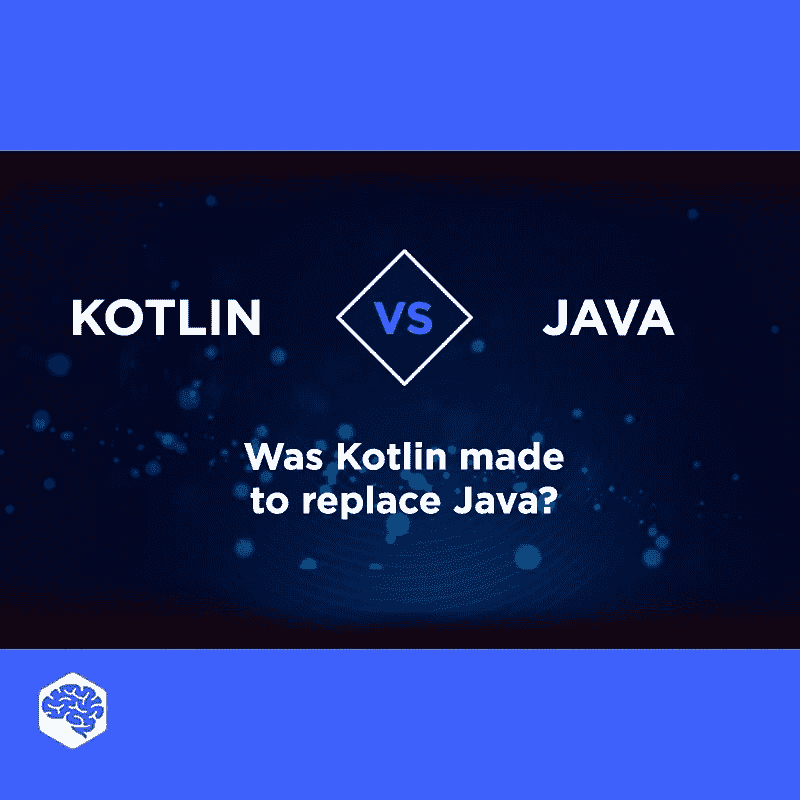

# Kotlin 是用来取代 Java 的吗？

> 原文：<https://medium.com/javarevisited/was-kotlin-made-to-replace-java-3c4df5dcc51d?source=collection_archive---------0----------------------->

## JAVA 与 KOTLIN 的比较

## 许多人认为科特林会扼杀 Java。那么是真的吗？

当谈到 Android 应用程序开发时，Java 可能是第一个跃入你脑海的编程语言。然而，[科特林](/javarevisited/top-5-courses-to-learn-kotlin-in-2020-dfc3fa7706d8)却被很多人预期要干掉 Java。那么是真的吗？让我们找出答案。

那么 [Kotlin](/javarevisited/7-free-courses-to-learn-kotlin-in-2020-327c3872c1e1) 是否会完全取代 [Java](https://javarevisited.blogspot.com/2018/07/top-5-websites-to-learn-coding-in-java.html) 用于 [Android 开发](/javarevisited/top-5-courses-to-learn-android-for-java-programmers-667e03d995b4)？请在评论中分享。

