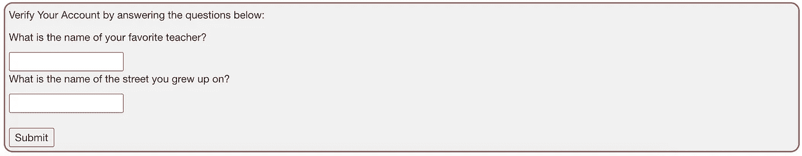
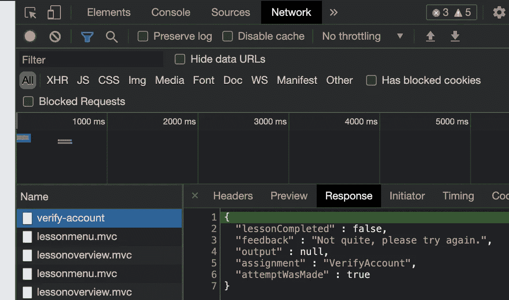
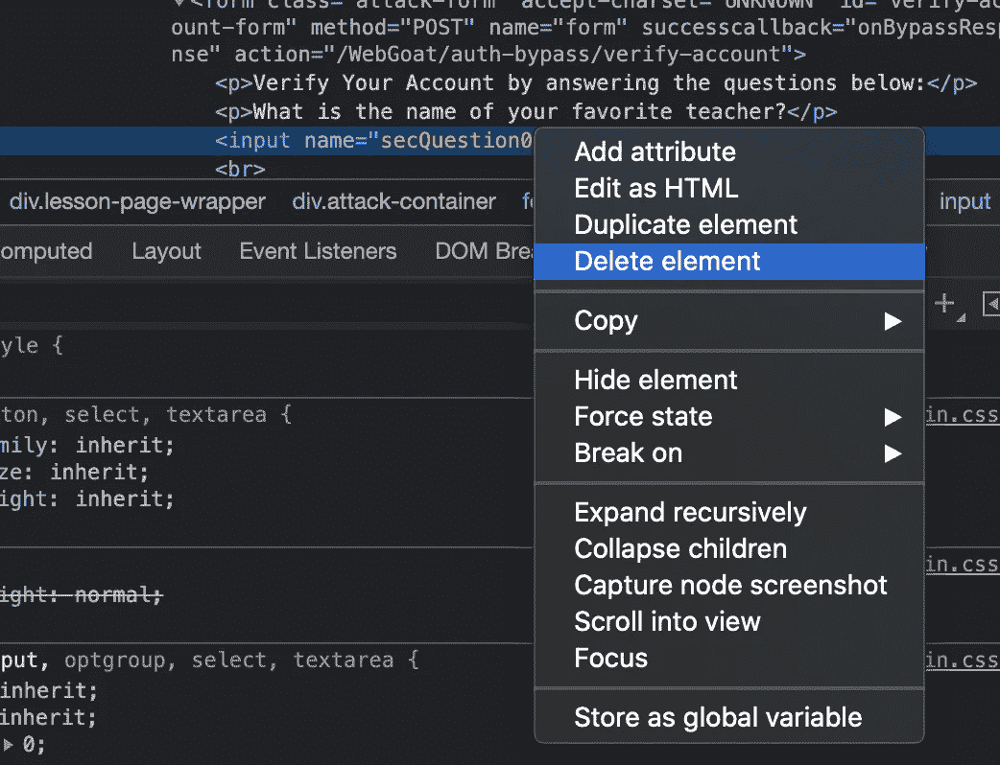
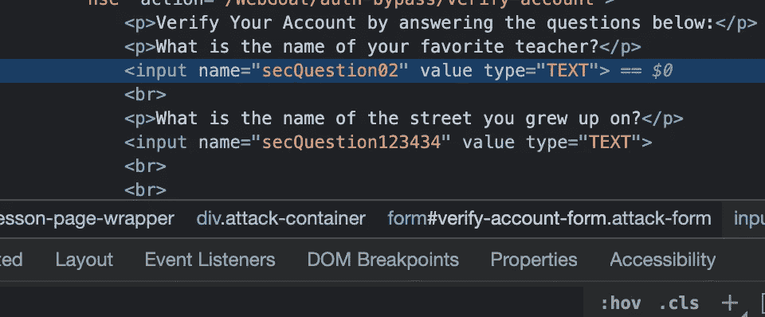
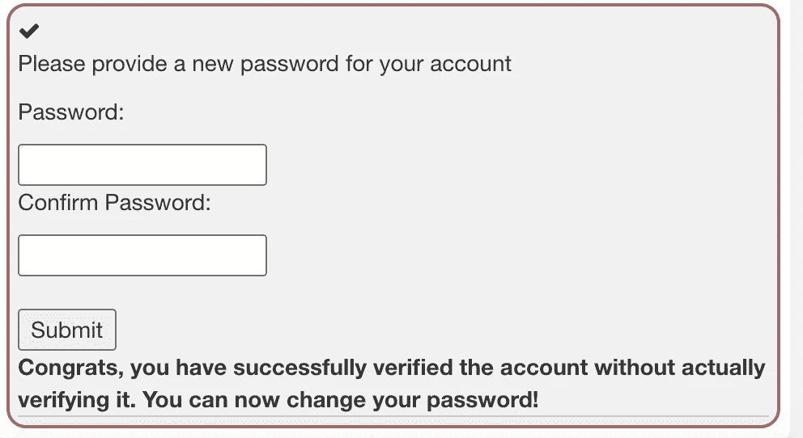

# WebGoat 认证在 Spring Boot 被绕过

> 原文：<https://medium.com/javarevisited/webgoat-authentication-bypasses-in-spring-boot-e1a70da0922?source=collection_archive---------1----------------------->

如果满足适当的条件，用户可以绕过身份验证。你可以在 PayPal 查看这个例子。然而，在成功之前，它需要创造力和许多尝试。

在本文中，我们将遵循 WebGoat 项目中的认证旁路步骤。

对于给定的用户名，不是提供密码，而是在之前的注册步骤中询问用户两个问题。



当我们提交表单时，我们可以在响应中看到一条验证消息。

[](https://www.java67.com/2012/08/spring-interview-questions-answers.html)

该请求包括两个安全问题:

[](https://javarevisited.blogspot.com/2021/02/spring-security-interview-questions-answers-java.html)

在 PayPal 的例子中，攻击者只是删除了安全问题。我们可以用代理(即:Burp Suite)拦截请求并删除参数。一个更简单的方法是从开发者工具窗口(F12)中删除两个参数:

[](https://javarevisited.blogspot.com/2019/06/3-books-and-courses-to-learn-spring-security-in-depth.html)

我们可以看到请求不包含这两个参数。


可惜，回应还是一样。所以删除参数没有用，提供一些随机值也没有用。接下来我们可以做的是重命名参数的名称。



这次我们很幸运，我们收到了成功的消息。



该缺陷是由导致验证通过的不良实现(本项目的目的)造成的。下面的 *if 条件*可以翻译为:如果有一个名为` **secQuestion0`** 的问题，并且答案是**而不是来自商店的**，则验证失败。

```
private static final Map<String, String> userSecQuestions = new HashMap<>();//...public boolean verifyAccount(Integer userId, HashMap<String, String> submittedQuestions) {//...if (**submittedQuestions.containsKey("secQuestion0")** && !submittedQuestions.get("secQuestion0").equals(secQuestionStore.get(verifyUserId).get("secQuestion0"))) {            return false;        }//...
```

通常对于这种情况的建议是*为* *正*。一个更好的选择是，只有当答案与存储库中给定问题的答案匹配时，才通过验证(返回 true)。这种心态在更多情况下是有用的，因为很难维护一个*不允许列表。*默认情况下，如果*允许条件*不满足，答案应该默认为 false(不允许)