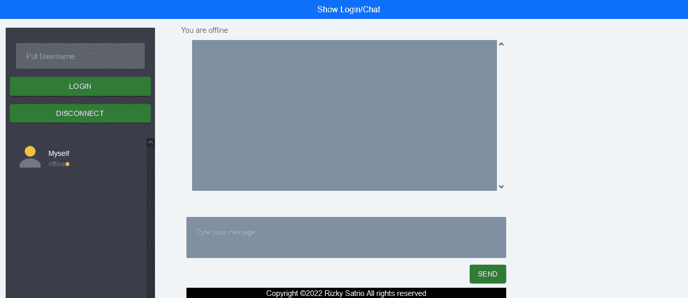
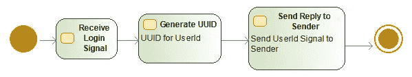
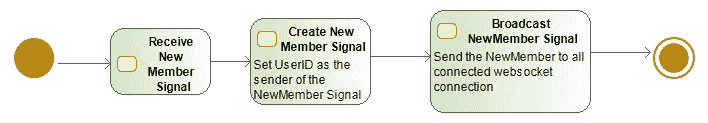

# 使用 Spring Boot 的 WebRTC 信令服务器示例

> 原文：<https://medium.com/javarevisited/webrtc-signaling-server-example-using-spring-boot-efd5f067900a?source=collection_archive---------0----------------------->

在本文中，我将解释如何构建一个简单的信令服务器用于 WebRTC 聊天应用程序。我没有找到很多关于这个主题的文章，所以我希望这篇文章能够帮助您对 WebRTC 聊天应用程序中的信令操作有一个基本的了解。

[](https://javarevisited.blogspot.com/2022/01/spring-boot-reactjs-example-for-java.html)

**问题陈述**

*   用于 WebRTC 聊天应用程序的信令服务器

**解决方案**

这里的解决方案是使用 WebSocket 技术。我用 Spring Boot 在短时间内创建了 WebSocket 服务器。

从**业务流程的角度来看**，我们将实现 WebSocket 服务器来处理这类信号:

*   注册
*   新成员
*   回答
*   提供
*   冰

[](https://www.java67.com/2021/11/5-best-spring-framework-courses-for.html?m=0)

图一。登录活动图

从上图中，我们可以看到登录活动主要处理生成 userId，并将 userId 发送回 WebSocket 客户端。

[](https://javarevisited.blogspot.com/2020/05/top-20-spring-boot-interview-questions-answers.html)

图二。新成员活动图

从上图中，我们可以看到 NewMember 活动主要处理将新成员的 userId 广播给其他 WebSocket 客户端。

[](https://javarevisited.blogspot.com/2021/10/what-is-spring-data-repository.html)

图 3。其他活动图

从上图中，我们可以看到 ICE/Answer/Offer 活动主要处理将信号从发送者转发到其各自的接收者。

从技术角度来看，我们需要在 maven 中添加这些依赖项:

```
<dependencies>
        <dependency>
            <groupId>org.springframework.boot</groupId>
            <artifactId>spring-boot-starter-websocket</artifactId>
        </dependency>              
</dependencies>
```

与 WebSocket 客户端交换的信号数据将使用 JSON 格式。JSON 由 4 个字段组成:

*   userId:发送数据的用户 Id
*   类型(强制):信号的类型(登录，新成员，回答，提供，冰，用户 Id)
*   数据:要发送的数据，可以是冰包、提供包、应答包等
*   toUid:要发送的数据的用户标识目的地

我们需要为如下信号类型创建枚举:

```
public enum SignalType {

    Login,
    UserId,
    Offer,
    Answer,
    Ice,
    NewMember,

}
```

我们需要创建一个带有必要注释的 [Spring Boot 应用程序](https://javarevisited.blogspot.com/2021/11/how-to-create-your-first-mvc-application-using-spring-mvc-.html):

```
@SpringBootApplication
public class SignallingServerApplication {

    public static void main(String[] args) {
        SpringApplication.run(SignallingServerApplication.class, args);
    }

}
```

我们还需要实现 WebSocket 配置器，如下所示。使用 allowed-origin 来限制可以调用 Web 套接字服务器的域。

```
@Value( "${allowed.origin:*}" )
    private String allowedOrigin;

    @Override
    public void registerWebSocketHandlers(WebSocketHandlerRegistry registry) {

        registry.addHandler(new SignalingHandler(), "/socket1").setAllowedOrigins(allowedOrigin);
    }
```

我们还需要实现 TextWebSocketHandler，并创建一个与我们之前设计的业务流程相匹配的流程。完整的代码可以在这个 [github](https://github.com/rsatrio/WebRTC-Signaling-Server) 里看到(请别忘了留个星)。

关于浏览器和信令服务器之间通信的完整流程，请参见这篇[文章](https://mrizkysatrio.medium.com/webrtc-chat-application-772539ae97b7)。

你也可以在这个[链接](https://glowing-creponne-b62856.netlify.app/)上查看 WebRTC 聊天应用的工作示例。

**参考文献和相关文章**

1.  https://www.baeldung.com/websockets-spring
2.  [https://mrizkysatrio . medium . com/webrtc-chat-application-772539 AE 97 b 7](https://mrizkysatrio.medium.com/webrtc-chat-application-772539ae97b7)
3.  [https://github.com/rsatrio/WebRTC-Signaling-Server](https://github.com/rsatrio/WebRTC-Signaling-Server)
4.  [https://glowing-creponne-b62856.netlify.app/](https://glowing-creponne-b62856.netlify.app/)