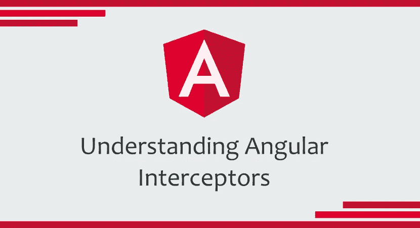

# 什么是 Http 拦截器，如何在 Angular 中使用？

> 原文：<https://medium.com/javarevisited/what-are-http-interceptors-and-how-to-use-them-in-angular-59fcb4efc235?source=collection_archive---------0----------------------->

## 在 Angular 中我们可以使用拦截器的用例。

我们已经面对了多种场景，在这些场景中，我们可能希望全局地捕获或更改每个请求或响应，比如附加用户的令牌或处理来自响应的错误，我们可以使用 Http 拦截器来实现这一点。拦截器是一个特殊的角度服务…