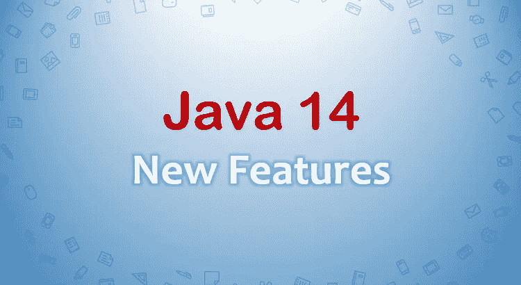

# Java 14 有哪些新特性？

> 原文：<https://medium.com/javarevisited/what-are-the-new-features-for-java-14-c1981f6e0551?source=collection_archive---------0----------------------->

[](https://medium.com/javarevisited/top-5-java-online-courses-for-beginners-best-of-lot-1e1e240a758)

Java 14 现已上市！Java 14 (Java SE 14)及其 Java 开发工具包 14 (JDK 14)开源已于 2020 年 3 月 17 日发布，是世界上最通用的编码语言和应用平台。

# 新功能

以下是 Java 14 的新特性。

参考资料:【https://openjdk.java.net/projects/jdk/14/】T2

**针对开发者:**

1–305:instance of 的模式匹配(预览)
2–358:有用的 NullPointerExceptions
3–359:记录(预览)
4–361:开关表达式(标准)
5–368:文本块(第二次预览)

**其他功能/工具**

1–343:打包工具(孵化器)
2–345:NUMA 感知的 G1 内存分配
3–349:JFR 事件流
4–352:非易失映射字节缓冲区
5–362:弃用 Solaris 和 SPARC 端口
6–363:删除并发标记清除(CMS)垃圾收集器
7–364:MAC OS 上的 ZGC
8–365:Windows 上的 ZGC【T19

**针对开发者:**

**305:实例的模式匹配(预览)**

请任何 Java 开发人员展示他们的代码库，你会在整个代码中很好地使用条件实例。具体来说，条件检查的实例之后通常是类型转换。

Java 14 之前:

> `if (obj instanceof String) {
> String item = (String) obj;
> System.out.println(item);
> }`

Java 14 以上版本:

> 在上面的代码中，只有当 obj 是 String 类型时，实例 s 才会被赋值。变量的范围仅限于条件块。

```
more example :if (obj instanceof String str && str.length() > 5) {..    str.contains(..) ..
}

if (obj instanceof String str || str.length() > 5) {.. str.contains(..) ..
}if (!(obj instanceof String str)) {
    .. str.contains(..) .. // no need to declare str object again with casting
} else {
    .. str....
}
```

# **358:有用的空指针异常**

空指针异常对于任何开发人员来说都是一场噩梦。以前，直到 Java 13，调试声名狼藉的 npe 都很棘手。开发人员不得不求助于其他调试工具，或者手动确定为空的变量/方法，因为堆栈跟踪只会显示行号。

Java 14 之前

```
Author author = null;
String name = author.getName()//Stacktrace
Exception in thread "main"at NullPointerExample.main(NullPointerExample.java:5)
```

Java 14 以后

```
Java 14 introduced a new JVM feature which gives better insights with a more descriptive stack as shown below:Exception in thread "main" java.lang.NullPointerException: Cannot invoke "author.getName()" because the **return** value of "author" is **null** at NullPointerExample.main(NullPointerExample.java:4)**Note**: The above feature is not a language feature. It’s an enhancement in the runtime environment.
```

# **359:记录(预览)**

这是 JDK 14 中的预览语言功能。它用于压缩记录的类声明语法。

我们需要编写大量低价值、重复的代码来负责任地编写一个简单的数据类:构造函数、访问函数、equals()、hashCode()、toString()等。

为了避免这种重复的代码，Java 计划使用记录语法。

之前:

```
final class Author{
    public final String name;
    public final int age;

    public Author(String name, int age) {
        this.name = name;
        this.age = age;
    }

    // state-based implementations of equals, hashCode, toString
    // nothing else
```

带有记录语法的 Java 14

```
record Author(int name, int age){} //Static fieldrecord Author (**int** id, String name, String topic) {
   **static** **int** followers;
   **public** **static** String followerCount() {
      **return** "Followers are "+ followers;
   } **public** String description(){
     **return** "Author "+ name + " writes on "+ topic;
   } **public** Author{
      **if** (id < 0) {
         **throw** **new** IllegalArgumentException( "id must be greater than 0.");
    }
  }
}
```

# 记录可以实现接口

```
record Author(String name, String topic) **implements** Information { **public** String getFullName() {
      **return** "Author "+ name + " writes on " + topic;
  }
}**interface** Information {
   String getFullName();
}
```

# 记录支持多个构造函数

```
record Author(String name, String topic) {
  public Author() {

    this("NA", "NA");
  }

  public Author(String name) {

    this(name, "NA");
  }
}
```

# 记录允许修改访问器方法

```
record Author(String name, String topic) {
  public String name() {
        return "This article was written by " + this.name;
    }
}
```

**使用记录的限制:**
-记录不能扩展任何其他类，除了对应于状态描述的组件的私有 final 字段之外，不能声明实例字段。
-记录是隐式最终的，不能是抽象的，这样的限制强调了记录的 API 完全由它的状态定义来定义，并且不能被另一个类或记录修改。
-记录的组成部分是最终的。

# **361:开关表达式(标准)**

java 14 之前

```
switch (day) {
    case MONDAY:
    case FRIDAY:
    case SUNDAY:
        System.out.println(100);
        break;
    case TUESDAY:
        System.out.println(200);
        break;
    case THURSDAY:
    case SATURDAY:
        System.out.println(300);
        break;
    case WEDNESDAY:
        System.out.println(400);
        break;
}
```

在使用 Java 14 之后

```
switch (day) {
    case MONDAY, FRIDAY, SUNDAY -> System.out.println(100);
    case TUESDAY                -> System.out.println(200);
    case THURSDAY, SATURDAY     -> System.out.println(300);
    case WEDNESDAY              -> System.out.println(400);
} another example:int numLetters = switch (day) {
    case MONDAY, FRIDAY, SUNDAY -> 100;
    case TUESDAY                -> 200;
    case THURSDAY, SATURDAY     -> 300;
    case WEDNESDAY              -> 400;
};//Yielding a value - introduce a new yield
int value = switch (day) {
    case MONDAY  -> 100;
    case TUESDAY -> 200;
    default      -> {
        int d = day.toString().length();
        int result = f(d);
        yield result;
    }
};
```

# **368:文本块(第二次预览)**

文本块是作为 Java 13 中的一个预览特性引入的，目的是允许轻松创建多行字符串文字。它有助于轻松创建 HTML 和 JSON 或 [SQL 查询字符串](/hackernoon/top-5-sql-and-database-courses-to-learn-online-48424533ac61)。

在 Java 14 中，文本块仍然在预览中，只是增加了一些新的内容。我们现在可以使用:

-反斜杠，用于显示好看的多行字符串块。
-\s 用于考虑缺省情况下被编译器忽略的尾随空格。它保留了它前面的所有空间

```
String text = """
               Did you know \
               Java 14 \
               has the most features among\
               all non-LTS versions so far\
             """;String text2 = """
                 line1
                 line2 \s
                 line3
               """;String text3 = "line1\nline2 \nline3\n"//text2 and text3 are equal.
```

**其他功能/工具:**

# 包装工具(培养箱)

目前，Java 应用程序通常作为简单的 JAR 文件分发。然而，这不是很方便，尤其是对于应用程序的用户来说。如果 Java 应用程序是像 Windows 上的 MSI 或 Mac 上的 DMG 那样的可安装包，那就好得多了。这将允许以用户熟悉的方式分发、安装和卸载 Java 应用程序。

[JEP 343](https://openjdk.java.net/jeps/343) 引入了`jpackage`工具，该工具将 Java 应用打包成一个特定于平台的包，该包包含所有必需的依赖项。Java 14 可以支持这个 jpackage 工具，但还不完全支持。

*   Linux 上的 DEB 和 RPM
*   苹果电脑上的 PKG 和 DMG
*   Windows 上的 MSI 和 EXE

请通过[https://openjdk.java.net/projects/jdk/14/](https://openjdk.java.net/projects/jdk/14/)查看更多细节

您可能喜欢的其他 Java 文章:

[](/javarevisited/what-java-programmers-should-learn-in-2020-648050533c83) [## 2020 年 Java 程序员该学什么？

### 2020 年 Java 程序员可以学习的有用工具、技术、框架和库

medium.com](/javarevisited/what-java-programmers-should-learn-in-2020-648050533c83) [](/javarevisited/top-5-courses-to-learn-new-features-of-java-8-to-java-13-107eb51d2a13) [## 学习 Java 8 到 Java 13 新特性的前 5 门课程

### 从 Java 8 到 Java 13 引入了许多有用的特性，如 lambda 表达式、流 API、新日期和…

medium.com](/javarevisited/top-5-courses-to-learn-new-features-of-java-8-to-java-13-107eb51d2a13) [](/javarevisited/what-next-for-senior-developers-in-tech-project-manager-technical-architect-or-a-devops-engineer-b532a80c9ba1) [## 高科技领域的高级开发人员接下来会做什么？项目经理、技术架构师或 DevOps 工程师

### 是时候考虑职业生涯的下一个层次了。

medium.com](/javarevisited/what-next-for-senior-developers-in-tech-project-manager-technical-architect-or-a-devops-engineer-b532a80c9ba1)