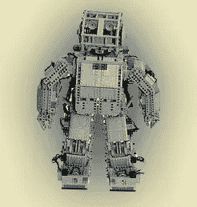
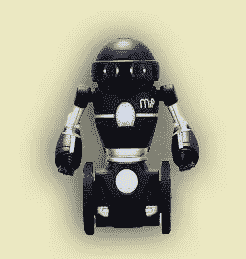

# 关于人工智能机器人每个人都必须知道的事情

> 原文：<https://medium.com/javarevisited/what-everyone-must-know-about-artificial-intelligence-robotics-4d18811f953d?source=collection_archive---------0----------------------->

# 什么是人工智能机器人？

基本上，机器人有一个特定的目标。当他们操纵这些物体时。例如，通过感知、拾取、移动、修改对象的物理属性。

机器人是什么？

一般来说，机器人是在现实世界环境中行动的人工智能体。

什么是机器人技术？

一般来说，*机器人学是人工智能的一个分支。*即由电气和机械组成的工程。此外，计算机科学用于机器人的设计、建造和应用。

阅读更多关于[机器人介绍-人工智能](https://data-flair.training/blogs/ai-robot/)

# 人工智能机器人方面

*   基本上，机器人有机械构造。也就是为了完成某一特定任务而设计的形式或形状。
*   此外，它还包含电子元件。那就是使用权力和控制机器。
*   基本上，它包含了某种程度的计算机程序。此外，它还决定了机器人做什么、什么时候做以及如何做。

# 机器人组件

要制造一个机器人，我们需要以下部件

**a .电源**

因为机器人是由电池、太阳能、液压驱动的。

**b .致动器**

我们用这个将能量转化为运动。

**交流电动机(交流/DC)**

我们需要这个来做旋转运动。

**d .气动空气肌**

我们可以说，当空气被吸入时，它们收缩了将近 40%。

**大肠肌丝**

虽然，我们已经注意到当电流通过它们时，它收缩了 5%。

**f .压电电机和超声波电机**

基本上，我们把它用于工业机器人。

**g .传感器**

通常，我们在任务环境中使用它，因为它提供实时知识的信息。

阅读更多关于[人工智能中流行的搜索算法](https://data-flair.training/blogs/popular-search-algorithms/)

# 机器人系统和人工智能程序的区别

*这里是人工智能和机器人的区别:*

人工智能程序

*   通常，我们在计算机模拟的世界里操作它们。
*   通常，输入以符号和规则的形式给出。
*   基本上，要操作它，我们需要通用计算机。

阅读有关人工智能应用的信息。

**人工智能机器人**

*   一般我们使用机器人在真实的物理世界中操作。
*   基本上，输入是以语音波形形式的模拟信号的形式给出的。
*   此外，要操作它，需要带有传感器和效应器的特殊硬件。

# 机器人运动

我们可以说这是一种机制。因为这有助于使机器人能够在他们的环境中移动。因为存在各种类型的运动-

a.有腿的

b.有轮的

c.腿和轮子运动的结合

d.履带式滑移/滑行

# a.腿式运动

演示走、跳等动作时。它消耗更多的能量。

完成一项运动需要更多的马达。此外，它最适合粗糙和光滑的地形。即不规则或过于光滑的表面。这使得它在轮式运动中消耗更多的能量。尽管由于稳定性问题而难以实现。

这是不同种类的。例如一条、两条、三条、四条和六条腿。它还说如果机器人有多条腿。那么腿部的协调对于运动来说是必要的。

机器人可能行走的步态总数取决于它的腿的数量。

如果一个机器人有 k 条腿，那么可能事件的数量 N = (2k-1)！。

在两条腿机器人(k=2)的情况下，可能事件的数量是 N = (2k-1)！也就是(2 * 2–1)！那是 3！= 6.

因此，我们有六种不同的可能事件-

*   抬起左腿
*   松开左腿
*   抬起右腿
*   松开右腿
*   双腿一起抬起
*   一起放开双腿

在 k=6 条腿的情况下，有 39916800 个可能的事件。因此，机器人的复杂程度与腿的数量成正比。

**b .轮式移动**

为此，一般来说，我们需要较少数量的电机来完成一个运动。

完成一项运动需要较少数量的马达。此外，与腿式运动相比，它更加节能。

标准车轮

它总是围绕轮轴和触点旋转。

脚轮

它有助于围绕轮轴和偏置转向接头旋转。

瑞典 45o 和瑞典 90o 车轮

这叫全方位轮。其围绕接触点、轮轴和滚子旋转。

球或球形轮

因为它是一个全方位的轮子。虽然技术上很难实现。

*人工智能机器人——轮式移动*

# c.滑动/打滑运动

一般来说，这种机动车辆使用坦克履带。此外，必须通过以不同的速度向相同或相反的方向移动轨道来操纵机器人。虽然，有一个大的接触面积的轨道，它提供了稳定性。

*人工智能机器人——滑动/滑行移动*

# 计算机视觉

一般来说，这是一种机器人可以看到的人工智能技术。此外，在安保、安全和娱乐方面发挥重要作用。它用于从一系列图像中提取有用的信息。

# a.计算机视觉系统的硬件

这涉及到

*   电源
*   诸如照相机的图像采集设备
*   处理器
*   一个软件
*   用于监控系统的显示设备
*   相机支架、线缆和连接器等附件

# 计算机视觉的应用领域

通常，计算机视觉有多种应用:

*   农业
*   自动驾驶汽车
*   生物测定学
*   字符电子识别
*   取证、安全和监控
*   工业质量检验
*   人脸识别
*   手势分析
*   地球科学
*   医学影像
*   污染监测
*   过程控制
*   遥感
*   机器人学
*   运输

# 机器人应用

**a .行业**

一般来说，我们在工业中出于各种目的使用机器人。例如处理材料、切割、焊接、彩色涂层、钻孔、抛光等。

**乙药**

一般来说，机器人非常有用，因为它们能够进行数百项临床测试。

**c .探险**

基本上，对于攀岩，太空探索，我们使用机器人。

**d .娱乐**

为了电影制作，迪士尼的工程师们创造了数百个机器人。

这是关于人工智能机器人的教程。希望你喜欢它

花 10 分钟入门[人工智能 vs 机器学习 vs 深度学习 vs 数据科学](https://data-flair.training/blogs/artificial-intelligence-vs-machine-learning-vs-dl-vs-ds/)

# 结论

我们研究了人工智能机器人技术以及人工智能与机器人技术之间的比较。此外，还学习了机器人组件、移动和机器人的不同应用。因为我们使用了图像来帮助您更好地理解。

此外，如果你有任何疑问，请在评论区提问。

其他有用的**数据科学与机器学习**资源
[机器学习 by 吴恩达](https://click.linksynergy.com/deeplink?id=JVFxdTr9V80&mid=40328&murl=https%3A%2F%2Fwww.coursera.org%2Flearn%2Fmachine-learning)
[AI 为大家](https://click.linksynergy.com/deeplink?id=JVFxdTr9V80&mid=40328&murl=https%3A%2F%2Fwww.coursera.org%2Flearn%2Fai-for-everyone) by [吴恩达](https://medium.com/u/592ce2a67248?source=post_page-----4d18811f953d--------------------------------)
[Top 8 Python 机器学习库](https://javarevisited.blogspot.com/2018/10/top-8-python-libraries-for-data-science-machine-learning.html)
[5 门免费课程学习机器学习用 R 编程](http://www.java67.com/2018/09/top-5-free-R-programming-courses-for-Data-Science-Machine-Learning-Programmers.html)
[2018 年 5 门免费课程学习 Python](http://www.java67.com/2018/02/5-free-python-online-courses-for-beginners.html)
[Top 5 数据科学与机器学习课程](https://hackernoon.com/top-5-data-science-and-machine-learning-course-for-programmers-e724cfb9940a)
[课程](https://hackernoon.com/top-5-tensorflow-and-ml-courses-for-programmers-8b30111cad2c)
[2018 年程序员可以学习的 10 项技术](http://www.java67.com/2018/01/top-10-web-mobile-and-big-data-framework-libraries-technologies-programmers-should-learn-in-2018.html)
[更好地学习 Python 的前 5 门课程](http://javarevisited.blogspot.sg/2018/03/top-5-courses-to-learn-python-in-2018.html)
[一个日本黄瓜农如何利用深度学习和 TensorFlow](https://cloud.google.com/blog/products/gcp/how-a-japanese-cucumber-farmer-is-using-deep-learning-and-tensorflow)

**P. S.** — —如果你需要一些免费资源来入手，可以查看一下这个免费课程 [***学习机器学习算法、软件、深度学习***](http://bit.ly/2DNKMdZ) 来开始你的准备。