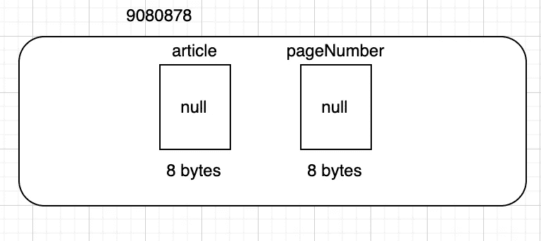
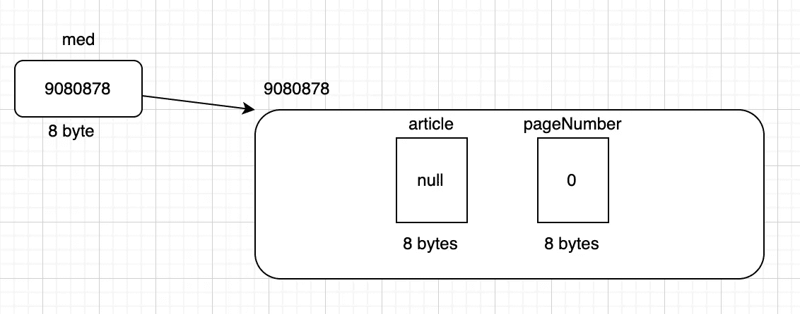

# 当你用 java 创建一个对象时会发生什么？

> 原文：<https://medium.com/javarevisited/what-happens-when-you-create-an-object-in-java-7c5b29f04d?source=collection_archive---------0----------------------->

要理解对象创建，首先要知道 [OOP](https://javarevisited.blogspot.com/2018/07/10-object-oriented-design-principles.html) 的概念。这是一个基于面向对象原则的四个核心支柱的编程模型，即[抽象](https://www.java67.com/2012/09/what-is-difference-between-interface-abstract-class-java.html#google_vignette)、[封装](https://www.java67.com/2012/08/difference-between-abstraction-and-encapsulation-java-oops.html)、继承和多态。我们将在以后的博客中讨论这四个支柱，但首先，我们需要理解术语对象。

对象只不过是类的一个实例。它有状态、行为和身份。对象的状态和行为可以在类中定义。

```
class Medium{

  String articles;                            // state 1
  int pageNumber;                              //state 2

  public void writeArticle(){                  // Behaviour 1 
      // some code ....
  }

  public void publishArticle(){                // Behaviour 2
      // some code .....
  }
}
```

"**状态**也称为类的数据成员或字段或属性，而"**行为**是类的方法或成员函数。

简而言之，我们可以说，阶级=国家+行为。这是一个扩展的结构概念，我们在面向过程的编程中读到过，如 C，C++等。根据上面的定义，我们可以很容易地说，类是对象的状态和行为的蓝图。

这就是关于类的大部分内容，但是为了理解对象创建，我们应该理解类的概念。现在我们要理解对象创建的概念，但在此之前，我们应该知道对象是什么意思。

对象是类的物理表示，它是一个运行时实体，因为它在执行类时在堆中分配内存。为了创建一个类的对象，我们应该知道相同的语法。

语法:<classname><referencevariable>= new<classname>()；</classname></referencevariable></classname>

```
Medium med = new Medium();
```

如果你理解到这里，那么这意味着我们正走在正确的轨道上，因为现在是高潮的时候了……

所以当我创建一个类的对象时，

```
Medium med = new Medium();
```

JVM 为引用变量分配 8 个字节的内存，并用 null 值对其进行初始化。


验证该类是否已加载。如果这个类没有被加载，那么首先它会在加载的时候为静态变量分配内存，这个变量在我们的类中没有，但是如果有，那么它会用默认值初始化这个变量，例如，对于 int -> 0，String -> null 和 float -> 0.0

之后，它将创建一个对象，为该类的一个实例变量分配内存，并用默认值初始化它。



现在对象的地址被赋给了引用变量。



分配给引用变量的

我希望你已经理解了这篇文章，并且对通过图表创建对象有了一个清晰的了解。如果你喜欢我的内容，请鼓掌并跟随。谢谢大家！

