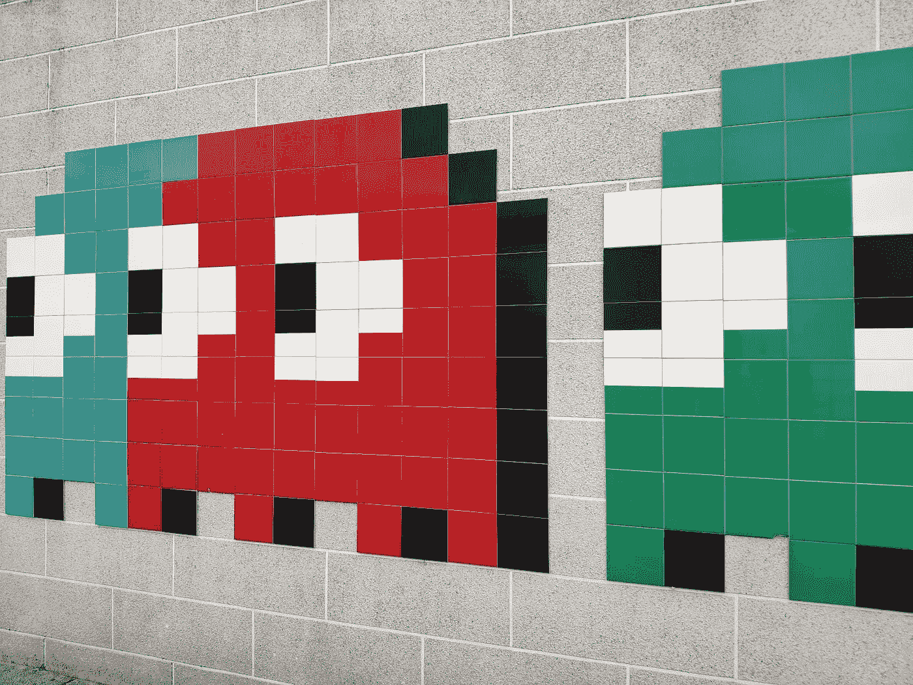
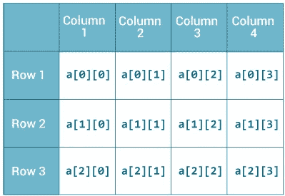
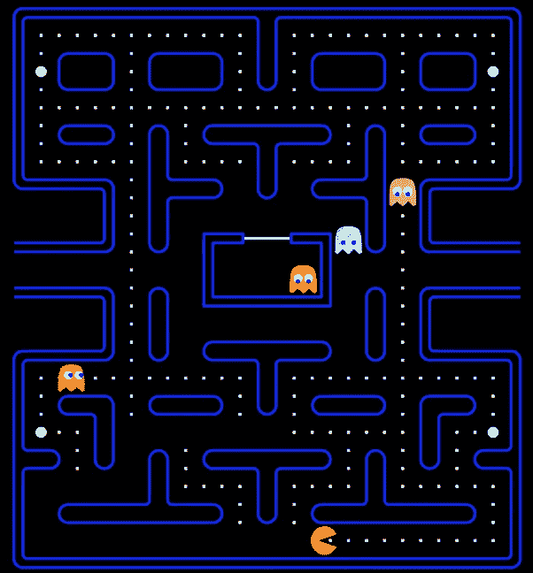

# 如何使用 Java 在两周内编写 Pac-Man

> 原文：<https://medium.com/javarevisited/what-i-achieved-after-13-weeks-of-learning-java-e6a081c401c9?source=collection_archive---------0----------------------->

## 这是一个循序渐进的指南，教你如何从头开始编写吃豆人的代码，尽管之前从未编写过游戏

芭芭拉·赞多瓦尔在 unsplash.com[拍摄的](https://unsplash.com/photos/nfA9WdbTfak)[照片](https://unsplash.com/@barbarazandoval)

学习 Java 面向对象编程的最好方法就是编写游戏代码。

它教你如何创建类，以及抽象代码减少冗余的重要性。您将学习如何构建大型应用程序以及制作测试用例的重要性。但最重要的是，你学会了以一种有趣和吸引人的方式编码。

## 先决条件

*   关于控制流的知识(if，else，while，for，for each)
*   理解类(实例和静态方法/属性)
*   对继承的理解
*   谷歌搜索的博士学位

## 如何开始

所有游戏的代码结构都有共同的主题思想

*   它们都有一个主运行循环，游戏有“滴答”(游戏中的一种时间度量)以及对屏幕的绘制
*   它们都有一个主要的`Game`类，用来存储游戏属性，比如生命，剩余水果的数量
*   他们使用[继承](https://javarevisited.blogspot.com/2012/10/what-is-inheritance-in-java-and-oops-programming.html)来最小化冗余代码。例如，一个`GameObject`类可以作为所有绘制到屏幕上的对象(吃豆人、鬼魂、水果和墙壁)的父类

编写游戏程序时，重要的是要有一个你期望你的代码如何构造的计划。每段代码都应该有明确的意图——缺乏计划会导致代码杂乱无章，调试起来也很头疼。现在花几分钟计划将会节省你调试的时间。

因此，阅读项目规范，**创建一个类层次结构** (UML 图)和**创建一个事件列表，详细说明您希望您的程序在运行一次后如何执行**。将游戏分解成几个独立的步骤对于界定游戏的范围和弄清楚你的代码如何组合在一起是至关重要的。

包括调用了哪些函数，它们如何工作的简要描述，以及将修改哪些对象——您希望从开始到结束都有一个逻辑有序的事件链。

系统化是游戏编程的关键。

照片由 [Kirill Sharkovski](https://unsplash.com/@sharkovski?utm_source=medium&utm_medium=referral) 在 [Unsplash](https://unsplash.com?utm_source=medium&utm_medium=referral) 上拍摄

## 程序应该如何运行的概述

1.  运行程序初始化一个`App`类的实例 *s.* `settings()`和`setup()`被自动调用，创建游戏窗口并初始化一个`Game`对象。
2.  游戏设置 [JSON 文件](https://javarevisited.blogspot.com/2015/03/parsing-large-json-files-using-jackson.html#axzz5YVgi0isQ)和`map.txt`一样被解析，创建`GameObjects`的 2d 矩阵，存储各自的精灵和位置。`GameObject`将父类型的所有对象绘制到屏幕上
3.  在`draw()`中，所有精灵都被绘制到屏幕上
4.  按键被记录下来，pacman 被移动
5.  吃豆人和鬼魂的实体被“勾选”，检查彼此、墙壁和水果的碰撞
6.  这些鬼魂被赋予了各自的行为，并定期在“分散”和“追逐”状态之间切换
7.  如果吃豆人失去 3 条生命或吃光所有水果，游戏结束。赢/输被绘制到屏幕上

Pacman 的类层次结构/ UML 图

上面的 UML 图应该用作指南，但是您可以随意做出自己的更改。

尽量不要被这个项目的规模所压倒。帮助我应对的是把整个项目分解成小步骤。这意味着我的目标很小，很容易完成，这让我可以像滚雪球一样把我的小胜利变成一个完整的游戏。

# 1.创建应用程序类

从写主循环开始。你将从项目说明书中看到，我们正在使用 [PApplet](https://processing.github.io/processing-javadocs/core/processing/core/PApplet.html) 和 [PImage](https://processing.github.io/processing-javadocs/core/processing/core/PImage.html) 。两者都有丰富的 javadoc 和有用的 javadoc。PApplet 将用于创建游戏的主窗口，而 PImage 将用于加载实体的精灵。

## **创建一个窗口，将精灵绘制到屏幕上**

`PApplet`将有`setup()`和`settings()`的功能。脚手架已经填充了一部分，所以您应该专注于创建必要的对象。

应该尽快初始化`Game`，最好是在调用`App()` 构造函数的时候。在加载`map.txt`之前需要解析 [JSON 文件](https://www.java67.com/2017/05/how-to-convert-java-object-to-json-using-Gson-example-tutorial.html)，因为它包含了所有的游戏设置 ie。生命数量，实体速度。

**代码的解释。运行`App.java`后，构造函数`App()`将被调用，创建`Game`的一个实例。然后，`setup()`被自动调用，设置`frameRate`为 60fps。包含设置的 JSON 文件被解析，例如生命，分散模式的长度，游戏从`map.txt`加载，其中包含地图如何布局的信息。**

## 创建主游戏循环，*，draw()* 。

从 PApplet 文档中，您将看到该函数每帧调用一次——在本例中，每秒调用 60 次。

在这个循环中，您需要将实体绘制到屏幕上，并对每个实体使用`tick()`函数，检查 pacman、幽灵和墙壁之间的碰撞。你将需要添加一个检查赢的情况下，如`if (this.game.fruits == 0) { // do something }`。

对于`draw()`，我推荐看看 javadocs，尤其是返回 PImage 对象的`app.loadImage(spriteFilepath)`和将 PImage 渲染到屏幕指定位置的`app.image(PImage, x, y)`。

请注意，根据项目规范，吃豆人应该在张开嘴和紧闭嘴的精灵之间交替。

**代码的解释。** `background(0,0,0);` 负责通过在之前的帧上绘制黑屏来刷新屏幕。`draw()`使用 PApplet 和 PImage 中的函数

`tick()` 函数将在后面的文章中更深入地讨论，但简单地说，它负责以下动作

1.  检查实体是否仍然存在
2.  (幽灵)检查游戏的当前状态，例如分散或追逐
3.  (重影)根据当前状态选择目标位置
4.  把最后一次按键当作一个动作
5.  将实体的移动排入队列
6.  检查潜在的碰撞
7.  如果没有碰撞，移动游戏对象并根据最后一次移动更新精灵位置。如果移动会导致碰撞，请不要执行

`draw()`使用 PApplet 中的`app.image()`将精灵绘制到屏幕上。

# 2.解析 JSON 设置文件和 map.txt

需要读取两个文件，第一个是 JSON 文件，其中包含游戏的所有设置，比如生命的数量、实体的速度、特定阶段的持续时间。

这个特殊的资源有助于学习如何解析 JSON 文件。

<https://stackoverflow.com/a/46888601/14304605> [## 如何使用 Java 和一个简单的 JSON 库读入 JSON 文件

stackoverflow.com](https://stackoverflow.com/a/46888601/14304605) 

**代码的解释。这段代码创建了一个`JSONParser`对象，它允许我们读取 JSON 文件。特定字段即。*地图、生命、速度*都作为实例属性存储在`Game`类*中。如果有任何错误，它们将被捕获，程序的执行将停止。***

一旦 JSON 文件被解析，就需要使用`loadGame()`来加载游戏地图。编写简单游戏代码时，一个常见的编程思想是将所有的`GameObjects`存储在一个列表列表中(2d 网格)。将对象存储为 2d 网格意味着每个元素都有一个可以链接到 x，y 坐标系的特定位置。

照片来自[programiz.com](https://www.programiz.com/java-programming/multidimensional-array)

每个`GameObject`应该至少存储来自`map.txt`的精灵、x、y 和相应的字符。

**代码的解释。**创建一个`GameObjects`的二维矩阵。包含`GameObjects`的数组列表的[数组列表](https://www.java67.com/2015/06/20-java-arraylist-interview-questions.html)。每个`GameObject`存储子画面、位置以及来自`map.txt`的相应字符。

`map.txt`被逐行读取，每个字符被迭代。对于遇到的每个值，使用一个 [HashMap](https://www.java67.com/2013/02/10-examples-of-hashmap-in-java-programming-tutorial.html) 将字符与其对应的 sprite 文件路径配对。例如，“g”映射到`“src/main/resources/ghost.png”`。PApplet 用于将文件路径转换为 PImage sprite。

每个精灵都是 16x16 个单位大，这就是为什么 x 和 y 在循环的每次迭代中增加 16。

由于每个对象都有不同的行为，所以它们的处理方式都略有不同

如果单元是一个玩家(“p”)，则创建一个玩家对象，并将其作为游戏的属性。这允许游戏容易地和直接地与玩家对象交互，而不需要每次都在 2d 矩阵中找到它。

如果该单元是重影(“a”或“c”或“I”或“w”)，则创建重影对象并将其添加到重影列表中。将实体添加到列表中(对墙也是如此)可以更容易地检查实体冲突。这可以通过在每次勾选时遍历重影和墙壁的列表来检查，并检查像素是否重叠，从而指示碰撞。

如果单元格是水果，那么您可以给每个`GameObject`赋予实例属性`isFruit`，在本例中将其设置为 true。你可以在玩家`tick()`中设置一个检查，这样如果玩家用`isFruit == true`越过一个物体，玩家就会吃掉它，精灵就会消失。记录水果的总数，这样你就可以检查水果的情况。`if this.fruits == 0`，那么所有的水果都被吃掉，玩家赢了。

## **总结**

到目前为止，你已经完成了 3 件大事

1.  App.java——你已经建立了游戏的主要运行循环
2.  Game.java——你已经从 JSON 文件中加载了游戏设置
3.  Game.java——您已经遍历了`map.txt`文件，获得了相应的字符，找到了对应的子画面，用子画面和位置初始化了一个`GameObject`,并将所有的`GameObjects`存储在一个 2d 矩阵中

现在你应该可以看到屏幕上的所有实体了！

感谢您的阅读！如果你想让我继续这个系列，请表示你的支持。

该系列目前的计划如下:

*   第 2 部分—如何编写 pacman 和 ghost 运动的代码
*   第 3 部分—如何对像素冲突检测进行编码
*   第 4 部分——如何对个人幽灵行为进行编码