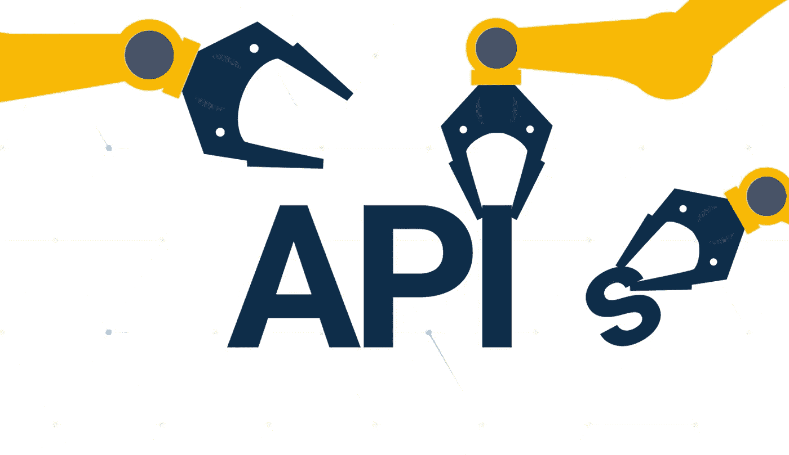
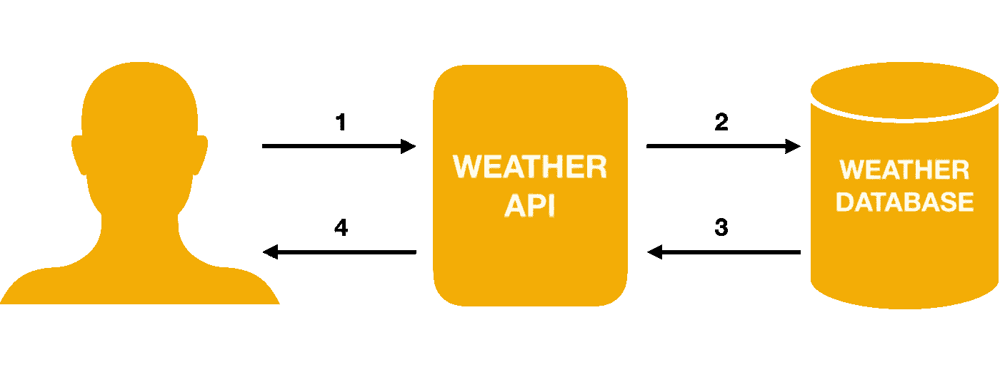
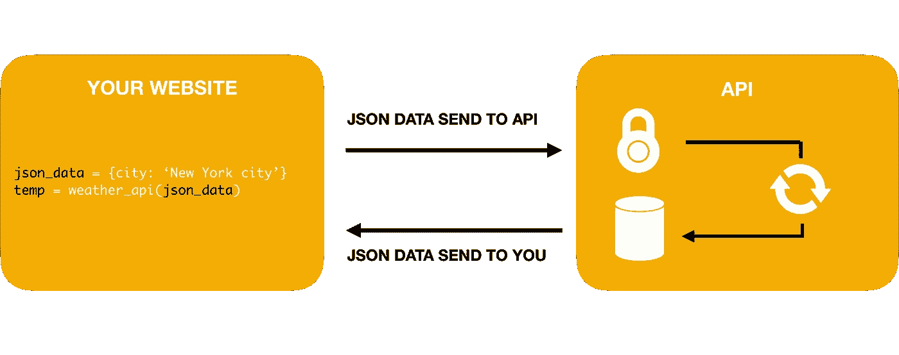

# 什么是 API:应用程序编程接口

> 原文：<https://medium.com/javarevisited/what-is-api-application-programming-interface-3e8985ac0fd4?source=collection_archive---------1----------------------->



图片来源: [Wrike](https://www.google.com/url?sa=i&url=https%3A%2F%2Fwww.wrike.com%2Fblog%2Fapplication-programming-interface-api-explained%2F&psig=AOvVaw1q4n6zo2FEf17PFKmclztU&ust=1588623124200000&source=images&cd=vfe&ved=0CAMQjB1qFwoTCLjGhrzAmOkCFQAAAAAdAAAAABAD)

API 代表 [**应用** **编程** **接口**](https://en.wikipedia.org/wiki/Application_programming_interface) 。为了解释这个概念，我喜欢用一个比喻。想象一下去你当地的面包店。在柜台，你询问你想买的东西。柜台的那个人会帮你打包这些东西。你只能得到你想要的特定的面包。

就像订购面包一样，应用程序编程接口是一种向别人索取东西的方式。在互联网上，API 会把你向他们索要的信息传递给你。

开发者使用 API 作为从互联网上的其他服务获取信息的方式。假设你是一个 web 开发人员，想了解某个城市的天气。您可以使用天气 API 来实现这一点。API 将被请求给出 x 城市的当前温度。在几毫秒内，API 将在数据库中查找温度，并向您发送 x 城市的当前温度。



为了更深入地理解 API，我将在下面解释技术细节。向下滚动查看一些 API 示例。

# API 在这里是为了速度、安全性和一致性

大多数时候，API 是由组织创建的，用来与客户或机器交换信息。API 使得组织能够快速、安全、一致地共享他们的信息。为什么？阅读下面每个概念的解释:

**快速**:假设你是一家银行，你想分享关于股票市场的信息。许多年前，银行的某个人可以打电话给你，告诉你当前的股票价格。这个银行职员的工作很辛苦，因为信息总是在变化。如今，一个 API 可以自动完成这个过程。只需几毫秒，家中的某个人就可以使用 API 查询当时的股票价格。不需要任何人。

**安全:**让我们继续以银行业为例。打电话给股票投资者提供股票价格的人可能会错误地分享一些关于银行的敏感信息。这对于 API 来说是不可能的。API 只共享预定义的信息。在信息和客户/计算机之间没有中间人。

**一致:**大概这个你已经猜到了。API 使用一些预定义的格式将信息传递给你。例如 excel 表格或 [JSON](https://realpython.com/lessons/what-is-json/) 格式。

# API 是如何工作的？

为了真正理解 API 的概念，我们需要更多的技术知识。API 需要由开发者来实现。虽然 API 很容易实现，但是需要一些小的编码经验。

通常 API 可用于许多编程语言，如 [JavaScript](https://javascript.info/intro) 、 [Python](http://pythonforbeginners.com/learn-python/what-is-python/) 或 [PHP](https://www.guru99.com/what-is-php-first-php-program.html) 。通常 API 提供者有一些关于如何实现他们的 API 的文档。API 创建者提供的一段代码需要放在您的应用程序中。

一旦实施，您就可以请求信息。请求需要采用预定义的格式。主要是 JSON 格式。请参见下面的 JSON 请求示例:

```
{
   city-information: 
   { 
      city-name: "New York City",
      city-country: "US",
   }
}
```

这段 JSON 信息被发送给 API。它理解这些信息。随后，请求的信息以 JSON 格式发送回用户。

# API 的过程

下图详细解释了 API 的所有不同步骤



**本图中的步骤为:**

1.  你在你的网站上用你喜欢的编程语言实现代码。
2.  如果代码运行并且数据以正确的格式显示，JSON 数据将被发送到应用程序编程接口的服务器。
3.  API 只对授权用户有效。有些 API 不是免费的，或者限制每月的请求数量。
4.  如果授权，您请求的数据将被处理。
5.  在数据库中查找请求。
6.  所请求的信息将被发送回您的网站(以 JSON 格式)

# API 的示例

下面我想给你看两个 API 的例子

# 1.设备检测 API

此工具检测用户的移动设备类型。例如:苹果 iPhone XS 或三星 Galaxy S20。[设备检测 API](https://theapicompany.com/device-detection-api) 需要在您的网站上用 JavaScript 实现。这个工具经常被用于网上商店的个性化。想象一个卖手机壳的网店。可以检测网站上访问者的设备。随后，用户只能看到该特定类型的手机壳。

# 2.地理定位 API

这个地理定位 API 检测你网站上某人的位置。该工具检测用户的城市、时区、货币和 IP 地址。想象一下它的许多应用。例如，广告商只向商店所在城市的人展示广告。或者，在网上商店根据顾客的当地价值自动转换价格。

# 结论

应用程序编程接口用于在服务之间共享信息。这是快速、安全和一致的。尝试自己使用一些 API。快乐编码🙂