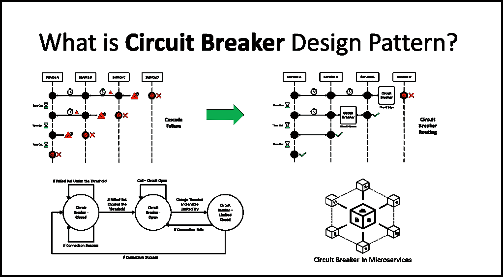

# 什么是微服务中的断路器？

> 原文：<https://medium.com/javarevisited/what-is-circuit-breaker-in-microservices-a94f95f5e5ae?source=collection_archive---------0----------------------->

大家好。今天我们来学习一下断路器设计模式。这种模式在[微服务](/javarevisited/10-best-java-microservices-courses-with-spring-boot-and-spring-cloud-6d04556bdfed)和分布式系统的环境中被大量使用。

## 断路器

在微服务中，一个应用程序或服务对运行在不同服务中的应用程序进行大量远程调用，这些调用通常在网络中的不同机器上进行。如果有…