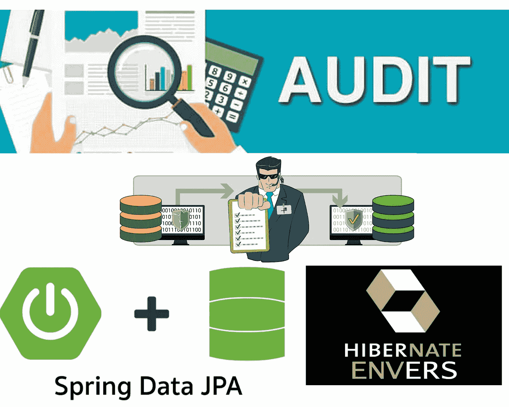

# 什么是数据库审计，以及如何使用 Spring Boot 应用程序审计数据库？

> 原文：<https://medium.com/javarevisited/what-is-database-audit-and-how-to-audit-a-database-using-a-spring-boot-application-11a08170e687?source=collection_archive---------0----------------------->

大家好。在本文中，我们将了解什么是**数据库审计**，然后了解审计数据库的**不同方式。然后我们将探索 **Hibernate Envers** 及其特性。后面我们会看到如何在**[**【Spring Boot】**](/javarevisited/10-best-java-microservices-courses-with-spring-boot-and-spring-cloud-6d04556bdfed)中使用 [Hibernate](/javarevisited/8-best-spring-and-hibernate-training-courses-for-java-developers-acf09aa0e244) Envers 在 **Spring Data JPA** 的支持下实现**数据库审计。让我们开始吧。**

