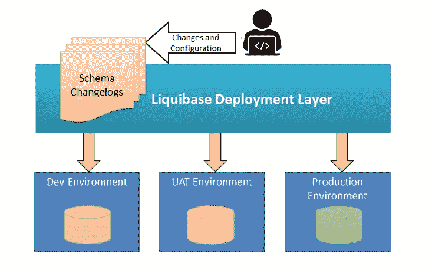

# 什么是 Spring Boot 的数据库迁移，如何使用 Liquibase 完成？

> 原文：<https://medium.com/javarevisited/what-is-database-migration-in-spring-boot-and-how-it-is-done-using-liquibase-bd5cad981862?source=collection_archive---------0----------------------->

图片来源:[https://www . techgeeknext . com/img/liqui base/liqui base-workflow。PNG](https://www.techgeeknext.com/img/liquibase/liquibase-workflow.PNG)

大家好。在本文中，我们将使用一个叫做 Liquibase 的流行工具来研究 Spring Boot[的数据库迁移](/javarevisited/top-10-courses-to-learn-spring-boot-in-2020-best-of-lot-6ffce88a1b6e)

# 什么是数据库版本控制？—它就像是 SQL 脚本的 Git