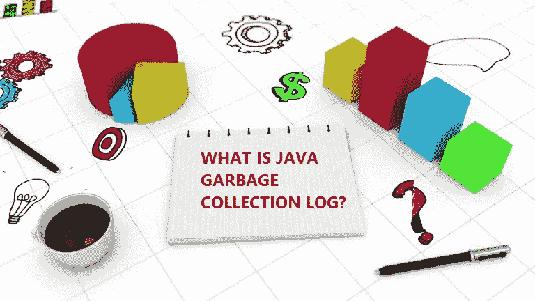
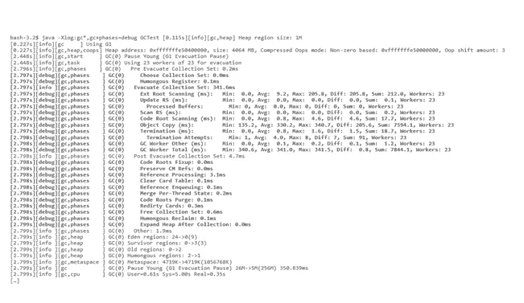

# 什么是垃圾收集日志？如何启用和分析？

> 原文：<https://medium.com/javarevisited/what-is-garbage-collection-log-how-to-enable-analyze-af53d4bc35de?source=collection_archive---------0----------------------->



垃圾收集对应用程序有更深远的影响与大多数工程师的想法相反。为了优化内存和垃圾收集设置以及解决与内存相关的问题，必须分析垃圾收集日志。

# 启用垃圾收集日志

可以通过在应用程序启动期间传递下面提到的系统属性来启用 GC 日志记录

**直到 Java 8:**

以下是所有版本的 [Java](https://javarevisited.blogspot.com/2018/05/top-5-java-courses-for-beginners-to-learn-online.html) 直到 JDK 8 都支持的系统属性。

```
-XX:+PrintGCDetails -Xloggc:<gc-log-file-path>Example:-XX:+PrintGCDetails -Xloggc:/opt/tmp/myapp-gc.log
```

**来自 Java 9:**

以下是从 [JDK 9](https://javarevisited.blogspot.com/2018/08/top-5-free-java-8-and-9-courses-for-programmers.html) 开始的所有 Java 版本支持的系统属性。

```
-Xlog:gc*:file=<gc-log-file-path>Example:-Xlog:gc*:file=/opt/tmp/myapp-gc.log
```

# 如何分析 GC 日志？

下面是传递上述系统属性时生成的 GC 日志示例:



GC 日志包含丰富的信息，但是理解 GC 日志并不容易。没有足够的文档来解释 GC 日志格式。最重要的是，GC 日志格式没有标准化。

它根据 [JVM](https://javarevisited.blogspot.com/2019/04/top-5-courses-to-learn-jvm-internals.html) 厂商( [Oracle](http://javarevisited.blogspot.sg/2013/01/difference-between-sun-oracle-jvm-ibm.html) ，IBM，HP，Azul，…)，Java 版本(1.4，5，6，7，8，9)，GC 算法(串行，[并行](https://javarevisited.blogspot.com/2012/10/10-garbage-collection-interview-question-answer.html)，CMS，G1，Shenandoah)，你传递的 GC 系统属性(-XX:+PrintGC，-XX:+PrintGCDetails，-XX:+PrintGCDateStamps，-XX:+PrintHeapAtGC …)。基于这种排列和组合，很容易就有 60 多种不同的 GC 日志格式。

因此，为了分析 GC 日志，强烈建议使用 GC 日志分析工具，例如 [GCeasy](http://gceasy.io/) 、 [HPJmeter](https://h20392.www2.hpe.com/portal/swdepot/displayProductInfo.do?productNumber=HPJMETER) 。这些工具解析 GC 日志并生成数据的可视化图形，报告关键性能指标和其他一些有用的指标。

其他**编程资源和文章**你可能喜欢的
[Java 内存管理](https://click.linksynergy.com/deeplink?id=JVFxdTr9V80&mid=39197&murl=https%3A%2F%2Fwww.udemy.com%2Fjava-memory-management%2F)
[Java 虚拟机(JVM)全面介绍](https://click.linksynergy.com/deeplink?id=JVFxdTr9V80&mid=39197&murl=https%3A%2F%2Fwww.udemy.com%2Fa-comprehensive-introduction-to-java-virtual-machine-jvm%2F)
[了解 Java 虚拟机:内存管理](https://pluralsight.pxf.io/c/1193463/424552/7490?u=https%3A%2F%2Fwww.pluralsight.com%2Fcourses%2Funderstanding-java-vm-memory-management)
[每个程序员都应该看的 10 篇文章](http://javarevisited.blogspot.sg/2014/05/10-articles-every-programmer-must-read.html)
[每个软件开发人员都应该知道的 10 个工具](http://javarevisited.blogspot.sg/2018/01/10-tools-every-software-developer-know.html)
[10 个面向程序员的数据结构和算法课程](https://hackernoon.com/10-data-structure-algorithms-and-programming-courses-to-crack-any-coding-interview-e1c50b30b927)
[5 个 Java 和 Web 开发框架程序员都应该学习的](https://javarevisited.blogspot.com/2018/04/top-5-java-frameworks-to-learn-in-2018_27.html)
[10 个面向 Java devs 的单元测试和集成测试工具](https://javarevisited.blogspot.com/2018/01/10-unit-testing-and-integration-tools-for-java-programmers.html)
[5 个课程学习 j](https://javarevisited.blogspot.com/2019/04/top-5-courses-to-learn-jvm-internals.html)

感谢您阅读本文。如果你喜欢这些工具，请与你在脸书的朋友和同事分享。如果您有任何问题或反馈，请留言。

*原载于 2018 年 12 月 1 日 https://medium.com*</@RamLakshmanan/what-is-garbage-collection-log-how-to-enable-analyze-29cb8cec9820>**。**