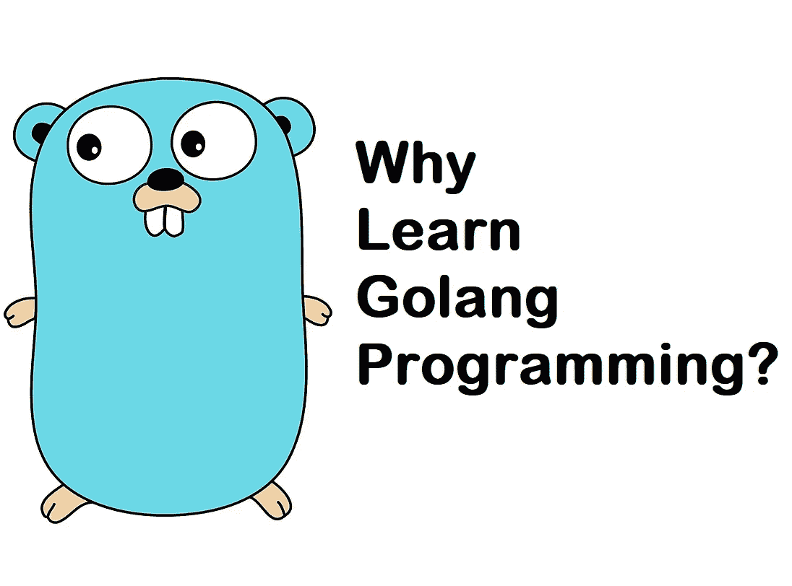
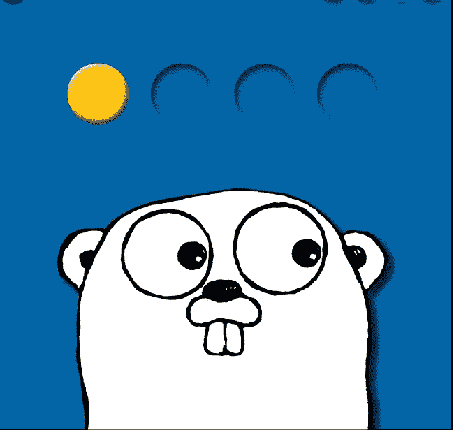
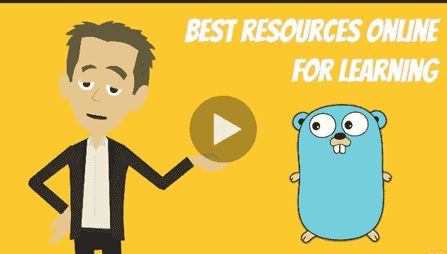
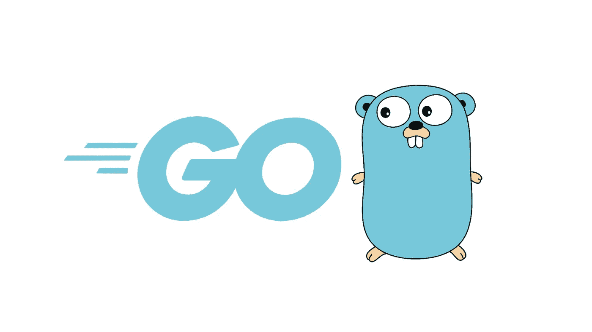
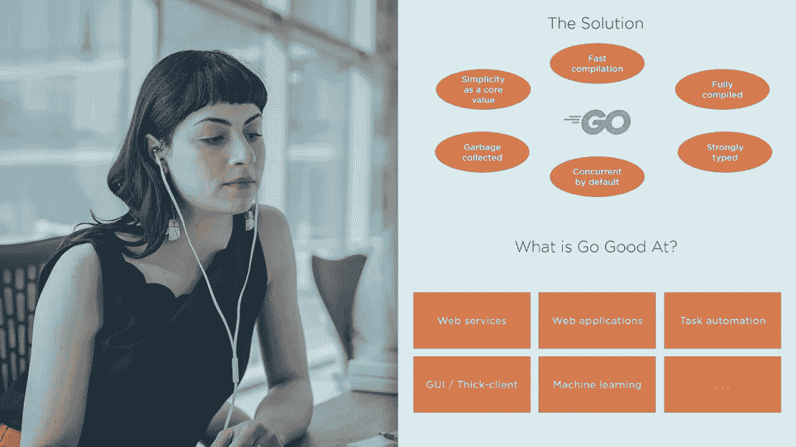
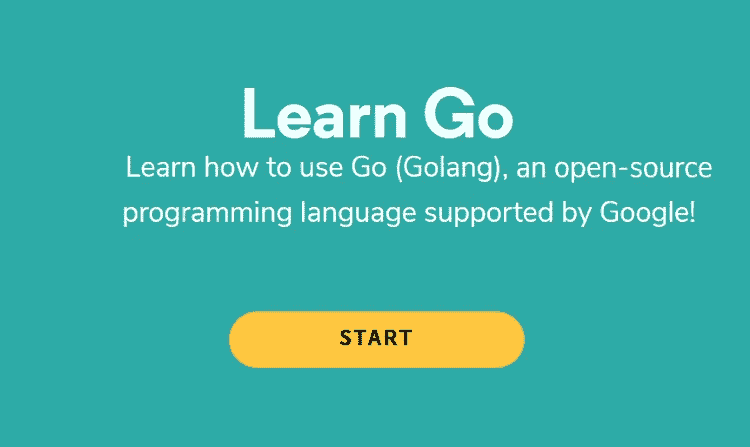
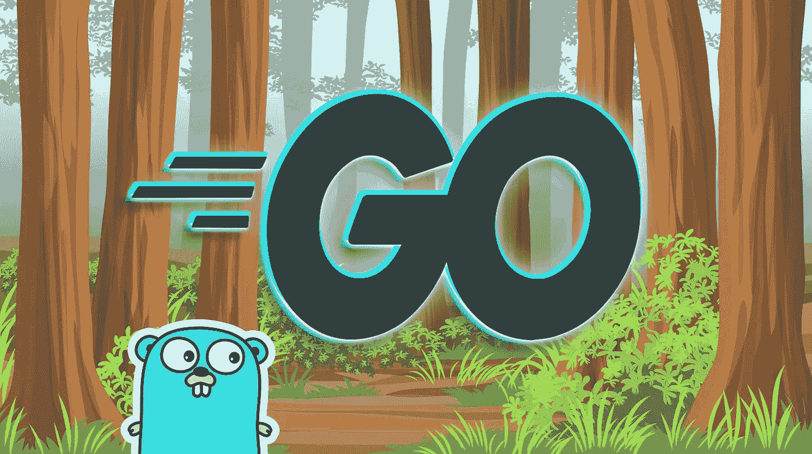

# 2023 年的 Golang 值得学吗？为什么要学习 Go 编程语言？

> 原文：<https://medium.com/javarevisited/what-is-go-or-golang-programming-language-why-learn-go-in-2020-1cbf0afc71db?source=collection_archive---------0----------------------->

## Golang 是一种受欢迎的技能和新兴的编程语言，在 2023 年学习 Golang 可以在更短的时间内开发更好的软件。

大家好，如果你想知道 Golang 是否值得学习，那么你来对地方了。早些时候，我已经分享了 2023 年需要学习的 [**最佳 Golang 课程**](/javarevisited/7-online-courses-to-learn-golang-or-go-programming-languages-in-2020-f599a25cf14a) 和 [**前 5 名编程语言**，在这篇文章中，我将谈论 Golang，这是谷歌的一种强大的编程语言，旨在提高性能和开发人员的工作效率。](/javarevisited/top-5-programming-languages-you-can-learn-in-2020-e68ab1a17af4)

我还将分享今年你可以用来学习 Golang 的最佳在线课程和教程但在我向你分享学习 Go 或 Golang 的资源之前，让我们先了解一下什么是 Go 和**为什么要在 2023 年学习 Golang？**

首先，Go 是一种开源编程语言，最初是由谷歌的一个团队开发的，其中包括 Ken Thomson，他是 UNIX 和 C 的创造者，开源社区的许多贡献者对其进行了改进。

随着摩尔定律接近其生命周期的终点，对[并发性](https://javarevisited.blogspot.com/2018/06/top-5-java-multithreading-and-concurrency-courses-experienced-programmers.html)的需求正在上升，因此，对能够有效实现并发程序的编程语言的需求也在上升。正因如此，Go 成为了最近一段时间最流行的语言之一。

Go 编程语言是谷歌为解决谷歌在**规模**开发软件的问题而设计的。谷歌每天开发数百万行代码，大部分是用 C++和大量 Java 和 Python 编写的。

软件开发发生在一个单一的源代码库中，但是从编写代码到运行在数百万台机器上的软件程序的过程是缓慢而笨拙的。

> Go 项目的目标是**消除谷歌软件开发的缓慢和笨拙**,从而使该过程更具生产力和可扩展性。

这种语言是为那些编写、阅读、调试和维护大型软件系统的人设计的。

它拥有像**从 Java** 中收集垃圾这样的现代功能，它还利用了强大的**多核计算机能力**和内置的**并发支持** t，同样类似于 [Java](https://javarevisited.blogspot.com/2018/06/top-5-java-multithreading-and-concurrency-courses-experienced-programmers.html) 。由于这些优秀的特性以及速度和可靠性，Golang 受到了全球不同类型开发者的广泛关注。他们中的许多人将它用于应用程序开发、基础设施自动化和云原生编码。

# 2023 年 Golang 或者 Go 编程语言值得学吗？

就受欢迎程度而言，Golang 也是增长最快的语言之一，这意味着学习 Go 可以打开新的机会之门，也可以帮助你在谷歌找到工作，因为他们经常使用 Go。如果你正在提高你的技术技能，这是一个很好的时间来学习基础的 [Golang](/javarevisited/7-online-courses-to-learn-golang-or-go-programming-languages-in-2020-f599a25cf14a) 。

现在你知道什么是 Go 编程语言或 Golang 了，是时候看看 2023 年学习 Golang 的最佳资源了。

**为什么学围棋**？它是由谷歌创建的，用来解决谷歌规模的问题。这使得它在解决大规模扩展挑战的其他公司中非常受欢迎。它也是过去十年中发展最快的编程语言之一。

这些因素=很好的工作前景。根据 ZipRecruiter 的数据，LinkedIn 上有 20，000 多个 Go 程序员的招聘信息(仅在美国)，他们的平均工资为 10 万美元/年。

所以，是的，2023 年及以后肯定 Golang 值得学习。学习 Golang 或 Gol 编程语言可以促进你的职业生涯，也可以帮助你在谷歌找到一份工作，这是许多软件开发人员的梦想。

如果你想在 2023 年学习 Golang，那么 [*这些 Golang 在线课程*](https://javarevisited.blogspot.com/2021/11/top-5-golang-courses-for-beginners-to.html) 是最好的资源。

# 2023 年初学者学习的 9 门最佳 Golang 编程课程

在线课程可能是像 Golang 这样学习新技术或技能的最实惠和最受欢迎的方式。以下是你可以从 [Udemy](/javarevisited/my-favorite-udemy-online-courses-for-programmers-and-software-engineers-f9d941dd0035) 、 [Pluralsight](/javarevisited/7000-free-pluralsight-courses-to-build-in-demand-tech-skills-without-leaving-your-house-40edb50a8cf2) 、 [Coursera](/javarevisited/is-coursera-plus-worth-it-review-7df4915cd326) 、 [Educative](/javarevisited/20-free-educative-courses-for-programmers-and-software-engineers-a7135028350c) 和 [CodeCademy](/javarevisited/pluralsight-or-udemy-d9a94d2e8ee) 加入的最好的在线课程。

您可以选择您想要的课程，因为该列表包含初级和高级课程以及基于文本的互动课程和您可以观看的课程。

## 1. [Go:完全开发者指南(Golang)](https://click.linksynergy.com/deeplink?id=JVFxdTr9V80&mid=39197&murl=https%3A%2F%2Fwww.udemy.com%2Fcourse%2Fgo-the-complete-developers-guide%2F)

这是另一个在 Udemy 上学习 Go 编程语言(Golang)的基础和高级特性的很棒的课程。

斯蒂芬·格里德(Stephen Grider)教授，这是一门经过深思熟虑、结构严谨的课程。这也是为数不多的几门课程之一，在这里你将学到 Golang 的一些强大而先进的特性，比如它的**并发模型**和接口类型系统。

**这里是在线加入本课程的链接** — [Go:完整的开发者指南(Golang)](https://click.linksynergy.com/deeplink?id=JVFxdTr9V80&mid=39197&murl=https%3A%2F%2Fwww.udemy.com%2Fcourse%2Fgo-the-complete-developers-guide%2F)

## 2.[围棋大师(Golang)编程:完整围棋训练营 2023](https://click.linksynergy.com/deeplink?id=JVFxdTr9V80&mid=39197&murl=https%3A%2F%2Fwww.udemy.com%2Fcourse%2Fmaster-go-programming-complete-golang-bootcamp%2F)

这是从零开始学习 Go 编程语言最好最全面的课程之一。这个课程对初学者和有经验的开发者来说都是完美的，因为它不仅教你围棋，还教你编程。

**以下是在线参加本课程的链接** — [围棋大师(Golang)编程:2023 年围棋训练营](https://click.linksynergy.com/deeplink?id=JVFxdTr9V80&mid=39197&murl=https%3A%2F%2Fwww.udemy.com%2Fcourse%2Fmaster-go-programming-complete-golang-bootcamp%2F)

## 3.[使用 Google Go 专业化进行编程](https://coursera.pxf.io/c/3294490/1164545/14726?u=https%3A%2F%2Fwww.coursera.org%2Fspecializations%2Fgoogle-golang)

你可能会有点惊讶，Coursera 还有一个由 UCI 继续教育部门提供的 Go 编程语言专业。

本专业介绍来自 Google 的 Go 编程语言，为学习者提供 Go 的特色概述。

Golang 认证包含三门课程:

1.  [Go 入门](https://coursera.pxf.io/c/3294490/1164545/14726?u=https%3A%2F%2Fwww.coursera.org%2Flearn%2Fgolang-getting-started)
2.  [围棋中的函数、方法和接口](https://coursera.pxf.io/c/3294490/1164545/14726?u=https%3A%2F%2Fwww.coursera.org%2Flearn%2Fgolang-functions-methods)
3.  [Go 中的并发](https://coursera.pxf.io/c/3294490/1164545/14726?u=https%3A%2F%2Fwww.coursera.org%2Flearn%2Fgolang-concurrency)

完成所有这些课程、测验和评估后，您还将获得一份证书。如果你只是想学习，不需要认证，也可以免费旁听这些课程。

**这是在线参加本课程的链接**——[谷歌 Go 专业化编程](https://coursera.pxf.io/c/3294490/1164545/14726?u=https%3A%2F%2Fwww.coursera.org%2Fspecializations%2Fgoogle-golang)

顺便说一句，如果你觉得 Coursera 的课程有用，因为它们是由知名公司如**谷歌**、 **IBM** 、**亚马逊**和世界上最好的大学创建的，我建议你加入 Coursera 的年度订阅计划 [**Coursera Plus**](https://coursera.pxf.io/c/3294490/1164545/14726?u=https%3A%2F%2Fwww.coursera.org%2Fcourseraplus) 。

这种单次订阅可以让你无限制地访问他们最受欢迎的**课程**、**专业**、**专业证书**和**指导项目**。它每年花费大约 399 美元，但是它完全物有所值，因为你可以获得无限制的证书。

## 4.奈杰尔·波尔顿的围棋基础

这是 2023 年在 [Pluralsight](/javarevisited/10-best-react-courses-from-pluralsight-for-beginners-and-experienced-developers-80b7c640cca3) 上学习 Golang 的另一个在线课程。如果你有 Pluralsight 会员资格，并且正在寻找一个很棒的 Golang 课程，那么你应该加入这个课程。

**这是在线参加本课程的链接** — [围棋基础](https://pluralsight.pxf.io/c/1193463/424552/7490?u=https%3A%2F%2Fwww.pluralsight.com%2Fcourses%2Fgo-fundamentals)

顺便说一句，你需要一个 [**Pluralsight 会员**](https://pluralsight.pxf.io/c/1193463/424552/7490?u=https%3A%2F%2Fwww.pluralsight.com%2Fpricing) 才能加入这个课程，费用大约是每月 29 美元，每年 299 美元(14%的折扣)，但这完全值得。另类。你也可以使用他们的 [**10 天免费试用**](https://pluralsight.pxf.io/c/1193463/424552/7490?u=https%3A%2F%2Fwww.pluralsight.com%2Flearn) 免费观看这门课程。

## 5.[继续学习代码教程](https://click.linksynergy.com/deeplink?id=JVFxdTr9V80&mid=44188&murl=https%3A%2F%2Fwww.codecademy.com%2Flearn%2Flearn-go&LSNSUBSITE=TEST)

如果你一直在网上学习，那么你可能知道[代码学院](https://medium.com/u/ec84fe9ce756?source=post_page-----f599a25cf14a----------------------)，这是互动在线学习的最佳场所之一。我使用过 [Codecademy](https://click.linksynergy.com/deeplink?id=JVFxdTr9V80&mid=44188&murl=https%3A%2F%2Fwww.codecademy.com%2Fpro%2Fmembership&LSNSUBSITE=TEST) 来学习 Python、Java、Bash 和 JavaScript，我可以说它们提供了最好的学习体验。

> **这是在线参加本课程的链接** — [继续学习代码学院](https://click.linksynergy.com/deeplink?id=JVFxdTr9V80&mid=44188&murl=https%3A%2F%2Fwww.codecademy.com%2Flearn%2Flearn-go&LSNSUBSITE=TEST)

## 6. [Go (Golang):完整训练营](https://click.linksynergy.com/deeplink?id=JVFxdTr9V80&mid=39197&murl=https%3A%2F%2Fwww.udemy.com%2Fcourse%2Flearn-go-the-complete-bootcamp-course-golang%2F)

这是另一门很好的课程。去吧，乌代米。本课程最棒的部分是它非常直观，你会发现很多动画有助于你更好地理解这个概念。

> 以下是加入本课程的链接— [Go (Golang):完整训练营](https://click.linksynergy.com/deeplink?id=JVFxdTr9V80&mid=39197&murl=https%3A%2F%2Fwww.udemy.com%2Fcourse%2Flearn-go-the-complete-bootcamp-course-golang%2F)

<https://click.linksynergy.com/deeplink?id=JVFxdTr9V80&mid=39197&murl=https%3A%2F%2Fwww.udemy.com%2Fcourse%2Flearn-go-the-complete-bootcamp-course-golang%2F>  

## 7.[学习围棋编程— Golang 初学者教程【免费】](https://www.youtube.com/watch?v=YS4e4q9oBaU)

如果你正在寻找一个学习 Golang 的免费在线课程，那么这个 freecodecamp 课程是一个很好的资源。这个课程是由迈克尔·范·西克尔创建的，他是一位多视角作者，他对 Golang、JavaScript 和 T21 的看法是正确的。

以下是您将在他的课程中学到的内容:

⭐️课程内容⭐️
⌨️ (0:00:00)简介
⌨️ (0:16:57)搭建开发环境
⌨️ (0:35:48)变量
⌨️ (0:57:05)原语
⌨️ (1:26:29)常数
⌨️ (1:47:53)数组和切片
☋( 2:17:20)映射和结构
☆000

这是免费观看本课程的链接—

你可以在 YouTube 上的免费代码营的频道上免费观看这门课程，或者就在这里，如果你需要更多的免费资源，那么你也可以查看这个为初学者提供的 [*免费 Golang 课程列表*](https://javarevisited.blogspot.com/2021/12/5-free-courses-to-learn-golang-for.html) 。

<https://javarevisited.blogspot.com/2021/12/5-free-courses-to-learn-golang-for.html>  

## 8.[围棋编程入门](https://www.educative.io/courses/introduction-to-programming-in-go?affiliate_id=5073518643380224)

本课程旨在为初学者提供详细的围棋入门知识。此外，它还阐明了 Go 与程序员习惯的传统编程语言有什么不同，以便让准备用这种语言深入研究 Go 的程序员熟悉。

> 以下是加入本课程的链接— [围棋编程入门](https://www.educative.io/courses/introduction-to-programming-in-go?affiliate_id=5073518643380224)

<https://www.educative.io/courses/introduction-to-programming-in-go?affiliate_id=5073518643380224>  

## 9. [Go 编程(Golang):完整的开发者指南](https://academy.zerotomastery.io/p/learn-golang?affcode=441520_zytgk2dn)

这是 2023 年学习 Golang 编程语言的又一门优秀课程。本课程将从零开始教你 Go 编程语言！不需要以前的经验。

正如我所说的，Golang 是一种非常好的编程语言，对于完全的初学者和更有经验的开发人员来说都是如此。

这门课程非常适合希望作为一个完全初学者学习编程的初学者，也适合希望学习 Golang 并能够在简历和工具包中添加新技能的开发人员。

任何想要学习围棋的人都可以通过构建有趣的、真实的项目来让你的投资组合脱颖而出。任何对使用 performant 编程语言构建微服务感兴趣的人也可以加入本课程。

**这里是加入本课程的链接** : [Go 编程(Golang):完全开发者指南](https://academy.zerotomastery.io/p/learn-golang?affcode=441520_zytgk2dn)

顺便说一句，你需要一个 [**ZTM 会员**](https://academy.zerotomastery.io/a/aff_c0gnlvf7/external?affcode=441520_zytgk2dn) 来观看这个课程，这个课程每月花费大约 23 美元，但也提供了许多超级吸引人和有用的课程，比如这个 [*JavaScript Web 项目:20 个项目来建立你的投资组合*](https://academy.zerotomastery.io/a/aff_c0gnlvf7/external?affcode=441520_zytgk2dn) 课程。您还可以使用我的代码朋友 10 获得您选择的任何订阅的 10%的折扣。

<https://academy.zerotomastery.io/a/aff_c0gnlvf7/external?affcode=441520_zytgk2dn>  

以上就是**什么是 Golang，为什么要学 Golang 2023**。正如我所说的，Go 被设计成可伸缩、快速、高效和使用有趣的，它得到了像网飞、优步、Codecademy，当然还有谷歌这样的公司的开发者的信任。

你可以在家里或办公室使用这些在线课程学习 Golang。它们是由 Golang 专家创建的，也受到成千上万在线开发者的信任。

您可能想查看的其他**编程资源**

*   [2023 年学习 Python 的十大课程](/better-programming/top-5-courses-to-learn-python-in-2018-best-of-lot-26644a99e7ec)
*   [面向 Java 和 DevOps 工程师的 5 门免费 Docker 课程](http://www.java67.com/2018/02/5-free-docker-courses-for-java-and-DevOps-engineers.html)
*   学习 Ruby 编程的前 5 门课程
*   [我最喜欢的初学者学习 AWS 的课程](/javarevisited/top-5-aws-training-courses-to-crack-amazon-web-service-solutions-architect-associate-certification-3f4affa8f660?source=collection_home---4------0-----------------------)
*   [学习 Java 编程的 5 门免费课程](/javarevisited/10-free-courses-to-learn-java-in-2019-22d1f33a3915)
*   [2023 年学习 JavaScript 的十大课程](https://javarevisited.blogspot.com/2018/06/top-10-courses-to-learn-javascript-in.html)
*   [深入学习 Swift 编程的 5 大课程](https://javarevisited.blogspot.com/2019/01/top-5-ios-developer-course-to-learn-ios.html)
*   [2023 年学习 Spring Boot 的 10 门课程](/javarevisited/top-10-courses-to-learn-spring-boot-in-2020-best-of-lot-6ffce88a1b6e)
*   [学习 Jenkins、Docker 和 Maven 的 10 门免费课程](/javarevisited/top-10-free-courses-to-learn-maven-jenkins-and-docker-for-java-developers-51fa7a1e66f6)
*   [2023 年学习 Java 编程的 10 门课程](/javarevisited/top-5-java-online-courses-for-beginners-best-of-lot-1e1e240a758)
*   [2023 年学习 C 编程的前 5 门课程](https://javarevisited.blogspot.com/2019/11/top-5-courses-to-learn-c-programming-in.html)
*   [2023 年学习 Kubernetes 的 7 门免费课程](/javarevisited/7-free-online-courses-to-learn-kubernetes-in-2020-3b8a68ec7abc)

感谢您阅读本文。如果你觉得这篇文章和这些在线培训课程有用，那么请与你的朋友和同事分享。

**附言——**如果你热衷于学习 Golang 但是正在寻找免费的在线培训课程，那么你也可以在 Udemy 上查看[**get going:Golang**](https://click.linksynergy.com/deeplink?id=JVFxdTr9V80&mid=39197&murl=https%3A%2F%2Fwww.udemy.com%2Fcourse%2Fgetgoing%2F)课程。这是完全免费的，你只需要一个免费的 Udemy 帐户就可以进入这个课程，现在已经有 9500 多名学生注册学习围棋了。

<https://click.linksynergy.com/deeplink?id=JVFxdTr9V80&mid=39197&murl=https%3A%2F%2Fwww.udemy.com%2Fcourse%2Fgetgoing%2F> 