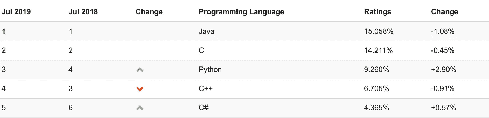
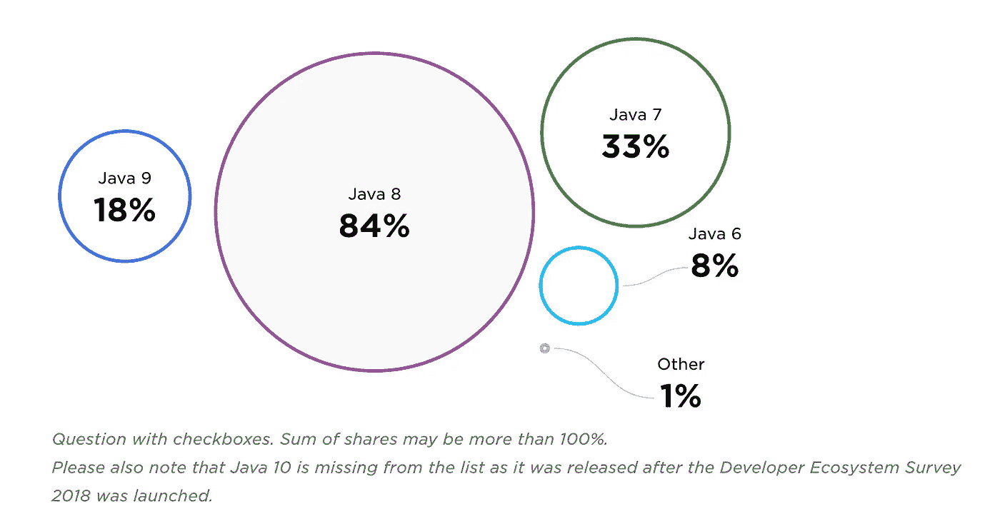
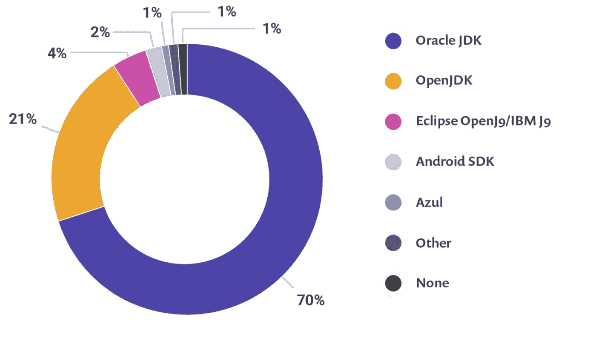

# Java 到底是怎么回事？

> 原文：<https://medium.com/javarevisited/what-is-going-on-with-java-111f92fdec3?source=collection_archive---------0----------------------->

这对于任何编程语言来说都是令人印象深刻的。我们可以估计现在至少有 50 种编程语言每天都在争夺市场的顶端。

让 Java 更令人印象深刻的是，在过去的 5 年里，它一直是市场上最受欢迎的 5 种语言之一。可以查: [TIOBE](https://www.tiobe.com/tiobe-index/) 或者 [REDMONK](https://redmonk.com/)

TIOBE 语言受欢迎程度 07-2019

为了保持 Java 仍然是一种有竞争力的语言并处于领先地位，需要进行一些改变，这种新的模型即使对于更有经验的工程师来说也会令人困惑，所以我这篇文章的目标是简化并展示正在发生的事情。

# Java 8 之前

在 Java 8 之前的 15 年里，我们只有 8 个 JDK 版本:

*   JDK 1.0(1996 年 1 月 23 日)
*   JDK 1.1(1997 年 2 月 19 日)
*   J2SE 1.2(1998 年 12 月 8 日)
*   J2SE 1.3(2000 年 5 月 8 日)
*   J2SE 1.4(2002 年 2 月 6 日)
*   J2SE 5.0(2004 年 9 月 30 日)
*   Java SE 6(2006 年 12 月 11 日)
*   Java SE 7(2011 年 7 月 28 日)

JDK 8 被认为是 Java 历史上最大和最重要的版本之一。此版本中添加的功能数量惊人，但让我们关注最重要的:

*   [λ表达式](https://javarevisited.blogspot.com/2014/02/10-example-of-lambda-expressions-in-java8.html#axzz5b2nmYJFN)
*   [方法引用](https://javarevisited.blogspot.com/2017/03/what-is-method-references-in-java-8-example.html)
*   [默认方法(Defender 方法)](https://javarevisited.blogspot.com/2014/07/default-defender-or-extension-method-of-Java8-example-tutorial.html)
*   [新的流 API。](https://www.java67.com/2016/08/java-8-stream-filter-method-example.html)
*   [可选](https://javarevisited.blogspot.com/2017/04/10-examples-of-optional-in-java-8.html)
*   [新的日期/时间 API](https://javarevisited.blogspot.com/2015/03/20-examples-of-date-and-time-api-from-Java8.html#axzz5dUGc82ss) 。

Jetbrains 发布 2018 年研究，**《2018 年开发者生态系统状况调查》，** [**此处**](https://www.jetbrains.com/research/devecosystem-2018/java/) **。在他们的 IDE 中，Java 8 是被采用最多的版本。**

但是强调一下 JAVA 9 的增长是很重要的，这也是我们在这篇文章中将要讨论的。

# Java 9 之后——新的发布模型

现在事情发展得很快，对于 Java 来说，保持每年 8 个版本是远远不够的。基于此，Oracle 决定定义一个新的发布模型，预测到 2025 年。

Oracle 将每 6 个月发布一个 JAVA 新版本，这个版本可以是 LTS 的，也可以不是 LTS 的。这意味着 JDK 将会有新的版本，但是只有在 LTS(长期支持 JDK)发布的版本，才是你可以在未来版本中期待的版本。

## 开放 JDK vs 甲骨文 JDK

OpenJDK 是 Java 平台标准版的免费开源实现。Oracle 支持开放 JDK，从现在开始，他们将拥有相同的代码库，不同的是，Oracle 可以在 Oracle JDK 上添加用于商业目的的功能。让我们看看有什么不同:

*   OpenJDK 和 Oracle JDK 目前都仅由 Oracle 创建和维护。
*   OpenJDK 和 Oracle JDK 是通过 Java 技术认证包的同一 Java 规范的实现。
*   从 [Java 11](https://www.java67.com/2018/02/5-online-courses-to-learn-java-9-better.html) 开始，前向 OpenJDK 构建将基本相同
*   JDK 的大多数供应商都是在 OpenJDK 之上编写的
*   从 JDK 11 开始，访问 Oracle JDK/Java SE 的长期支持现在需要商业许可证，以用于生产环境
*   两个 JDK 的性能应该相似。

最大的变化是**甲骨文 JDK、**[JAVA 10](https://dzone.com/articles/java-10-released-10-new-features-devs-should-know)(2018 年 7 月)将免费提供甲骨文 JDK 的最后一个免费版本，之后要在生产环境中运行甲骨文 JDK，您将需要购买商业许可证。

根据“ [JVM 生态系统报告 2018](https://snyk.io/blog/jvm-ecosystem-report-2018/) ”，让我们看看这在市场上代表了什么:

您在生产中使用哪个 Java 供应商的 JDK 来开发您的主要应用程序。

Oracle JDK 代表了某些市场 70%的生产环境，有趣的是，在不久的将来，对 OpenJDK 的需求会不断增长。

通过这种新模式，开发人员正在学习如何应对这些变化:

你打算如何应对 Java 的新发布周期？

# 结论

Java 的未来非常有希望，这种新的工作方式将使我们的生活更加有趣，每 6 个月就会有新的挑战和新的特性。我们有如此多的内部和外部变量需要考虑，以至于我个人会选择“逐个版本地决定”。“非 LTS”版本仍然允许 Oracle 根据自己的意愿删除或添加功能。

我对新 JDK 的建议是，试着升级并检查什么地方出了问题，如果你没有时间解决所有问题，在你当前的版本中编译代码，但是使用新的 JDK，享受虚拟机上的所有改进。

我希望你喜欢这篇文章中介绍的所有资源！如果你想了解更多，你还可以探索这些我最喜欢的 [**免费课程来深入学习 Java**](/javarevisited/10-free-courses-to-learn-java-in-2019-22d1f33a3915)

</javarevisited/10-free-courses-to-learn-java-in-2019-22d1f33a3915>  

# 推荐阅读

学习 Java 的其他**有用资源**你可能喜欢的
[2019 年 Java 程序员应该学习的 10 件事](https://javarevisited.blogspot.com/2017/12/10-things-java-programmers-should-learn.html?source=post_page---------------------------#axzz5atl0BngO)
[从零开始学习 Java 的 10 门免费课程](http://www.java67.com/2018/08/top-10-free-java-courses-for-beginners-experienced-developers.html?source=post_page---------------------------)
[深入学习 Java 的 10 本书](https://medium.freecodecamp.org/must-read-books-to-learn-java-programming-327a3768ea2f?source=post_page---------------------------)
[每个 Java 开发者都应该知道的 10 个工具](http://www.java67.com/2018/04/10-tools-java-developers-should-learn.html?source=post_page---------------------------)
[学习 Java 编程语言的 10 个理由](http://javarevisited.blogspot.sg/2013/04/10-reasons-to-learn-java-programming.html?source=post_page---------------------------)
[2019 年 Java 和 Web 开发者应该学习的 10 个框架【t 成为 2019 年更优秀的 Java 开发者](http://javarevisited.blogspot.sg/2018/01/10-frameworks-java-and-web-developers-should-learn.html?source=post_page---------------------------)
[2019 年要学习的 5 大 Java 框架](http://javarevisited.blogspot.sg/2018/04/top-5-java-frameworks-to-learn-in-2018_27.html?source=post_page---------------------------)
[每个 Java 开发者都应该知道的 10 个测试库](https://javarevisited.blogspot.sg/2018/01/10-unit-testing-and-integration-tools-for-java-programmers.html?source=post_page---------------------------)