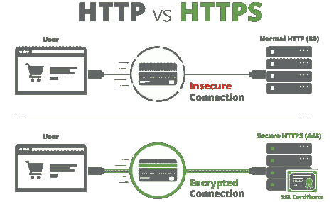

# 什么是 HTTP、HTTP(S)、SSL 穿越和 SSL 终止？

> 原文：<https://medium.com/javarevisited/what-is-http-http-s-ssl-passthrough-and-ssl-termination-fc729fe87fed?source=collection_archive---------2----------------------->

图片来源:[https://www . suntech . org . ng/suntech _ content/uploads/2018/08/benne fits-of-SSL . png](https://www.suntech.org.ng/suntech_content/uploads/2018/08/Bennefits-of-SSL.png)

在本文中，让我们看看什么是 HTTP、HTTPS、SSL 穿越和 SSL 终止。这对所有程序员来说都是一个非常重要的话题，因为它涵盖了客户机-服务器通信的基础

# 什么是 HTTP 协议？