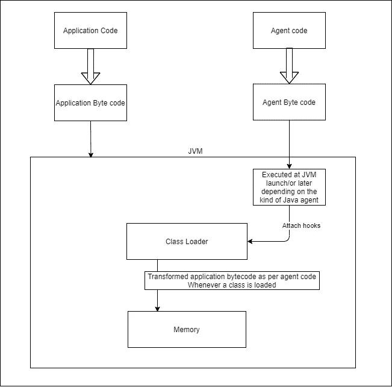
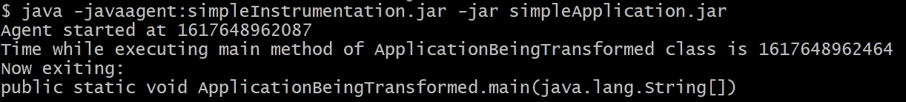

# 什么是 Java 插装？为什么需要它？

> 原文：<https://medium.com/javarevisited/what-is-java-instrumentation-why-is-it-needed-1f9aa467433?source=collection_archive---------1----------------------->

代码片段的简单解释



声明:这是一个过于简单的解释。请忽略小疏忽，谢谢。

那么，什么是 Java 插装呢？

您可能已经了解到这是一种向应用程序字节码添加额外字节码的方法。如果您想在应用程序执行时添加一些东西，而不实际接触应用程序代码，那么插装就是您想要做的。

那么，它到底为什么重要，谁使用它呢？

Java instrumentation 主要由应用程序工具(如 jaCoCO、Profilers)和监控工具(如 Datadog、Instana 等)使用。这些工具需要将它们自己附加到应用程序代码上，而不实际接触应用程序代码，因为它们没有你的应用程序代码来添加它们的功能。

想象一下，如果 10 个应用团队正在开发 10 个不同的[微服务](/javarevisited/10-best-java-microservices-courses-with-spring-boot-and-spring-cloud-6d04556bdfed)，如果他们需要从这些微服务中提取精确的简单指标，而不需要监控工具，那么他们可以编写简单的代理来单独提取这些指标。如果变得复杂，那么使用监控工具比编写特定的代理代码更容易。

那么，只有专家才能做的仪器仪表是不是很复杂？肯定没有。

这是否意味着您也应该为您的应用程序这样做？也没有。

大多数时候，[应用程序开发人员](/javarevisited/top-10-online-courses-to-become-a-fullstack-web-developer-in-2020-d608a6b63232)不需要担心插装，除非您有非常具体的企业级需求来更新应用程序代码，以便提取某些指标(或者一些其他的概要文件或任何需要的东西)。这种情况几乎从来没有过。

但是了解工具如何工作，自己开发一些工具总是很有趣的！

让我们用一个简单的例子来看看它是如何工作的。在讨论细节之前，我想在这里指出，有两种方法可以实现插装。

1.  在 JVM 启动期间，当[类加载器](https://javarevisited.blogspot.com/2012/12/how-classloader-works-in-java.html)加载应用程序时，添加代理代码
2.  在应用程序启动后添加代理代码

在这里，我选择了选项 1 进行解释。

对于应用程序代码，让我们有一个简单的 java 类，它什么也不做，只打印当前时间并退出。

让我们对此进行编译，并将其与一个清单文件捆绑到一个 jar 中，我们将其命名为 *application.mf*

```
***Main-Class***: ApplicationBeingTransformed
```

要将这个简单的应用程序代码编译并捆绑到一个 jar 中，请执行下面的

```
javac ApplicationBeingTransformed.javajar cfm simpleApplication.jar application.mf ApplicationBeingTransformed.class
```

现在，我们有一个名为 simpleApplication.jar 的 jar。

我们现在将编写一个简单的代理类，在`ApplicationBeingTransformed` 类中的方法退出时添加一个页脚。我将在这里使用 [ByteBuddy](https://bytebuddy.net/#/) 来避免样板代码。ByteBuddy 是一个出色的工具库。

在上面的代码中，我所做的是

1.  创建 premain 方法，这是 jvm 启动期间启动的代理的入口点
2.  创建一个简单的通知类，将 SysOut 语句(第 31 行)添加到方法代码的末尾。
3.  将建议类连接到仪器类，作为第 24 行中的[变压器](https://docs.oracle.com/cd/E17802_01/j2se/j2se/1.5.0/jcp/beta1/apidiffs/java/lang/instrument/Instrumentation.html#addTransformer(java.lang.instrument.ClassFileTransformer))
4.  当元素名称在第 18 行中有“ApplicationBeingTransformed”时，它将执行这种转换
5.  这个建议只有当它是一个方法时才会被访问。方法也是一个名为“ApplicationBeingTransformed”的元素。

让我们用 javac 编译它，并用一个清单文件将它捆绑到 jar 中。

```
javac -cp byte-buddy-1.10.22.jar;. SimpleInstru.javajar cfm simpleInstrumentation.jar instru.mf SimpleInstru.class SimpleInstru\$TimeFooter.class
```

我们现在有一个名为 simpleInstrumentation.jar 的代理 jar。

在 jvm 启动期间启动的代理代码中需要注意的一件重要事情是在清单文件中添加前置主类名。下面是我使用过的清单文件:

```
***Premain-Class***: SimpleInstru
***Class-Path***: byte-buddy-1.10.22.jar
```

到目前为止，我们做了什么？

1.  我们已经创建了一个应用程序
2.  我们已经创建了一个代理来向应用程序代码添加额外的一行代码

让我们现在执行并检查它看起来如何。我们有两个 jar，simpleApplication.jar 和 simpleInstrumentation.jar

我没有使用过任何复杂的打包或构建工具。因此，我需要在将要执行的目录中使用 byteBuddy jar(按照我声明的清单文件)。

与应用程序代码一起执行代理的命令。

```
java -javaagent:simpleInstrumentation.jar -jar simpleApplication.jar
```

现在，来自代理的额外一行代码被插入到应用程序代码中。我们可以从下面的执行中看到这一点:



如果我在 ApplicationBeingTransformed.java 有另一个方法，这个页脚也会添加到那里。

因此，每当调用该类中的方法时，页脚消息也会打印在控制台中，因为该页脚现在是应用程序字节码的一部分。

这里使用的代码可以在 Github: [作者的资源库](https://github.com/mrajaian/agent-static-load)中找到