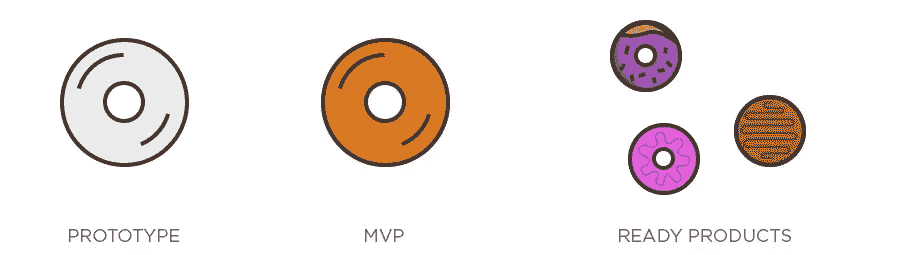

# 什么是最小可行产品(MVP)？

> 原文：<https://medium.com/javarevisited/what-is-minimum-viable-product-mvp-2d0611979d41?source=collection_archive---------5----------------------->

让我从《精益创业》中获取 MVP 的定义。

根据 lean startup 的说法，“最小可行产品是一个新产品的版本，该版本允许团队以最少的努力收集关于客户的最大量的有效信息。”——埃里克·里斯。

好的，你从定义中理解了什么吗？

也许“是”也许“不是”

如果你对定义不理解，当我第一次读《精益创业》这本书时，同样的事情也发生在我身上。

让我来解释你的 MVP 术语。

最小可行产品

MVP 的“最少”部分是关于努力的，这通常转化为 MVP 必须成功的特性的数量。问题是很难量化最小特征集应该是什么。这取决于你想把什么推向市场。

“可行的”部分意味着 MVP 应该产生利润。如果你用你的 MVP 服务你的顾客，他们应该为服务付费。事实上，这是建立 MVP 的主要原因之一——获得付费客户。

“产品”是最少争议的部分:每个人都知道产品是什么。

因此，考虑到所有三个组件的重要性，MVP 应用程序将是一个需要最少努力来构建的应用程序，并且包括足够的功能来让您的客户订阅或预购该应用程序的全功能版本

为什么是最小产品？

有了最少的产品，你可以进入市场，获得客户的反馈，学习和实施或根据客户的需求修改你的产品。

感谢 Eric Ries 带来的最小可行产品。

如果你还没有读过 Eric Ries 的《精益创业》,请读一读，这本书在 Amazon.com 有售

请继续阅读我的文章，我欢迎大家的反馈。

谢谢你

阿克什塔 H