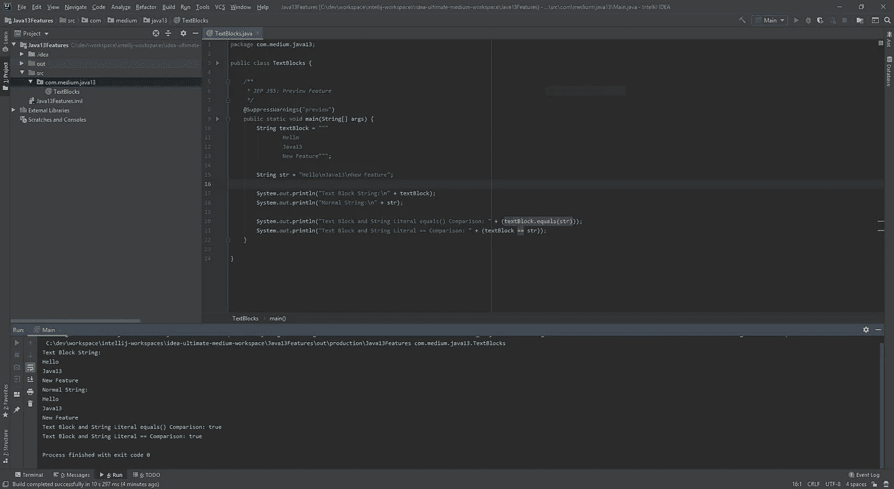
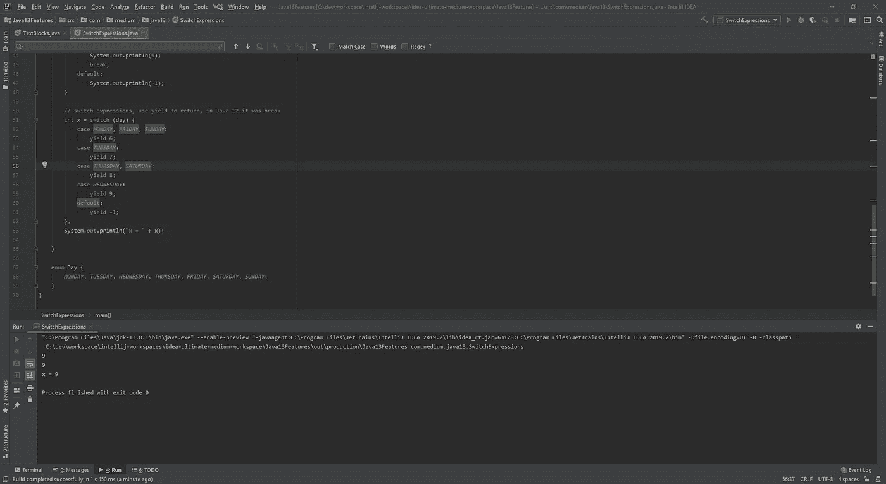

# Java 13 的新特性是什么

> 原文：<https://medium.com/javarevisited/what-is-new-in-java-13-d3d7ae7fc741?source=collection_archive---------1----------------------->

久别重逢的问候。在这篇文章中，我将告诉你 Java 13 中的文本块(JEP 355)和开关表达式(JEP 354)。


Java 13

正如您所看到的，下面列出了 Java 13 中的一些其他特性。您可以点击此[链接](https://www.oracle.com/technetwork/java/13-relnote-issues-5460548.html#NewFeature)了解关于这些功能的更多信息。

*   重新实现传统套接字 API — JEP 353
*   动态光盘存档— JEP 350
*   ZGC:取消提交未使用的内存— JEP 351
*   FileSystems.newFileSystem()方法
*   支持 Unicode 12.1
*   支持名称空间的 DOM 和 SAX 工厂？

# 如何启用对 Java 13 预览版特性的支持？

文本块(JEP 355)和开关表达式(JEP 354)是 Java 13 的预览功能。您可以通过在项目中启用预览功能设置来使用这些功能。


马库斯·斯皮斯克在 [Unsplash](https://unsplash.com?utm_source=medium&utm_medium=referral) 上拍摄的照片

如果您从命令行运行 java 程序，您可以使用`--enable-preview`开关启用它。您可以使用这个开关在启用预览功能的情况下启动 JShell。

```
$ jshell --enable-preview  
$ java --enable-preview --source 13 Test.java
```

如果您使用的是 IntelliJ IDEA，您必须在项目结构设置中设置相应的语言级别，并安装 JDK 进行编译。

如果您正在使用 Eclipse，您可以从 Java 编译器设置中启用预览功能。

# 文本块

使用这个预览功能可以很容易地创建多行字符串。多行字符串必须写在一对三重双引号内。

您可以只使用这些引号来创建这些文本块，而不需要任何其他东西。

```
public class TextBlocks {

    */**
     * JEP 355: Preview Feature
     */* @SuppressWarnings("preview")
    public static void main(String[] args) {
        String textBlock = """
            Hello
            Java13
            New Feature""";

        String str = "Hello\nJava13\nNew Feature";

        System.*out*.println("Text Block String:\n" + textBlock);
        System.*out*.println("Normal String:\n" + str);

        System.*out*.println("Text Block and String Literal equals() Comparison: " + (textBlock.equals(str)));
        System.*out*.println("Text Block and String Literal == Comparison: " + (textBlock == str));
    }

}
```

输出:



文本块输出

使用 Java 13 中的文本块，你也可以在 String 类中使用新的方法。比如`formatted(Object... args)`、`stripIndent()`、`translateEscapes()`。

# 切换表达式

在 Java 12 版本中，开关表达式作为预览特性被添加进来。我已经在这里提到了[如何在 Java 12 中使用它们](/@yigitcannalci/how-to-use-new-switch-expressions-in-java-12-8510ab9f83c3?source=friends_link&sk=da9966b5f3af9fc37cafea0f0b762574)。

除了`yield`，Java 12 版本和 Java 13 几乎一样。在 Java 13 中，`break`语句被替换为`yield`。

```
public class SwitchExpressions {

    @SuppressWarnings("preview")
    public static void main(String[] args) {
        Day day = Day.*WEDNESDAY*;

        switch (day) {
            case *MONDAY*:
            case *FRIDAY*:
            case *SUNDAY*:
                System.*out*.println(6);
                break;
            case *TUESDAY*:
                System.*out*.println(7);
                break;
            case *THURSDAY*:
            case *SATURDAY*:
                System.*out*.println(8);
                break;
            case *WEDNESDAY*:
                System.*out*.println(9);
                break;
            default:
                System.*out*.println(-1);
        }

        // from java 13 onwards - multi-label case statements
        switch (day) {
            case *MONDAY*, *FRIDAY*, *SUNDAY*:
                System.*out*.println(6);
                break;
            case *TUESDAY*:
                System.*out*.println(7);
                break;
            case *THURSDAY*, *SATURDAY*:
                System.*out*.println(8);
                break;
            case *WEDNESDAY*:
                System.*out*.println(9);
                break;
            default:
                System.*out*.println(-1);
        }

        // switch expressions, use yield to return, in Java 12 it was break
        int x = switch (day) {
            case *MONDAY*, *FRIDAY*, *SUNDAY*:
                yield 6;
            case *TUESDAY*:
                yield 7;
            case *THURSDAY*, *SATURDAY*:
                yield 8;
            case *WEDNESDAY*:
                yield 9;
            default:
                yield -1;
        };
        System.*out*.println("x = " + x);

    }

    enum Day {
        *MONDAY*, *TUESDAY*, *WEDNESDAY*, *THURSDAY*, *FRIDAY*, *SATURDAY*, *SUNDAY*;
    }
```

输出:



开关表达式输出

**注意:**你可以用这个[链接](https://github.com/ragcrix/Java13Features)从 Github 下载源代码。

学习 Java 的其他**有用资源**你可能喜欢的
[Java 程序员 2020 年应该学习的 10 件事](https://javarevisited.blogspot.com/2017/12/10-things-java-programmers-should-learn.html#axzz5atl0BngO)
[从头开始学习 Java 的 10 门免费课程](http://www.java67.com/2018/08/top-10-free-java-courses-for-beginners-experienced-developers.html)
[深入学习 Java 的 10 本书](https://medium.freecodecamp.org/must-read-books-to-learn-java-programming-327a3768ea2f)
[每个 Java 开发人员都应该知道的 10 种工具](http://www.java67.com/2018/04/10-tools-java-developers-should-learn.html)
[学习 Java 编程语言的 10 个理由](http://javarevisited.blogspot.sg/2013/04/10-reasons-to-learn-java-programming.html)
[2020 年 Java 和 Web 开发人员应该学习的 10 个框架](http://javarevisited.blogspot.sg/2018/01/10-frameworks-java-and-web-developers-should-learn.html) 成为 2020 年更优秀的 Java 开发者
[2020 年要学习的 5 大 Java 框架](http://javarevisited.blogspot.sg/2018/04/top-5-java-frameworks-to-learn-in-2018_27.html)
[每个 Java 开发者都应该知道的 10 个测试库](https://javarevisited.blogspot.sg/2018/01/10-unit-testing-and-integration-tools-for-java-programmers.html)

<https://javarevisited.blogspot.com/2019/10/the-java-developer-roadmap.html#123>  

# 感谢您的阅读！🙏你的想法对我很有价值。请随意分享。😄