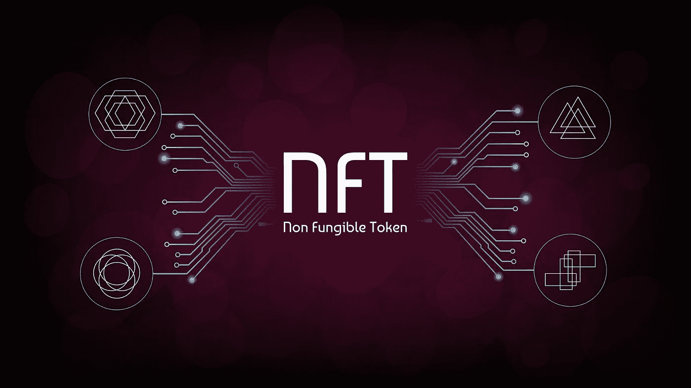
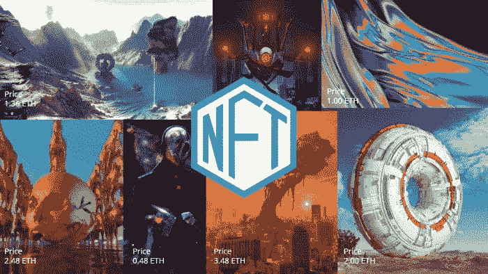

# 什么是 NFT，它有什么好处？

> 原文：<https://medium.com/javarevisited/what-is-nft-and-what-are-its-benefits-9b780239c867?source=collection_archive---------3----------------------->

作为一名社交媒体用户和技术专家，我们与家人和朋友分享许多信息图、艺术作品、笑话和其他数字资产，用于娱乐目的，让公众意识到你的创造力，或获取信息。

但是你有没有想过谁是这些资产的创造者，或者这些数字财产的来源是什么？这些问题的答案是 [NFT(不可替代令牌)。](https://www.leewayhertz.com/nft-non-fungible-token/)

第一个名为 Crypto Punks 的 NFT 于 2017 年在以太坊区块链上发布。同年，启动了另一个名为 Crypto Kitties 的项目，获得了 1250 万美元的投资。

让我们了解什么是 NFT。

# 什么是 NFT？

可替代项目表示一项资产或一项可以与同类资产进行交易或交换的项目。相比之下，不可替代资产是独特的，它们的所有权可以在区块链平台上追踪。

不可替换令牌是用于拥有代表各种有形和无形项目(如绘画、明信片、视频、虚拟房地产等)的商品或资产的数字资产或数字证书。非功能性交易不能等同于或复制为普通资产，因为每个 NFT 资产都是独一无二的。

拥有一个数字收藏品比拥有一个实体收藏品更有好处。每个 NFT 包含可区分的信息，使其不同于其他 NFT，并使收藏品的真实性更容易。

# NFTs 的历史

彩色硬币被认为是第一个存在的 NFT。它们是 T2 区块链 T3 上真实世界资产的描述。据说有色硬币为 NFTs 奠定了基础。在这些硬币之后，以太坊上稀有人物的交易成为了 NFT 计划，在这之后，第一个名为加密朋克的 NFT 被释放。

过了一段时间后，稀有比特成为了 NFT 的市场，并获得了 600 万美元的投资。

由于多种原因，NFT 正被用于多个行业。首先，NFT 的完整数据安全地保存在[区块链](/javarevisited/7-free-courses-to-learn-blockchain-in-2020-764e66b47ebe?source=---------5------------------)上，这意味着令牌永远不会被移除、复制或销毁。它们是不可分割的，因为它们不能被分成更小的面额。使用区块链功能，可以轻松地追溯到 NFT 的实际所有者，并且无需第三方验证。

# 不可替换令牌的一些独特特征是什么？

**1。不可互操作**

由于大多数 NFT 遵循 ERC-721 标准，它们被认为是不可互操作的，这意味着存储在其中的信息不能以任何方式使用或交换。

**2。坚不可摧**

NFT 通过[区块链](https://javarevisited.blogspot.com/2020/07/top-5-online-courses-to-learn-blockchain.html#axzz6tFYADc00)进行存储和管理，从而提高了安全性。这意味着无论如何都不能移除或销毁它们。

**3。稀有**

目前，全球非森林交易的总数很少，这使得它们很少，并提高了它们的价值。NFT 的数量越少，价格就越高。

**4。独特的**

NFT 使用区块链来确定艺术的真实性。它使你能够区分原始对象和它们的复制副本。

尽管 NFT 仍处于发展的早期阶段，许多人正在投资 NFT 以获得声望。如果你也计划建立一个 NFT 或 NFT 市场的解决方案，你应该联系一个 [NFT 发展公司](https://www.leewayhertz.com/nft-development-company/)来帮助你成功地启动它。

**你可能喜欢的其他文章:**

</javarevisited/best-blockchain-courses-and-certification-in-2020-63729f8f04d0> 