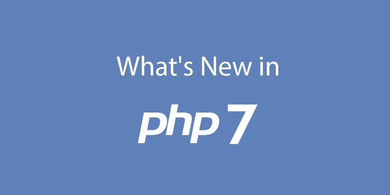

# 什么是 PHP &你应该学习 PHP 的理由

> 原文：<https://medium.com/javarevisited/what-is-php-reasons-you-should-learn-php-38f898a8e287?source=collection_archive---------1----------------------->

**PHP** :超文本预处理器(Hypertext Preprocessor)是一种通用编程语言，最初是为 web 开发而设计的。

学习 PHP

任何从事开发和编程工作的人都听说过 PHP，即使他们没有使用过，他们也肯定听说过。然而，我们在这里不是要看 PHP 是否流行(我们已经知道它是流行的)，但是问题是，你应该学习它吗，或者更确切地说，它适合你吗？

让我们言归正传。为了了解 PHP 是否适合你，我们必须先了解什么是 PHP。

# PHP 是什么？

PHP，最初是个人主页的首字母缩写，是由拉斯马斯·勒德尔夫在 1995 年为他自己的个人主页开发的，你猜对了。他用 C 语言编写了 CGI(公共网关接口)程序，并用 web 表单对其进行了扩展，以便它们可以与数据库进行通信。这是 PHP 作为一种语言的开始。

从那里，它可以用来构建简单但动态的 web 应用程序。为了改进代码，Lerdorf 公开了他的创造，这就是我们今天拥有 PHP 的原因。现在，PHP 不再代表个人主页，而是超文本预处理器的递归首字母缩略词。

服务器端编程语言（Professional Hypertext Preprocessor 的缩写）

[PHP7](https://www.eduonix.com/courses/Web-Development/the-complete-php-7-guide-for-web-developers#utm_source=medium&utm_medium=social&utm_campaign=sdaprl) 是 PHP 的最新版本，也是目前 web 上最常用的服务器端脚本语言。它也可以作为一种通用编程语言，从头开始构建网站和应用程序。

PHP 的最新版本经过优化，比旧版本更快更好，被称为 PHP 下一代(phpng)。通过重构 Zend 引擎，PHP 使用了更紧凑的数据结构，改进了缓存局部性，同时保持了近乎完全的语言兼容性。

# **PHP 7 的特点**

*   **速度**—Zend 引擎和 PHP 代码库的重构降低了内存消耗，提高了性能，使 PHP 7 更快。
*   **类型声明—** 用户现在可以设置类型声明，以便 PHP 确切地知道如何处理代码，从而减少错误，提高代码的可读性。标量类型提示&返回类型声明是 PHP 7 支持的两种声明类型。
*   **错误处理—** 最初致命的错误会暂停脚本，但在 PHP 7 中，它现在会抛出一个异常，以便编码人员确切地知道错误是什么以及如何修复它。
*   **新运算符—** 引入了两个新运算符，宇宙飞船运算符&零合并运算符。宇宙飞船运算符由小于、等于和大于三个运算符组合而成。执行时，它单独检查每个操作符，最适合用于排序。Null Coalesce 运算符是虚构的 if-set-or。如果不为空，它将返回左操作数，否则将返回右操作数。
*   **Easy User-land cs prng—**User-land 是指内核外部的应用空间，受权限分离保护，API 是 PHP 中一个易于使用且可靠的密码安全伪随机数生成器。

# 那么，该不该学 PHP 呢？

如果你想建立强大的动态网站和应用程序，那么 PHP 是开发者可以使用的最好的语言之一。它不仅易于学习和理解，还能让你对你的网站有更大的掌控力。

有许多不同的方法可以让你开始学习 PHP，在线和离线。如果你是一个经验丰富的开发者，你可以参考 [PHP 文档](http://php.net/manual/en/getting-started.php)来帮助你入门。但是，如果你是一个新手，你可以使用这个完整的 PHP 7 指南来帮助你成为 PHP 7 的专业人士。

快乐学习！