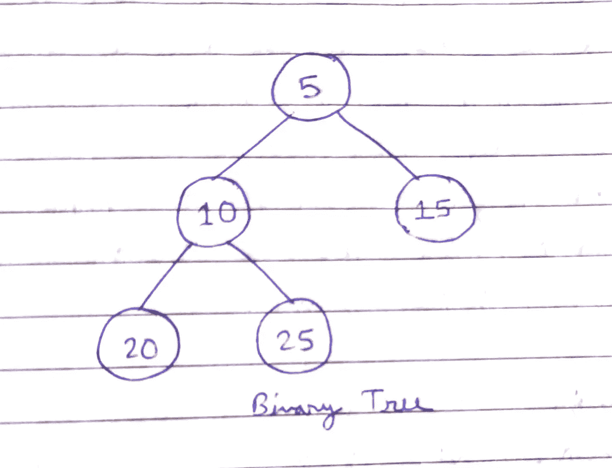
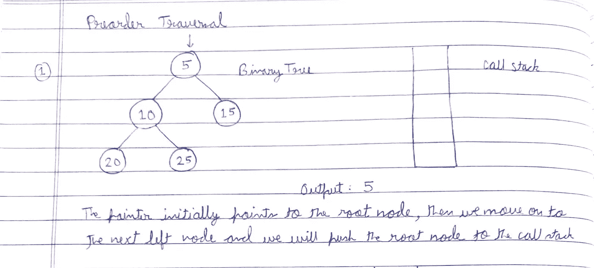
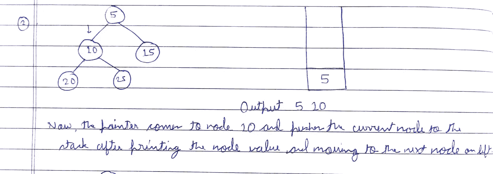
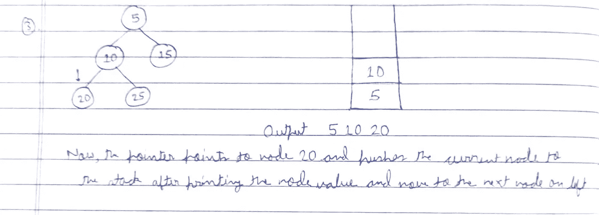
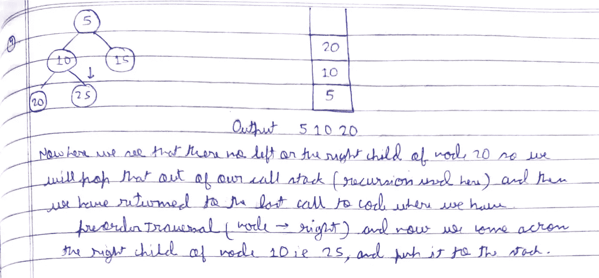
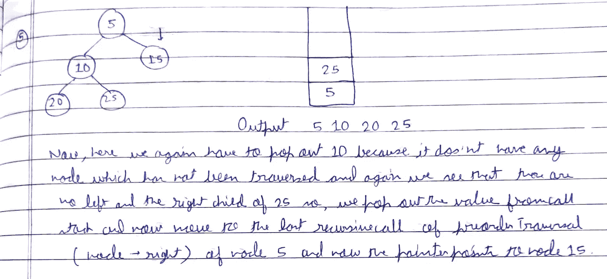
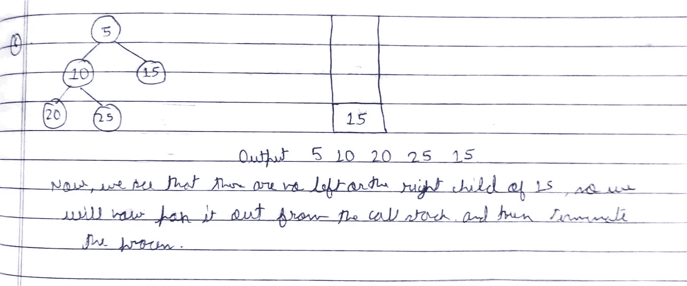

# 什么是递归，它是如何工作的？

> 原文：<https://medium.com/javarevisited/what-is-recursion-and-how-does-it-work-ea20f1b4e697?source=collection_archive---------2----------------------->

你们在看任何一种编程语言的代码时，有没有注意到一个被定义的函数在它自己的定义中被应用？也许你只是忽略了这一点，啊！只是函数调用，那是什么我必须做的？

嗯，这是编程中最重要的概念之一，基本上当你谈到[数学](/javarevisited/5-best-mathematics-and-statistics-courses-for-data-science-and-machine-learning-programmers-bf4c4f34e288)和[计算机科学](/javarevisited/8-best-computer-science-courses-for-beginners-to-learn-online-696379aa4e96)的时候，其中一个函数直接或间接调用它自己，或者一个被定义的函数在它自己的定义内被应用。

现在，我们中的大多数人已经编写了涉及编写**递归** **函数**的代码，但是在编写定义良好的**递归函数**之前，我们需要记住以下两个非常重要的**条件，它们是:**

1.  对于我们的函数，**递归函数**的**基础用例**显然定义了无限数量的函数调用，因此为了在某个步骤结束函数调用，您将需要一个**基础用例**来完成同样的任务！
2.  **递归步骤**现在，要到达基本情况，您需要一个**递归步骤**，它将最终导致**基本情况**并终止流程。

[](https://javarevisited.blogspot.com/2021/11/top-5-courses-to-learn-recursion-for.html)

你可能听说过**斐波那契数列，**这是**递归**的最好例子之一

```
Fib(0) = 0 as base case 1
Fib(1) = 1 as base case 2
For all integers *n* > 1, Fib(*n*) = Fib(*n* − 1) + Fib(*n* − 2)
```


现在，让我们来看看并了解一下[递归如何工作](https://javarevisited.blogspot.com/2012/12/recursion-in-java-with-example-programming.html)，尽管研究**递归函数**并写下解决各种算法问题的代码</javarevisited/50-data-structure-and-algorithms-interview-questions-for-programmers-b4b1ac61f5b0>****很容易，但你有没有尝试去理解它，看看它在屏幕后面实际上是如何工作的，以及你如何做出必要的改变来操纵你的函数来执行一些不仅仅是刚刚提到的事情？好吧，如果不是，那么不要担心！我将通过一个二叉树的**前序遍历的例子使你的工作变得容易，并帮助你理解它实际上是如何工作的！******

****现在，在跳转到我们的代码和理解更多关于**递归之前，**让我们来看看一个新术语，即**递归堆栈或调用堆栈******

## ****定义:****

******调用栈**与我们在解决各种**算法问题时可能用到的东西非常相似，**即 [**栈**](https://javarevisited.blogspot.com/2022/02/-stack-and-queue-data-structure-interview-questions.html) **，**我们都知道，它使用 **LIFO 规则**来执行函数，这代表**后进先出，**你可以一个接一个地添加东西，并从中取出最近添加的项目！在移动到 [**前先序遍历**](https://javarevisited.blogspot.com/2016/07/binary-tree-preorder-traversal-in-java-using-recursion-iteration-example.html#axzz6dXsEfLvJ)**让我们知道，什么是前序遍历？******

## ********定义:********

********前序** **遍历**是一种在**二叉树**中遍历的方式，我们从**根节点**开始，遍历每个**级**的**父节点**的**左子节点**，然后到达其**右子节点。********

```
**Algorithm:
1\. Visit the root.
   2\. Traverse the left subtree, i.e., call Preorder(left-subtree)
   3\. Traverse the right subtree, i.e., call Preorder(right-subtree)**
```

## ****前序遍历代码****

****现在，让我们看一下代码:****

```
****void** preorderTraversal(**struct** node* node){**if** (node == NULL)
   **return**;/* first print data of node */
cout << node->val << " ";/* recursion performed on left subtree */
preorderTraversal(node->left);/* now perform recursion on right subtree */
preorderTraversal(node->right);}**
```

****现在，让我们看看二叉树的**前序遍历**并理解**递归**是如何工作的！****

****[](https://www.java67.com/2022/01/how-to-find-maximum-sum-level-in-given-binary-tree-java.html)

图 0.0:一棵二叉树**** 

****现在，我们已经给出了如上图所示的 [**二叉树**](https://javarevisited.blogspot.com/2015/10/how-to-implement-binary-search-tree-in-java-example.html#axzz7DyRjLUX9) ！****

****[](https://javarevisited.blogspot.com/2016/12/how-to-count-number-of-leaf-nodes-in-java-recursive-iterative-algorithm.html)

图 1.1**** 

****现在，在**的第一步中，**我们在左侧有一个**二叉树**，在右侧有一个**调用栈**，现在指针指向**根节点**，如图所示，我们移动到**根节点的**左子节点，并将**根节点**推送到我们的**调用栈******

********

****图 2.2****

****在**第二步中，**我们将**当前节点**推入**调用栈**并移动到其**左侧子节点******

****[](https://dev.to/javinpaul/21-binary-tree-interview-questions-for-programmers-42bh)

图 3.3**** 

****在**第三步中，**我们将**当前**最后**左节点**推到堆栈中，并移动到其**左子节点******

****[](https://www.java67.com/2016/07/binary-tree-preorder-traversal-in-java-without-recursion.html)

图 4.4**** 

****在**的第四步中，**我们可以观察到既没有 20 的**左孩子**也没有**右孩子**，所以我们将弹出当前节点并且**递归地**移动到代码行**preorder traversal(node->right)**，其中节点 10 的**右孩子**被推送到我们的**调用堆栈，******

****[](https://www.java67.com/2016/07/how-to-implement-preorder-traversal-of-binary-tree-in-java.html)

图 5.5**** 

****在下一个 **pre final 步骤中，**由于我们没有 25 的**左**或**右**子节点**，我们将弹出当前节点，并将**递归地**移回**根节点的右子节点** 15，并将其推入**调用栈，**和**弹出**根节点**5】********

**[](https://www.java67.com/2021/07/recursion-programming-exercises-in-java.html)

图 6.6** 

**在**最后一步**中，我们再次看到，没有节点 15 的**左**和**右**子节点，所以我们**弹出当前节点**并得到如上图所示的输出，这是我们的最终输出。**

**所以，你可以很容易地理解**递归**是如何工作的，还有更多**递归的例子，**我试图用一种简单的方式来解释它，通过一个许多学生在编写 [**二叉树**](https://www.java67.com/2020/02/top-40-binary-tree-interview-questions.html) **代码时面临的复杂问题。****

**继续学习，继续成长，继续探索！**

**祝一切顺利！**

**更多有趣和信息丰富的文章和提示请关注我的 [**Medium**](https://swapnilkant11.medium.com/) **和**[**Linkedin**](https://www.linkedin.com/in/swapnil-kant-279a3b148/)**

**<https://javarevisited.blogspot.com/2021/09/top-10-recursion-interview-questions.html?m=0> **