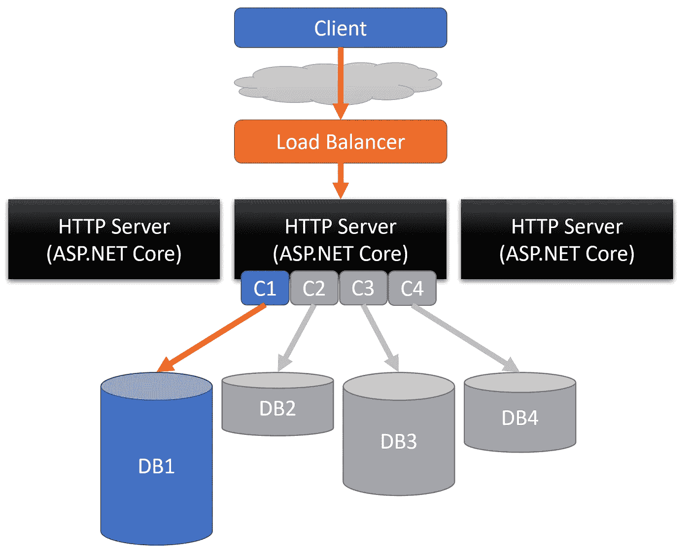

# 什么是微服务中的服务发现？

> 原文：<https://medium.com/javarevisited/what-is-service-discovery-in-microservices-15a2333bc1db?source=collection_archive---------0----------------------->

图片鸣谢:[https://i0 . WP . com/www . dineshonjava . com/WP-content/uploads/2019/07/discovery-service . png？fit=610%2C512 & ssl=1](https://i0.wp.com/www.dineshonjava.com/wp-content/uploads/2019/07/discovery-service.png?fit=610%2C512&ssl=1)

大家好。在本文中，让我们来看看[微服务架构](/javarevisited/8-best-online-courses-to-learn-service-oriented-soa-and-microservices-architecture-94c01d6b94e6)中的服务发现。

## 整体建筑

图片来源:[https://code opinion . com/WP-content/uploads/2020/12/scale 4 . png](https://codeopinion.com/wp-content/uploads/2020/12/scale4.png)