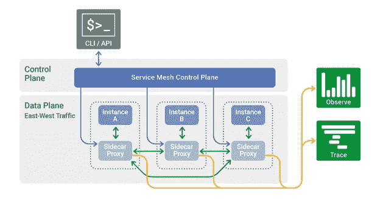

# 什么是服务网格？—特使代理简介

> 原文：<https://medium.com/javarevisited/what-is-service-mesh-an-introduction-to-envoy-proxy-379c667106e6?source=collection_archive---------1----------------------->

## 服务网格和特使架构介绍的优势是什么？

[https://www . nginx . com/WP-content/uploads/2019/02/service-mesh-generic-topology . png](https://www.nginx.com/wp-content/uploads/2019/02/service-mesh-generic-topology.png)

# **什么是服务网格？**

服务网格是微服务设置中的通信层。所有往来于每个服务的请求都将通过网格。每个服务都有自己的…