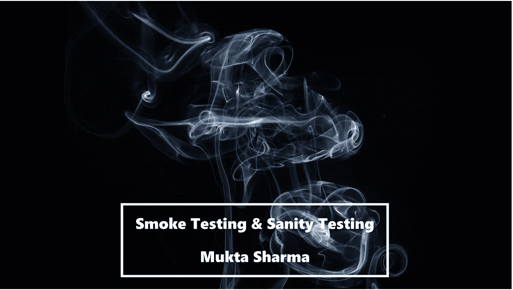

# 什么是冒烟和健全性测试？这些一样吗？这些不一样吗？

> 原文：<https://medium.com/javarevisited/what-is-smoke-sanity-testing-are-these-same-are-these-different-6ac7263f347a?source=collection_archive---------0----------------------->

图片来源:[黄贯中](https://unsplash.com/@paul_wong?utm_source=unsplash&utm_medium=referral&utm_content=creditCopyText)在 [Unsplash](https://unsplash.com/s/photos/smoke-testing?utm_source=unsplash&utm_medium=referral&utm_content=creditCopyText) 上的照片

在一些组织中，**冒烟**和**健全性**测试是相同的，然而，在其他组织中，这些测试被认为彼此略有不同。

在我之前的一个组织中，我们认为他们是不同的。你知道它们之间有细微的差别吗… **如何**？让我解释一下: