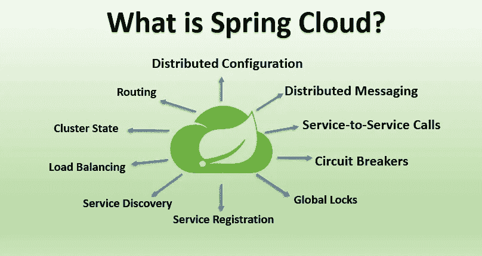

# 什么是春云，它与春天和 Spring Boot 有什么不同？

> 原文：<https://medium.com/javarevisited/what-is-spring-cloud-and-how-it-is-different-from-spring-and-spring-boot-128d276a1432?source=collection_archive---------0----------------------->

春天的云

大家好。让我们在这篇文章中讨论春云。像[春](/javarevisited/how-to-learn-spring-framework-spring-mvc-spring-boot-and-spring-security-best-resources-202e7f6ab3c8)、 [Spring Boot](/javarevisited/top-10-courses-to-learn-spring-boot-in-2020-best-of-lot-6ffce88a1b6e) 、[春云](/javarevisited/5-best-courses-to-learn-spring-cloud-and-microservices-1ddea1af7012)等等的术语很多。在我们跳进春云之前，让我们先看看春天和 Spring Boot。

## 弹簧框架