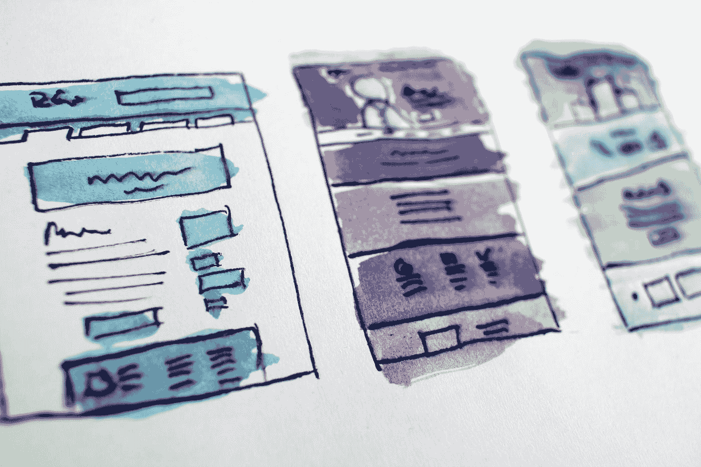
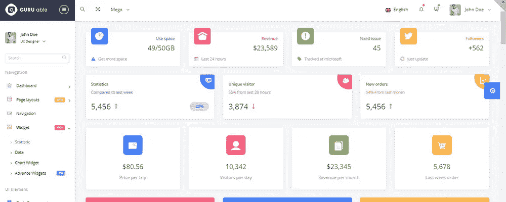
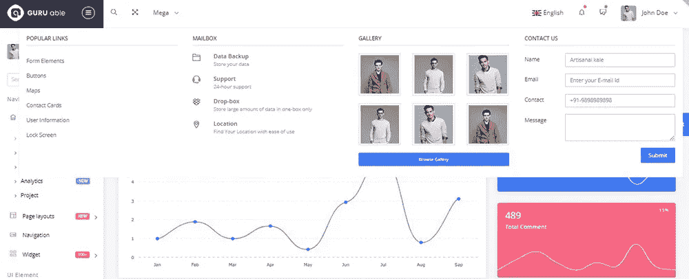
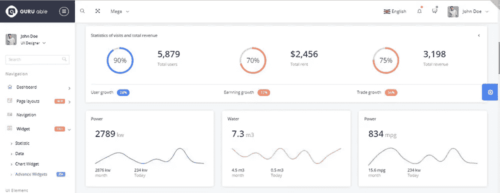
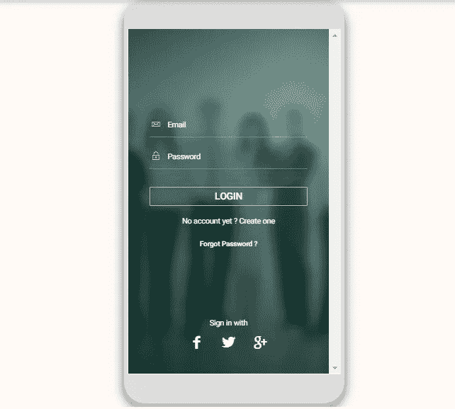
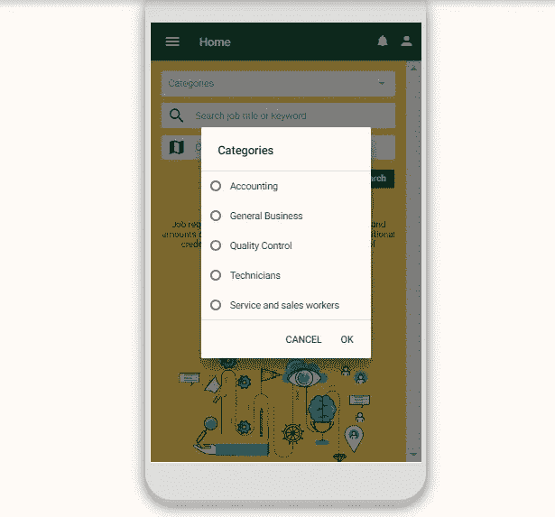
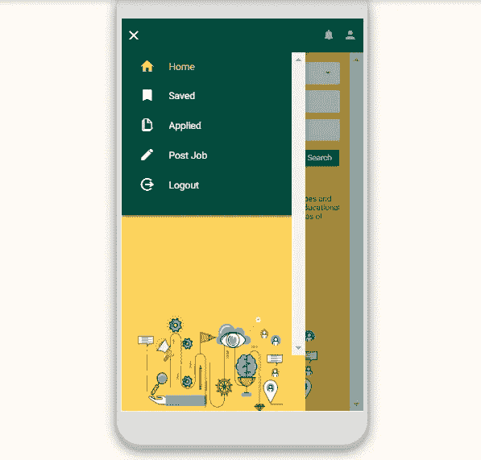

# 什么是管理角度模板？

> 原文：<https://medium.com/javarevisited/what-is-the-admin-angular-template-bd57bd148760?source=collection_archive---------1----------------------->

哈尔·盖特伍德在 [Unsplash](https://unsplash.com?utm_source=medium&utm_medium=referral) 上拍摄的照片

Web 应用程序是一个快速发展的领域，有许多相互竞争的标准，这些标准不断地自我创新，并基于它们的能力来更好地服务于它们的功能，并且总是在增加它们能够做事情的数量、速度和效果。

随着人们开始期望从他们的网站和应用程序获得更多更好的行为，高质量的解决方案堆栈对于大多数基于网络或基于应用程序的软件的成功部署变得至关重要。**管理仪表板模板**有助于完成这项任务。

## 什么是管理角度模板？

**angular template**是一个 JavaScript 开源前端 web 应用框架。它主要是由 Google，以及一个扩展的个人和公司社区支持的，以解决开发单页面、跨平台、高性能应用程序时面临的许多挑战。它是完全可扩展的，并且与其他库配合良好。 **Angular theme** 是一款出色的工具，可以:

*   使您能够更快、更轻松地创建软件。
*   从而产生更易维护软件。
*   鼓励良好的编程实践和设计模式，如 MVC。
*   允许您更轻松地与其他人协作。
*   让你在合理的时间内变得精通。
*   解决你的软件架构中可能出现的问题，比如依赖注入，DRY(不要重复自己)等。

**模板**用于定义一个组件视图。一个模板看起来像**常规的 HTML** ，但也有一些不同。像 ***ngFor、{{hero.name}}、(click)** 和**【hero】**这样的代码使用角度模板语法来增强 HTML 标记功能。模板也可以包含定制组件，比如非常规 HTML 标签形式的<定制元素>。这些组件在相同的布局中与原生 HTML 无缝混合。

<https://javarevisited.blogspot.com/2019/04/10-free-angular-and-react-courses-for.html>  

# 怎样才能得到有角度的模板？

管理角度设计的市场已经饱和。一些公司通过市场销售模板，许多其他公司通过他们的商店销售。如果您想为大公司开发应用程序，请选择一个设计严谨、客户记录良好、文档清晰、支持响应速度快的管理面板。这里有一些带有 **Angular 管理模板**的源代码，你可以用它们为你的 web 应用程序创建一个优秀的管理面板。

# [模板怪兽](https://www.templatemonster.com/templates.php?sort=relevant&text=angular?aff=javarevisited&utm_campaign=blog_site_angular&utm_source=javarevisited&utm_medium=referral)

在 TemplateMonster marketplace 上，你可以买到价格实惠的数码产品，这为你提供了能够控制内容、外观、功能或任何其他方面的优势。这意味着你可以自己编辑大部分内容。他们模板的特点:

*   现场定制选择，什么适合你的项目愿望。
*   结构良好的代码风格
*   全面响应和浏览器兼容性测试设计。
*   引人注目的颜色风格
*   专为高性能和高美学标准而打造

**价格:**16 美元起。

# 主题森林

森林是环境市场的一部分。在 ThemeForest，你可以买卖[网站创建模板](https://www.motocms.com/website-templates/?aff=javarevisited&utm_campaign=blog_site_angular&utm_source=javarevisited&utm_medium=referral)以及流行的 CMS 产品的主题，如 WordPress、Joomla、Angular 模板等等。项目的价格取决于文件的复杂程度、质量和用途。他们模板的特点:

*   纯打字稿。
*   现场定制选择什么设置您的项目需要。
*   嗯，结构化代码。
*   全面响应和浏览器测试设计。
*   引人注目的颜色风格。
*   他们是为性能和高审美代码。

**价格:**14 美元起。

# [WrapPixel](https://www.wrappixel.com/templates/category/angular-templates/)

从 2016 年开始，WrapPixel 现在已经发展成为一个由 7 名成员组成的完整团队，现在专注于提供高质量的引导管理响应模板、角度管理模板和 web UI 工具包，以及出色的技术支持和实时聊天支持。他们模板的特点:

*   惰性装载
*   模块化组件
*   动态路由过滤
*   UI 元素
*   黑暗模式
*   样本页面

**价格:**39 美元起。

# [WrapBootstrap](https://wrapbootstrap.com/search?q=angular)

WrapBootstrap 是一个市场，设计师可以在这里出售他们基于 **Bootstrap 框架**的模板和主题。Bootstrap 已经在开发人员中得到广泛采用，许多人表达了他们对除默认风格之外的设计定制的渴望。他们模板的特点:

*   设计质量
*   代码质量
*   易于安装
*   文件质量

**价格:**8 美元起。

# [NGX-Admin](http://akveo.github.io/ngx-admin/)

基于 Angular 8+、Bootstrap 4+和支持 [Eva 设计系统](https://eva.design/)的 [Nebular](https://akveo.github.io/nebular) 的最受欢迎的管理仪表板。用于个人和商业目的的免费开源软件。再也不要从头开始。[集成现成的解决方案:ngx-admin 与后端](https://store.akveo.com/collections/all)。他们模板的特点:

*   00 多个与后端服务集成的 UI 组件
*   针对手机优化
*   用于定制的三个主题和两个仪表板
*   后端集成捆绑包。NET，Node.js，Ruby，PHP
*   现成的解决方案或增加增量功能

**价格:**39 美元起。

# [创意-蒂姆](https://www.creative-tim.com/templates/angular)

这是一家专门为 Bootstrap 构建高质量 UI 套件和仪表板的初创公司。他们模板的特点:

*   易于安装
*   文件质量
*   唯一页面的数量
*   更新
*   支持质量

**价格:**49 美元起。

# [科瑞](https://coreui.io/angularjs/)

CoreUI admin dashboard 提供了一系列可响应、可定制和可重用的组件，您需要这些组件来创建现代、美观、响应迅速的应用程序。他们模板的特点:

*   管理面板模板
*   易于安装
*   CoreUI 3 库
*   CoreUI 3 免费管理模板
*   CoreUI 3 Pro 演示

**价格:**49 美元起。

# [平面逻辑](https://flatlogic.com/templates/angular)

Flatlogic 使用趋势网络技术和数据科学，在我们的管理模板基础上，为各行各业的许多企业从头开始创建网络和移动应用程序。他们模板的特点:

*   前端+后端节点
*   超过 30 个独特的页面
*   认证系统
*   完全响应
*   Angular 8.0 全新
*   完整记录的代码库

价格:59.95 美元起

# 角度模板示例

# [Guru Able Bootstrap 2 — Angular 4 倒打字稿版本管理模板](https://www.templatemonster.com/admin-templates/guru-able-bootstrap-4-angular-4-pure-typescript-version-admin-template-65839.html?aff=javarevisited&utm_campaign=blog_site_angular&utm_source=javarevisited&utm_medium=referral)

这一项被称为最强大的 Bootstrap 4 & Angular 4 模板。它具有令人印象深刻的功能，并有一个精简版。你可以免费试用，看看一切是如何运作的。Guru Able 软件包包含 35 个演示，包括以下内容:

*   主页，
*   紧凑的侧栏，
*   全角 CLI 4，
*   菜单多样，
*   RLP 演示等。

使用这些现成的设计来上传自定义内容。或者您可以创建新的样式作为替代。Guru Able 为用户提供了快速拖放编辑器和实时预览。有了它，您可以进一步管理网站的过程。此外，这将更容易让你避免犯常见的错误。以下是 Guru Able 快速创建布局的元素:

*   200 多种页面布局，
*   1200 多个 UI 组件，
*   100 多个集成插件，
*   300 多个部件，
*   6 种配色方案，
*   黑暗和光明模式。

更重要的是，Guru Able 包括直播风格切换器。使用该功能可以在几秒钟内选择和调整页面样式。这个过程就像 ABC 一样简单。你不需要编码或类似的东西。顺便说一下，颜色并不是唯一可以用 Guru Able 轻松定制的东西。在预先设计的主题布局中，有:

*   折叠+方框布局，包括五种背景图案，
*   具有五种不同选项的水平布局，
*   深色布局，丰富的颜色选择，
*   150 多张图表和地图，
*   50 多种形式，
*   维护页面，
*   易读的字体。

众所周知，网络用户更喜欢制作精美的在线项目。你应该关注最新的网页设计趋势，以便脱颖而出。为了节省您的时间，Guru Able 会定期更新。一旦出现新功能或附加组件，您就可以自动安装它们。它是免费的。

通过购买 Guru Able，您可以获得一个突破性的管理面板，它非常易于使用。该项目包包括大型菜单，以便您可以管理任何共谋的一部分。在网站菜单设计中添加图像、联系方式和视觉效果非常简单。此外，您可以使用下拉菜单或同时使用这两种菜单。最后一个允许在展示很多细节的时候保持网站的简约。它改善了网站导航，使你的项目更加面向访问者。他们说最重要的是让网站访问者立即找到需要的页面。在 Able 大师的帮助下，你可以做到更多。

# [乔布斯 App 模板](https://www.templatemonster.com/app-templates/jobs-app-template-77089.html?aff=javarevisited&utm_campaign=blog_site_angular&utm_source=javarevisited&utm_medium=referral)

[3.325 亿](https://www.millforbusiness.com/how-many-websites-are-there/#how-many-domain-names-are-there)是 2017 年域名注册数。你能想象从那时起它增加了多少吗？今天，任何商业领域都需要一流的网站。你一定有很多竞争对手。这就是为什么它是至关重要的优化您的网站，以满足他们的需求。

尽管如此，网站建设并不是你脱颖而出的唯一途径。有不同的移动应用程序模板可用于有价值的商业展示。为什么您可能想要使用其中一个？查看下面的[数据](https://buildfire.com/app-statistics/)。

1.  27 亿是全球智能手机用户的数量。
2.  到 2020 年，手机应用程序预计将产生近 1900 亿美元的收入。
3.  谷歌 Play 商店有 280 万个应用程序可供下载。
4.  AppStore 有 220 万个应用可供安装。
5.  半数千禧一代每天打开应用程序至少 50 次。
6.  49%的用户每天访问应用超过 11 次。
7.  普通人每月使用 30 个手机应用。

这个模板不仅仅是一个推广工具。人们可以用它来构建一个轻量级的[健壮的应用](https://codeforgeek.com/single-page-web-app-angularjs/)。和在线项目一样，如果你想让移动应用拥有受众，它也应该是用户友好的。这些是你在模板包里现成的页面。

1.  登录和注册——这是一个必备页面，包含所有需要的 SM 按钮。
2.  主页—该页面允许按技能搜索职务。让你的访问者通过使用关键词快速找到空缺。
3.  列表页面和过滤器。该布局带有时间标签和工作信息预览。
4.  详细信息页面和保存的作业。
5.  发布职务—使用该功能发布包含所有可用要求的新职务。
6.  申请页面—此页面用于添加简历。

正如预期的那样，该模板对查看者友好。它带有一个侧菜单，很容易导航。由于 100%响应的界面，用户将能够在任何手机屏幕上打开你的应用程序。以下是该产品的一些功能:

*   动画，
*   相机插件，
*   9+屏幕，
*   完整的配色方案，
*   扁平化设计，
*   优化的源代码，
*   多功能布局。

此外，你还可以得到字体、图标和按钮。所有这些组件都是现成的，并带有超级丰富的定制设置。顺便说一下，该产品还会定期更新。它们是免费的，并且有自动安装。请不要犹豫观看现场演示。

<https://javarevisited.blogspot.com/2018/06/5-best-courses-to-learn-angular.html>  <https://dev.to/javinpaul/10-books-tutorials-and-courses-to-learn-angular-in-2019-2m0l> 