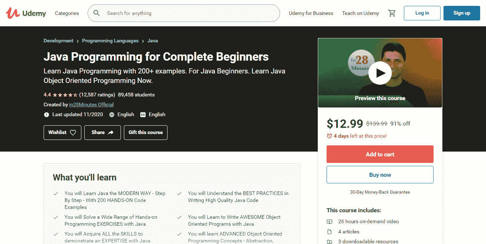
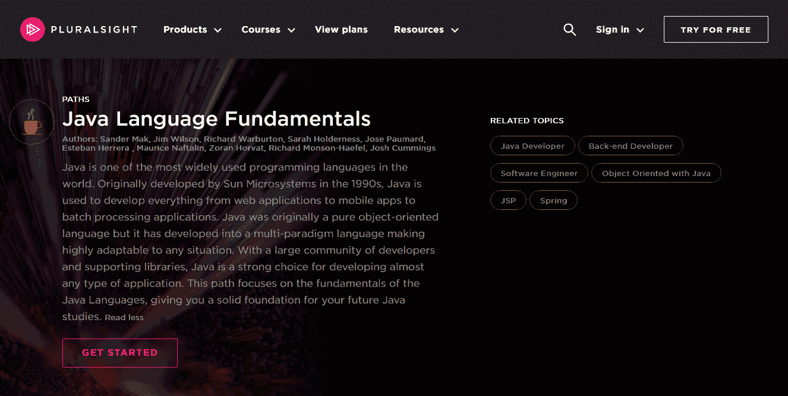
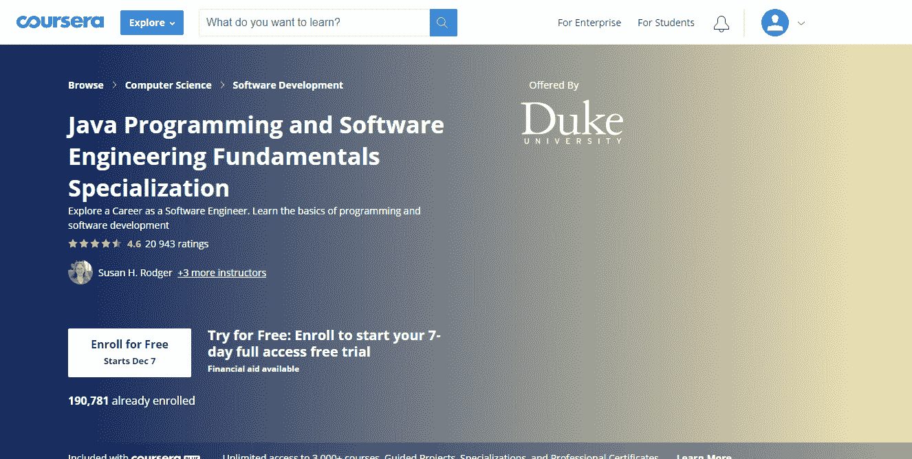

# 学习 Java 最好的方法是什么？

> 原文：<https://medium.com/javarevisited/what-is-the-best-way-to-learn-java-13dcdade691e?source=collection_archive---------2----------------------->

迈克尔·泽兹奇在 [Unsplash](https://unsplash.com/s/photos/programming?utm_source=unsplash&utm_medium=referral&utm_content=creditCopyText) 上的照片

让我们面对现实吧:今天的网络上充斥着各种口味和预算的教育材料。一方面，它对学习者有好处，因为他们可以获得所需的知识，而不用在大学里花费大量的金钱和时间。另一方面，这一大堆课程有时会让新手感到困惑，并偶然发现一个棘手的选择。有数不清的[课程](/javarevisited/top-5-java-online-courses-for-beginners-best-of-lot-1e1e240a758)、[书籍](/javarevisited/10-books-java-developers-should-read-in-2020-e6222f25cc72)、[网站](https://javarevisited.blogspot.com/2018/07/top-5-websites-to-learn-coding-in-java.html)、视频教程和其他资源可以获得关于任何编程语言的深入知识。

> 但是，学习 Java 的最好方法是什么呢？这是个问题。

在这篇文章中，我总结了一些最有效的方法，它们将成为你掌握 Java 的良好起点。所以，请继续关注并准备好把它们写下来。

# 如何精通 Java

几年前，还没有那么多学习 Java 的互联网资源，这不能说是现代。今天，网上有无数的互动教育材料。学习的形式也发生了很大的变化。

以前，你要么完全独立学习，要么参加全日制课程。现在，你可以找到满足你理论和实践需求的在线课程。

因此，编程之旅的第一步是选择知识和实践的主要来源。

# 选择合适的 Java 课程

虽然大多数现代 Java 课程都是交互式的、有趣的，但有些课程符合你的需求，有些则不符合。所以，找到你感兴趣的正确课程是很重要的。

## CodeGym

定价—从免费选项到高级订阅(高级 49 美元；高级专业版 99 美元)。

主要特点:

*   基于实践的 1200 多项任务
*   虚拟导师的即时验证
*   一个庞大而活跃的社区
*   免费的 Java 语法零级探索
*   免费游戏区

CodeGym 是一个专注于教你 Java 编程语言的平台。加入这个课程后，你将被迫在完成越来越复杂的实际任务的同时编写大量的代码。该课程既适合新人，也适合有以往经验的开发者。学生可以从头开始学习 Java，而或多或少有经验的程序员可以通过编写自己版本的经典视频游戏来磨练已经获得的技能。

## 完整的 Java Masterclass

定价——129.99 美元。

主要特点:

*   36 编码任务
*   每一个话题后的挑战
*   证书
*   关于用于提高生产力的工具和最佳实践的附加信息
*   手机和电视接入

[课程](http://bit.ly/2AHuthF)的名字本身意味着你将从最基础的开始学习 Java，并逐渐过渡到更高级的主题，这是你作为 Java 程序员找到第一份工作所需要的。除了涵盖 Java 概念之外，本课程还提供了实际例子，在您开始下一部分之前检查您的知识。

## 面向完全初学者的 Java 编程

定价——139.99 美元。

主要特点:

*   200 个实用代码示例
*   26 小时视频点播
*   理论-实践-解决方法
*   证书
*   关于块、方法、类和其他主题的 Java 技巧

掌握 Java 需要走多少步？10，100，还是 200？《T4》这门课程的作者确信，你将能够通过 250 步掌握 Java，并获得求职所需的技能。您还将通过超过 200 个编码挑战、测验和练习来测试您的知识。

## Java 基础知识

定价—每月 29 美元、每年 299 美元或高级包 499 美元。需要额外请求团队和企业包的报价。

主要特点:

*   固体概念解释
*   面向实践的任务
*   简短而精确的理论
*   互动视频和测验
*   有真实例子的概念

如果你已经设定了从事大型项目的目标，那么 Java 是一个很好的选择。实际上有无穷无尽的教育资源，这门课程就是其中之一。您将从 Java 语法和基础知识开始，然后进入更复杂的主题，比如 OOPs 和 Java 的 HttpClient。

## 杜克大学的 Java 认证

定价— 7 天完全免费试用。

主要特点:

*   初学者友好课程
*   涵盖语言不同方面的 5 门课程
*   证书
*   来自同事反馈的评估任务
*   顶点工程

如果你正在寻找一个能帮助你解决实际问题的项目，杜克大学的这个课程是一个不错的选择。除了学习 Java 编程，你还将通过 [HTML](/javarevisited/10-best-html-and-css-courses-for-beginners-in-2021-6757eec00032) 、 [JavaScript](/javarevisited/10-best-online-courses-to-learn-javascript-in-2020-af5ed0801645) 和 [CSS](/javarevisited/top-5-advanced-css-courses-to-learn-flexbox-grid-and-sass-da8e37b09b1d) 完成基本的 web 开发。

# Java 基础学完了吗？开始你自己的项目

一旦你对 Java 基础有了扎实的了解，包括语言语法、OOP 和集合，是时候进入下一步，编写你自己的[现实世界项目](/javarevisited/20-amazing-java-project-ideas-that-will-boost-your-programming-career-75c4276f6f5)了。做一个小项目会让你尝试已经获得的知识，磨练你的技能。以下是可供你选择的想法清单:

*   创建一个计算器
*   创建您自己版本的经典[视频游戏](https://codegym.cc/projects/games)，如《我的采摘者》、《饥饿的蛇》、《2048》、《超级马里奥兄弟克隆》、《Flappy-Bird》等。
*   开发学校、体育、食谱、库存或图书馆管理系统
*   考虑创建一个计费系统或银行应用程序
*   想出一个货币转换器

# 向他人学习，并教导他人

如果你已经找到了一个愿意花时间审查和编辑你的代码、为你提供反馈、为你的职业发展设立标杆的导师，你是一个幸运儿。然而，找到一个真正好的导师并不是一个容易的挑战——不是所有的专业开发人员都擅长教学，也不是每个人都愿意投入时间(尽管我肯定会鼓励你去寻找这样的人)。

这就是为什么一个来自 StackOverflow 或者 GitHub 的“集体程序员”可能会成为一个新人的所谓导师。新手的主要目标是学会问正确的问题。所以不要犹豫这样做。

一旦你对编程更有信心，就开始自己回答新手的问题。这种练习很有用，可以帮助你记住关键的语言概念。

如果你问我哪里可以找到愿意指导你的专业程序员，我会建议你考虑我最喜欢的编码相关的论坛，比如:

*   [Reddit](https://www.reddit.com) 频道
*   r/编程
*   学习编程
*   r/代码在一起
*   r/编程工具
*   r/游戏开发
*   r/Prog articles
*   r/webdev
*   r/每日程序
*   [松弛](https://slack.com)通道
*   标签开发者
*   欧洲发展探索者
*   DevOps 聊天
*   [StackOverflow](https://stackoverflow.com)
*   [站点点](https://www.sitepoint.com/community/)
*   [黑客新闻](https://news.ycombinator.com)
*   [Quora](https://www.quora.com/I-want-to-get-a-job-as-a-junior-backend-developer-and-I-would-appreciate-if-some-of-you-can-give-me-some-feedback?__nsrc__=4)

# 阅读别人的代码，然后修改它

除了自己写代码，阅读好的和坏的代码并学会区分它们也很重要。哪里能得到有保证的好代码？例如，在 Java 本身的类中，它们的代码可以在 IDE 中打开。

你可以放在列表上的另一个选项是在 GitHub 或 StackOverflow 上阅读代码。当你检查别人的代码，看看它是如何工作的，你会对开发过程有一个更清晰的了解。由于网上有大量的开源代码，你可以在回顾有经验的开发者的完美作品的同时学习几乎所有的东西。

但是，你不应该把自己限制在仅仅阅读代码和试图理解它是如何工作的。留出你的时间去跑步和玩耍。这将使学习过程变得容易得多，并将帮助你找到许多解决问题的方法。记住——你对代码探索和实践得越多，你就会成为越好的 Java 程序员。

在阅读完代码并自行修改后，我建议在开始阶段与社区或导师分享。现在这样做可以避免你以后忘记。

# 手工编写代码仍然有效

整个 Java 生态系统包括各种不同的操作，无论是依赖管理、类导入、重构还是注释。都和逻辑没有什么共同点，所以在开发过程中使用 IDE 是很有必要的。这就是为什么 Java 程序员必须知道如何利用集成开发环境。

新来者也应该小心 IDE——因为它“增加”了很多东西，专家们很可能没有注意到他们已经错过了一些东西。这就是手工编码的用处，它有助于理解编码者是否掌握了语法和结构的知识。如果由于某种原因，开发人员有差距，这种老式但有效的方法允许他们揭示它们并改进。

除此之外，当申请人通过技术面试时，面试官希望申请人手工编写代码。这是测试程序员熟练程度的通用方法。所以，不要推迟代码书写，今天就开始练习吧。

# 包装东西

现在你知道学习 Java 的最好方法是什么，我相信你会充分利用上面提到的方法。请记住，在这条船上你并不孤单，如果你在学习过程中遇到困难，你可以随时寻求帮助。Java 社区很友好，它的成员愿意帮助初学者。所以，记住列出的建议，现在就开始掌握这门语言。