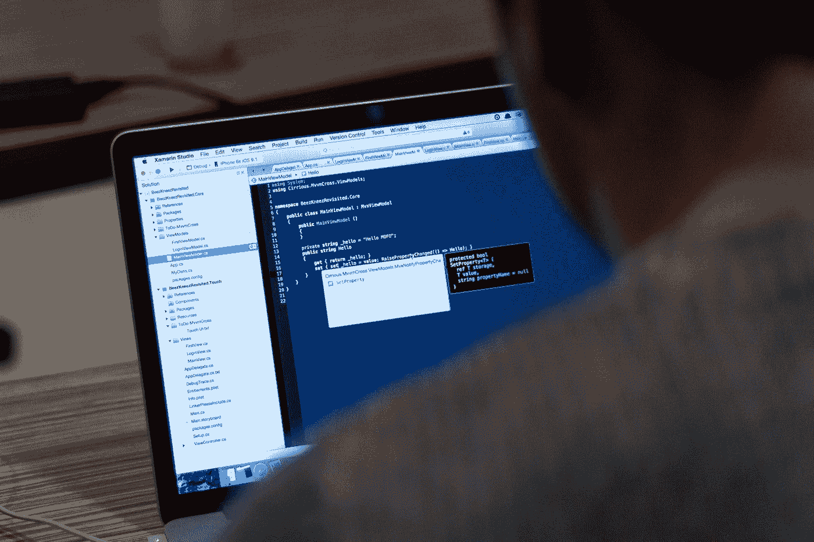

# Java 中变量的作用域是什么？让我们深潜吧

> 原文：<https://medium.com/javarevisited/what-is-the-scope-of-a-variable-in-java-lets-deep-dive-c2a9ca566d1?source=collection_archive---------2----------------------->

## 详细了解方法范围、块范围和所有其他概念

> 你遇到过变量没有初始化或者已经初始化的错误吗？
> 
> 您是否对已经存在的变量名何时何地可以重复使用以及何处不可以重复使用感到困惑？

如果其中一个问题的答案是 ***是的*** ，那么继续阅读，让你的概念变得清晰，这样你就不会遇到任何与 **JAVA** 中的作用域相关的问题，即使发生了，你的调试也会容易得多。



照片由 [Tirza van Dijk](https://unsplash.com/@tirzavandijk?utm_source=medium&utm_medium=referral) 在 [Unsplash](https://unsplash.com?utm_source=medium&utm_medium=referral) 上拍摄

# 什么是可变范围？

简单来说，变量作用域就是**区域**，在其中可以访问、更改/修改/更新某个特定的变量。

在 **Java** 中，**区域**可以认为仅仅是被 ***花括号*** 包围的区域或区块。

```
public static void func () {
    int a = 5;
    a = a + 10;
    System.out.println(a);
} 
```

在上面的代码片段中，**变量**在名为`**func**`的方法中被声明和初始化。因此，变量`**a**`的范围是这个特定方法`**func**`内的 **ONLY** ，区域是被**花括号**包围的区域。

> **注:-** 变量的**值**只有**在被初始化后才能被访问，或者说已经被赋值。否则，将抛出一个 [**错误**，说明变量已声明，但**未初始化**](https://www.java67.com/2016/07/how-to-fix-variable-might-not-have-been-initialized-error-in-java.html) 。**

现在，我们已经大致了解了变量的作用域，让我们来关注在处理多个方法时变量的作用域是如何定义的。

# JAVA 中的方法范围

在跳到作用域之前，值得一提的一件重要事情是在 ***Java*** 中没有**传递引用**。Java 中唯一存在的在函数调用时将实参值传递给参数的方法就是[通过值](https://javarevisited.blogspot.com/2012/12/does-java-pass-by-value-or-pass-by-reference.html) 传递**。**

现在，当处理属于一个特定类的多个方法时，请始终记住:-

> 无论在方法体中声明和初始化了什么变量，都只能在这个特定的方法中访问。

任何在该特定方法之外或任何其他方法中声明的同名变量都是完全不同的，与该方法中包含的变量没有任何关系。

```
public class Example1 {
    public static void main (String [] Args) {
        int num = 45; // Same name num Case 1
        int a = 5;
        int b = 10;
        func1();
        func2();
        System.out.println("num inside main method is " + num);
        System.out.println("a in main method is " + a);
        System.out.println("b in main method is " + b);
        c = 35; // ERROR Case 2
        d = 55; // ERROR
    } public static void func1 () {
        int num = 30;
        int c = 15;
        a = 74; //ERROR
        System.out.println("num inside func1 is " + num);
        System.out.println("c in func1 is " + c);
    }public static void func2 () {
        int num = 37;
        int d = 26;
        b = 58; //ERROR
        System.out.println("num inside func2 is " + num);
        System.out.println("d in func1 is " + d);
    }
```

现在，删除所有突出显示为错误的行后，生成的输出如下所示

```
OUTPUT
num inside func1 is 30
c in func1 is 15
num inside func2 is 37
d in func2 id 26
num inside main method is 45
a in main method is 5
b in main method is 10
```

## 了解错误的原因和 num:-

**理解错误:-** 在 main 方法内部声明的**变量**即`**a**`和`**b**`只能在 main 方法内部访问和修改。 [Java](/javarevisited/5-tips-and-4-books-to-learn-java-programming-from-scratch-cbca21befed1) 找不到主方法外的变量`***a***`和`***b***` **，会抛出一个错误，声明变量是**而不是**声明的。**

所以我们**既不能给`***func1***` **中的*变量* `***a***`赋值，也不能给`***func2***` ***中的***变量*`***b***`赋值。*** *但是我们可以在 ***main*** *方法*中访问`**a**`和`**b**`，就在变量被初始化的那一行之后。***

*相同的逻辑和概念适用于所有其他错误。在`**func1**`内声明和初始化的 Like 变量`**c**`不能在`**func2**`内访问或修改或赋值。*

***变量的变化值** `**num**` **:-** 我们可以看到，名为`***num***`的变量在所有三个方法中都被声明和初始化了，令人惊讶的是没有抛出任何错误。而且一个变量`**num**`对应的**输出**在所有的*三种* ***方法*** 中是完全不同的！！*

> *这是因为所有的变量`num`虽然名称相同，但完全不同，它们之间没有共同的联系，各自有不同的作用域。*

*如前所述，Java **无法**找到其作用域之外的变量。它认为好像从未创建过具有该名称的变量。因此，在名为`***func1***`的*方法*中声明一个变量`***num***`就像创建一个全新的变量，并且这个变量`***num***`的范围仅限于`***func1***` **中的**。*

*我们已经触及了与方法作用域相关的所有要点，现在让我们把注意力集中在块作用域上。*

**

*照片由[特雷西·亚当斯](https://unsplash.com/@tracycodes?utm_source=medium&utm_medium=referral)在 [Unsplash](https://unsplash.com?utm_source=medium&utm_medium=referral) 上拍摄*

# *块范围*

*在讨论作用域之前，让我们定义一下块的含义。*

*块只是一对花括号中的一部分。它可以在任何方法体中。让我们用一个例子来了解更多。*

```
*public class BlockScope {
    public static void main (String [] args) {
        int outsideBlock = 15;
        outsideBlock += 25;
        {
            int insideBlock = 4;
            insideBlock += 14;
            int outsideBlock = 35; // ERROR Case-1
            outsideBlock = 47; // Case-2
            System.out.println("insideBlock value inside the block  is " + insideBlock);
            System.out.println("outsideBlock value updated inside the block is " + outsideBlock);
        }
        insideBlock = 7; // ERROR Case-3
        outsideBlock += 4; // Case-4
        int insideBlock = 14; // Case-5
        System.out.println("insideBlock value outside the block is " + insideBlock);
        System.out.println("outsideBlock value outside the block is " + outsideBlock);
}*
```

*从上面的代码片段中删除所有突出显示为错误的行，我们得到如下输出*

```
*OUTPUT :-
insideBlock value inside the block is 18
outsideBlock value updated inside the block is 47
insideBlock value outside the block is 14
outsideBlock value outside the block is 51*
```

*现在，深入了解代码中发生了什么，变量`***insideBlock***`和`***outsideBlock***`的范围是什么，让我们用一行代码来理解这个概念，并深入了解块内和块外变量的范围发生了什么。*

> *在块内声明和初始化的任何变量只能在块内访问和修改/更新。但是，在块外声明的变量也可以在块内访问和修改。*

*另外，在访问在块外声明和初始化的变量时，要记住的一件重要事情是:-*

> *即使我们可以访问在块外初始化的原始变量，但是我们**不能**声明和初始化一个完全**新的**变量**在**块内，其**名称与块外**的**名称相同。***

*现在，让我们一个一个地分析每个案例，以获得一个更清晰的画面*

*   ***情况 1 :-** 变量`***outsideBlock***`已经在块外定义并初始化。所以我们不能在块中声明和初始化一个同名的新变量`***outsideBlock***`。*
*   ***案例二:-** 变量`***outsideBlock***`的**范围**是`**main**` ***方法*** 内的**整个** ***区域*** 。因此，一旦变量被初始化，就可以从 main 方法内部的任何地方访问和修改/更新。甚至从**内的*块作为块也被放置在[主方法](http://javarevisited.blogspot.sg/2011/12/main-public-static-java-void-method-why.html#axzz4uMEUqg5v)的**体**内。**
*   ****情况 3:-** 变量`***insideBlock***`的范围只限定在块内。因此，每当我们试图访问块外的变量时，Java 找不到任何具有该特定名称的变量，并抛出一个错误，声明变量未声明。**
*   ****案例 4:-** 与案例 3 有关联。Java 找不到名为`***insideBlock***`的变量，并且认为好像不存在具有该名称的变量。所以，现在如果我们声明并初始化一个新的变量，并给它一个名字`***insideBlock***`，Java 会把它当作一个新声明并初始化的变量，只不过这个变量与程序块中的变量没有预先的联系。**

****

**照片由[米歇尔·勒恩斯](https://unsplash.com/@leunesmedia?utm_source=medium&utm_medium=referral)在 [Unsplash](https://unsplash.com?utm_source=medium&utm_medium=referral) 拍摄**

# **循环范围**

**这几乎和上一个一样。同样，在循环内部声明和初始化的变量的作用域仅限于循环体内部，不能在循环外部访问或修改。**

**类似地，像块范围一样，先前在循环外部声明和初始化的变量也可以在循环体内被访问和修改。**

**但是在循环内部声明和初始化的新变量，或者甚至是在开始指定条件的地方，**不能与已经在循环外部声明和初始化的变量同名。****

**那些已经读完整篇文章并读到这里的人，恭喜你们！！**

**您刚刚学习并掌握了与变量范围相关的所有概念，现在已经完全了解了如何处理和调试围绕该主题的所有错误。**

**与 JAVA 和其他编程语言的核心概念相关的新博客/文章将会比预期来得更快！！你也可以分享你希望我在即将到来的博客/文章中涉及的话题。**