# 2023 年 Java 程序员该学什么？

> 原文：<https://medium.com/javarevisited/what-java-programmers-should-learn-in-2020-648050533c83?source=collection_archive---------0----------------------->

## 2023 年 Java 程序员可以学习的有用工具、技术、框架和库

[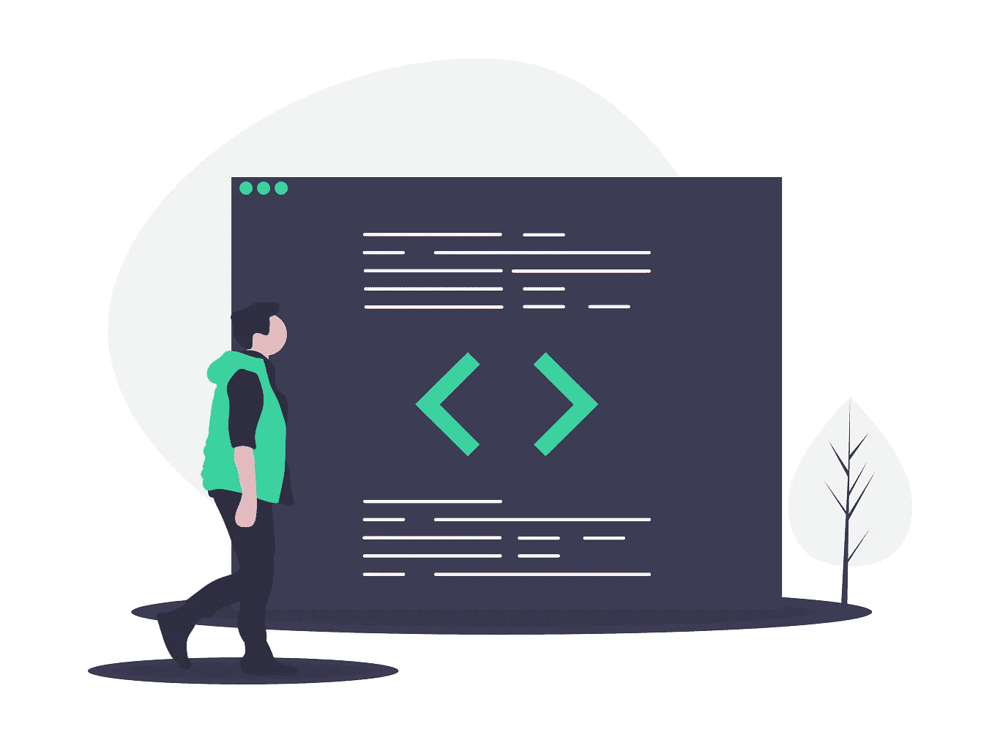](http://bit.ly/2ylC68g)

大家好，首先祝大家 2023 新年快乐。我相信你们在新的一年和新的十年都有一个很好的开始，并准备好将你们的职业生涯提升到一个新的水平。作为一名 Java 开发人员，我也制定了一些目标，希望今年成为一名更好的 Java 开发人员。

如果你还没有制定目标，这将帮助你制定 2023 年的目标。作为一名程序员，我们最大的挑战是保持自我更新。技术变化非常快，每隔几年你就会看到新版本的编程语言和框架。

今年有很多变化，每 6 个月更新一个新的 Java 版本， [Spring 5](https://javarevisited.blogspot.com/2018/06/top-6-spring-framework-online-courses-Java-programmers.html) 、 [Spring Security 5](https://www.java67.com/2017/12/top-5-spring-security-online-training-courses.html) 和[Spring Boot 2](/javarevisited/top-10-courses-to-learn-spring-boot-in-2020-best-of-lot-6ffce88a1b6e)；就 Java 开发人员的变化而言，这可能是最忙碌的一年。

2023 年开始的时候，我以为 Java 15 是新的，还没来得及彻底学完 Java 11，Java 16 和 Java 17 已经准备好了。自 JDK 9 版以来，所有这些 Java 版本都带来了许多令人兴奋的特性，比如文本块、switch case 中的字符串、 [var with local variables](http://javarevisited.blogspot.sg/2018/03/finally-java-10-has-var-to-declare-local-variables.html) 、API 增强、GC 改进、线程本地握手等等。2023 年学那些真的很激动。

同样的还有 [Spring 框架](https://javarevisited.blogspot.com/2018/06/top-6-spring-framework-online-courses-Java-programmers.html)和 [Spring Security](https://javarevisited.blogspot.com/2019/06/3-books-and-courses-to-learn-spring-security-in-depth.html) ，我并不知道 Spring 4.0 和 Spring Security 4.0 的所有变化，我的项目还在使用 Spring Security 3.1，boom 我们现在有了 Spring 和 Spring Security 的 6.0 版本。

在过去的几年里，我的学习速度有所放缓，我无法让自己跟上最新最棒的技术，因为我还没有掌握新技术，比如容器 [Docker](https://javarevisited.blogspot.com/2018/02/10-free-docker-container-courses-for-Java-Developers.html) 和 [Kubernetes](https://javarevisited.blogspot.com/2019/05/top-5-courses-to-learn-docker-and-kubernetes-for-devops.html) ，JavaScript 框架比如 [Angular](https://javarevisited.blogspot.com/2018/06/5-best-courses-to-learn-angular.html) 和 [React](https://javarevisited.blogspot.com/2018/08/top-5-react-js-and-redux-courses-to-learn-online.html) 云平台比如 [AWS](/javarevisited/top-5-aws-training-courses-to-crack-amazon-web-service-solutions-architect-associate-certification-3f4affa8f660) 、GCP 和 Azure，以及

因此，2023 年将会让我自己了解技术方面最重要的事情，改进我的工具集链，探索 [DevOps](https://javarevisited.blogspot.com/2018/09/10-devops-courses-for-experienced-java-developers.html) 和[云计算](https://javarevisited.blogspot.com/2019/07/top-5-online-courses-to-learn-cloud-computing-aws.html)的前景，特别是关于 [Docker](/javarevisited/5-best-docker-courses-for-java-and-spring-boot-developers-bbf01c5e6542) 、 [Kubernetes](/javarevisited/10-best-kubernetes-courses-for-developers-and-devops-engineers-94c35cd3a2fd) 和拥有 AWS 的 Jenkins。

# 2023 年 Java 开发者该学什么？

以下是我列出的一个 Java 开发人员应该在 2023 年学习的东西，很可能你已经知道了其中的大部分，但是更好地学习它们并深入钻研并不会有什么坏处:

## 1.集装箱(Docker 和 Kubernetes)

您可能已经听说过 Docker 和 Kubernetes 等容器技术及其对 DevOps 团队的影响。一开始你可能会想，“啊，我需要学习的又一项新技术”，但是我会说 Docker 不仅仅是另一项技术，而是真正的游戏规则改变者。与 Kubernetes 一样，它是你可以学习的最重要的工具之一，并将伴随你的整个职业生涯。

如今， [Docker](/@javinpaul/10-free-courses-to-learn-docker-and-devops-for-frontend-developers-691ac7652cee) 和 [Kubernetes](/javarevisited/top-15-online-courses-to-learn-docker-kubernetes-and-aws-for-fullstack-developers-and-devops-d8cc4f16e773) 几乎每个开发团队都在使用，无论是大型企业还是小型创业公司。可以肯定地说，如果你现在进入职场，你很可能会在某个时候碰到 Docker。

总之，无论你是初级 Java 开发人员，还是有几年经验的资深人士，拥有 Docker 和 Kubernetes 的知识对于你的职业发展和跳槽都是必不可少的。如果你已经意识到 Kubernetes 的重要性，并希望在 2023 年学习 Kubernetes，那么 Stephen Grider 在 Udemy 上的[**Docker and Kubernetes:The Complete Guide**](https://click.linksynergy.com/deeplink?id=JVFxdTr9V80&mid=39197&murl=https%3A%2F%2Fwww.udemy.com%2Fcourse%2Fdocker-and-kubernetes-the-complete-guide%2F)是一门很好的课程。

[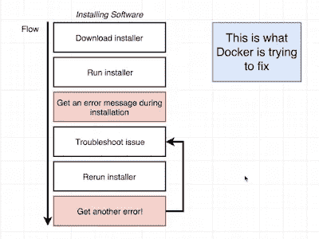](https://click.linksynergy.com/deeplink?id=JVFxdTr9V80&mid=39197&murl=https%3A%2F%2Fwww.udemy.com%2Fcourse%2Fdocker-and-kubernetes-the-complete-guide%2F)

如果你喜欢免费的资源，比如免费的在线课程，那么你也可以看看这个为 Java 开发者准备的免费 Docker 和 Kubernetes 课程列表。

## 2.云平台(AWS、GCP 或 Azure)

除了容器，云是我认为每个软件开发人员和数据科学家在 2023 年应该学习的另一件事。各种规模和领域的公司现在都在将其环境转移到云中，以节省成本和提高可扩展性，这意味着迟早您需要使用云原生应用程序。

它们对于[数据科学](/javarevisited/top-10-resources-to-learn-data-science-and-machine-learning-best-of-lot-f153e1f44e89)、[机器学习](https://dev.to/javinpaul/10-data-science-and-machine-learning-courses-for-programmers-looking-to-switch-career-57kd)和[人工智能](https://javarevisited.blogspot.com/2019/10/top-5-courses-to-learn-artificial-intelligence-AI.html)领域的所有朝阳发展也是必不可少的，因为只有云才能提供那些资源饥渴模型所需的计算能力。

学习像[亚马逊网络服务](https://javarevisited.blogspot.com/2019/08/how-to-crack-aws-certified-solution-architect-exam.html) ( [AWS](/javarevisited/top-10-courses-to-learn-amazon-web-services-aws-cloud-in-2020-best-and-free-317f10d7c21d) )、谷歌云平台(GCP)或微软 Azure 这样的云平台，不仅在你目前的工作中，而且在下一份工作中，都会让你比你的竞争对手领先一步。你不需要学所有的，事实上，学一门意味着你会对其他的有一个公平的想法。

首先，我建议你**学习 AWS** ，因为它是最受欢迎和最成熟的云平台，对拥有 AWS 知识的开发人员和系统管理员有着强烈的需求。如果你需要资源，我推荐云专家 Ryna Kroonenberg 的 [**AWS 认证解决方案架构师-助理 2023**](http://bit.ly/2ytDULA) 课程。这不仅有助于你深入学习 AWS，也为你准备 AWS 认证。

[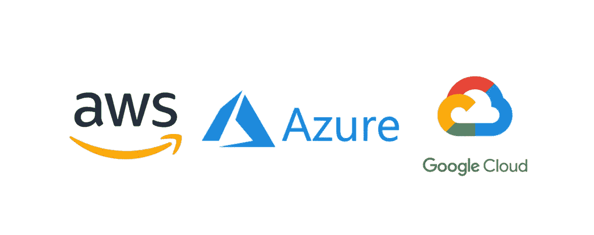](http://bit.ly/2ytDULA)

## 3.饭桶

Git 和 Github 已经存在一段时间了，虽然我过去在 Eclipse 和 IntelliJIDEA 中使用过 Git，但是我还没有习惯在命令行中使用 Git。

为什么我至今没有掌握 Git？仅仅因为我还不需要它。我偶尔会从 Github 下载项目，并从 Eclipse 运行，但我仍然是 Git 的新手。

现在，大部分公司都把项目从 SVN、CVS 迁移到 Git，是时候学习和掌握 Git 了。我最近在 Udemy 上以 10 美元的价格购买了[**Git Complete:Git**](https://click.linksynergy.com/fs-bin/click?id=JVFxdTr9V80&subid=0&offerid=323058.1&type=10&tmpid=14538&RD_PARM1=https%3A%2F%2Fwww.udemy.com%2Fgit-complete%2F)**的权威分步指南，这将是 2023 年完成的第一件物品。如果你也有同样的情况，并且想在 2023 年学习 Git，那么一定要查看 Udemy 的课程，这很方便。**

**[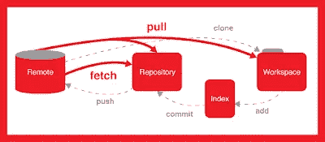](https://click.linksynergy.com/fs-bin/click?id=JVFxdTr9V80&subid=0&offerid=323058.1&type=10&tmpid=14538&RD_PARM1=https%3A%2F%2Fwww.udemy.com%2Fgit-complete%2F)**

## **4.单元测试(JUnit 和 Mockito)**

**另一个我想在来年改进的地方。有许多新的[框架](/javarevisited/top-10-frameworks-full-stack-java-developers-can-learn-in-2020-5995021401e5)和工具可供 Java 程序员进行单元测试，集成测试他们的应用程序，如用于模仿对象的 Mockito 和 PowerMock，用于自动化集成测试的 Robot Framework 和 Cucumber，当然还有新的闪亮的 JUnit 5 库。在这方面有很多东西要学。如果你能花一些时间提升你的单元测试技能，不仅你的编码专业知识会提高，而且你会成为一个更专业的开发人员，这是每个公司都期待的。首先，你可以去看看 Udemy 的 [**JUnit 和 Mockito 速成班**](https://click.linksynergy.com/fs-bin/click?id=JVFxdTr9V80&subid=0&offerid=323058.1&type=10&tmpid=14538&RD_PARM1=https%3A%2F%2Fwww.udemy.com%2Fjunitandmockitocrashcourse%2F) 。**

**[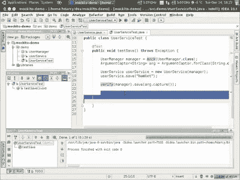](https://click.linksynergy.com/fs-bin/click?id=JVFxdTr9V80&subid=0&offerid=323058.1&type=10&tmpid=14538&RD_PARM1=https%3A%2F%2Fwww.udemy.com%2Fjunitandmockitocrashcourse%2F)**

## **5.JDK 9 到 17 的新 Java 特性**

**正如我过去说过的，我仍然在努力赶上半年一次的 Java 发布，许多 Java 开发者也是如此。今年，我花了一些时间学习 Java 9、10、11 和 12 的新特性，但对我来说，Java 11 仍然是优先选择，直到我转向 Java 13，这是一个 LTS 版本。

JDK 9 在模块、Jigsaw、反应流、过程 API、HTTP2 客户端、JShell 和 API 改进(如集合工厂方法)方面带来了很多好东西，我真的很期待尽早学习它们。

同样，JDK 10 带来了 var，给你一种动态打字的味道和一些 GC 的改进。然后，在 JDK 12 和 JDK 13 的交换机中有文本块和字符串。

在上次的 Udemy 10$特卖中，我购买了一大堆课程，其中一门是[T**he Complete Java master class**](https://click.linksynergy.com/fs-bin/click?id=JVFxdTr9V80&subid=0&offerid=323058.1&type=10&tmpid=14538&RD_PARM1=https%3A%2F%2Fwww.udemy.com%2Fjava-the-complete-java-developer-course%2F)，是针对 Java 17 更新的，我很期待以此开始我的 Java 17 之旅。

顺便说一句，如果你还没有开始使用 JDK 8，那么这里是我最喜欢的 Java 8 教程和课程的列表，你可以免费获得:[学习 Java 8 的 10 个最佳教程](http://www.java67.com/2014/09/top-10-java-8-tutorials-best-of-lot.html)。**

**[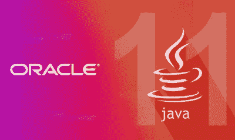](https://click.linksynergy.com/fs-bin/click?id=JVFxdTr9V80&subid=0&offerid=323058.1&type=10&tmpid=14538&RD_PARM1=https%3A%2F%2Fwww.udemy.com%2Fjava-the-complete-java-developer-course%2F)**

## **6.弹簧框架 5 或 6**

**几年前，我们已经看到了许多对 Spring 和 Java 生态系统的重大升级，Spring Framework 5.0 就是其中之一。**

**我听说了一些新特性，比如 Spring 5 上的反应式编程模型，Java 8 和 9 的采用，一些单元测试的改进等等。但是我还没有尝试过。

反正我已经跟着 [**Spring 5 开始学习 Spring 5.0 了。0:初学者到大师**](https://click.linksynergy.com/fs-bin/click?id=JVFxdTr9V80&subid=0&offerid=323058.1&type=10&tmpid=14538&RD_PARM1=https%3A%2F%2Fwww.udemy.com%2Fspring-framework-5-beginner-to-guru%2F) 并将在 2023 年保持势头。如果你用 Spring，大概是学习 Spring 5.0 的最好时机。**

**[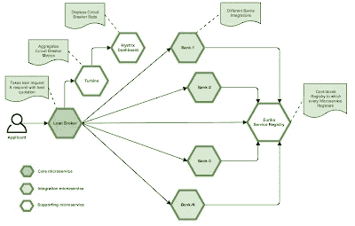](https://click.linksynergy.com/fs-bin/click?id=JVFxdTr9V80&subid=0&offerid=323058.1&type=10&tmpid=14538&RD_PARM1=https%3A%2F%2Fwww.udemy.com%2Fspring-framework-5-beginner-to-guru%2F)**

**如果你喜欢书，你也可以看看 Manning 和 Packt 出版公司为 Java 开发人员提供的这个[高级 Spring 书籍](https://javarevisited.blogspot.com/2018/04/5-spring-framework-books-experienced-Java-developers-2018.html)列表。**

## **7.德沃普斯(詹金斯)**

**随着越来越多的公司进入 [DevOps](/javarevisited/top-10-courses-to-learn-devops-for-experienced-programmers-d93b666db151) 并采用持续集成和部署，这是去年我看到很有吸引力的另一个领域。

DevOps 非常庞大，你需要学习很多工具和原理，而这也是让很多开发者不知所措的，但是你不需要担心。我分享了一个 [DevOps 路线图](https://javarevisited.blogspot.com/2018/09/the-2018-devops-roadmap-your-guide-to-become-DevOps-Engineer.html)，你可以按照自己的速度学习和掌握 DevOps，尤其是 Jenkins。

这意味着如果你是一名经验丰富的 Java 程序员，对管理环境、自动化和改进整体结构充满热情，你可以成为一名 DevOps 工程师。

如果你正在寻找一些优秀的资源，那么 [**Jenkins，从零到英雄:成为 DevOps Jenkins 高手**](https://click.linksynergy.com/deeplink?id=JVFxdTr9V80&mid=39197&murl=https%3A%2F%2Fwww.udemy.com%2Fcourse%2Fjenkins-from-zero-to-hero%2F) 是一个很好的入门课程，尤其是对于 Java 开发者来说。**

****

## **8.RESTful Web 服务**

**我想在 2023 年继续提高的另一件事是我关于使用 Spring 用 Java 编写 REST API 和实现安全和可伸缩的 RESTful Web 服务的知识。

这是 Java 界非常需要的一项技能，既懂 Java 又懂 REST 的人不多。如果你也在同一条船上，想学习如何使用 Spring 开发 RESTful Web 服务，来自欧根·帕拉斯基夫的 Spring master class[**的其余部分是一个很好的起点。**](http://courses.baeldung.com/p/rest-with-spring-the-master-class?affcode=22136_bkwjs9xa)**

****

## **9.Spring Security 5.0 (OAuth)**

**这是春天生态系统的第三次重大升级。流行的安全框架的第 5 版有几个错误修复和一个主要的 OAuth 2 模块，你不能错过。

这是我 2023 年的另一个优先事项，还有 Spring 5.0 框架的东西。令人欣慰的是，Eugen 已经更新了他最畅销的课程 [**和 Spring Security**](https://courses.baeldung.com/p/learn-spring-security-the-master-class?utm_source=javarevisited&utm_medium=web&utm_campaign=lss&affcode=22136_bkwjs9xa) 的学习，以包括 5.0 的功能，并为 OAuth 2.0 添加了一个单独的模块。，大概是此刻学习 Spring Security 5.0 最好的素材。**

**[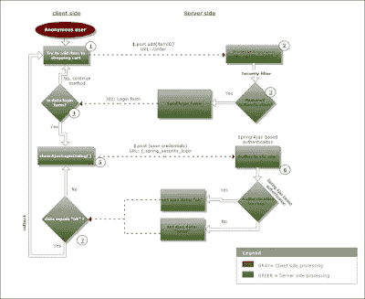](https://courses.baeldung.com/p/learn-spring-security-the-master-class?utm_source=javarevisited&utm_medium=web&utm_campaign=lss&affcode=22136_bkwjs9xa)**

## **10.Spring Boot 新协议和微服务**

**Spring Boot 框架也有一个新的版本，Spring Boot 2。如果你今年有时间完成所有这些目标，那么你也应该花些时间学习 Spring Boot 2。**

**如果你也想学习 Spring Boot 2 和 2023 年的微服务，那么你也可以通过 Udemy 的 Spring Boot 和春云 来了解一下这个 [**大师微服务。**](https://click.linksynergy.com/deeplink?id=JVFxdTr9V80&mid=39197&murl=https%3A%2F%2Fwww.udemy.com%2Fcourse%2Fmicroservices-with-spring-boot-and-spring-cloud%2F)**

**[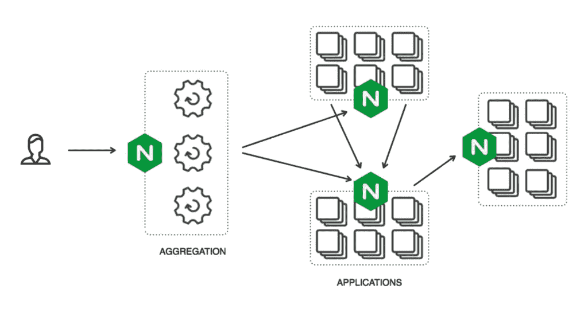](https://click.linksynergy.com/deeplink?id=JVFxdTr9V80&mid=39197&murl=https%3A%2F%2Fwww.udemy.com%2Fcourse%2Fmicroservices-with-spring-boot-and-spring-cloud%2F)**

**如果你需要更多的选择，那么你也可以查看这份 2023 年 Java 开发者学习的[春季顶级入门课程](https://javarevisited.blogspot.com/2018/05/top-5-courses-to-learn-spring-boot-in.html)列表。**

## **11.角度 2+或反应 JS**

**这两个 JavaScript 框架已经完全改变了你开发 web 应用的方式。作为一名 Java 开发人员，我在客户端使用过 Servlet、JSP 和 jQuery，但还没有尝试过使用 [Angular](/javarevisited/top-10-angular-books-and-courses-for-beginners-and-experienced-web-developers-best-of-lot-9a2dae87f04c) 或 React。

2023 年，我的目标之一是学习 Angular，我将从 Udemy 的**[**Angular-The Complete Guide**](https://click.linksynergy.com/fs-bin/click?id=JVFxdTr9V80&subid=0&offerid=323058.1&type=10&tmpid=14538&RD_PARM1=https%3A%2F%2Fwww.udemy.com%2Fthe-complete-guide-to-angular-2%2F)开始我的旅程。如果你也在同一条船上，那么你也可以看一看那门课程；很方便。****

****如果你想学习 React，那么我建议你加入 Udemy 上同一作者的[**React——完全指南**](https://click.linksynergy.com/deeplink?id=JVFxdTr9V80&mid=39197&murl=https%3A%2F%2Fwww.udemy.com%2Fcourse%2Freact-the-complete-guide-incl-redux%2F) 课程。****

**** [## React 16:完整课程(包括 React 路由器 4 和 Redux)

### 本课程是 React 的最新版本，包括 React 挂钩！当然会保留…

udemy.com](https://click.linksynergy.com/deeplink?id=JVFxdTr9V80&mid=39197&murl=https%3A%2F%2Fwww.udemy.com%2Fcourse%2Freact-the-complete-guide-incl-redux%2F)**** 

## ****12.机器人****

****如果你不知道如何在 2023 年编写 Android 应用，那么你就缺少了一些东西。移动是接触大量用户的最佳平台之一，而 [Android](/hackernoon/top-5-courses-to-learn-android-for-java-programmers-667e03d995b4) 可能是最受欢迎的编写移动应用的平台。尽管我知道 Android 的基本知识，但我还没有发布过任何 Android 应用，也许 2023 年会改变这一点。就目前而言，我列出了这些 [**最佳安卓在线课程**](/javarevisited/top-5-courses-to-learn-android-for-java-programmers-667e03d995b4) 来刷新我的知识，更上一层楼。如果你也在同一条船上，那么你可能会发现它们也很有用。****

****[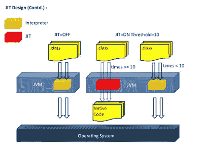](http://javarevisited.blogspot.sg/2017/12/top-5-android-online-training-courses-for-Java-developers.html)****

## ****13.阿帕奇火花和卡夫卡****

****我想在 2023 年继续深入探索的另一件事是大数据，主要是 Apache Spark 和 [Apache Kafka 框架](/javarevisited/top-10-apache-kafka-online-training-courses-and-certifications-621f3c13b38c)。我不确定我是否有时间看看其他大数据技术，但这确实是好东西，而[大数据](/dataseries/top-6-courses-to-learn-big-data-and-hadoop-in-2020-2e20593347fe)可能是目前最热门的技术。

如果你也想在 2023 年学习大数据，不妨看看我的[入围课程清单，从 Udemy 和 Pluralsight 学习面向 Java 开发者的 Apache Spark](http://javarevisited.blogspot.sg/2017/12/top-5-courses-to-learn-big-data-and.html#axzz51uO7MlUG)。****

****[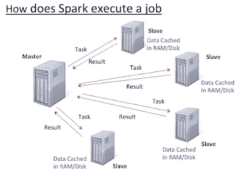](https://click.linksynergy.com/deeplink?id=JVFxdTr9V80&mid=39197&murl=https%3A%2F%2Fwww.udemy.com%2Fcourse%2Fapache-spark-course-with-java%2F)****

****顺便说一下，你需要一个 [**Pluralsight 会员**](https://pluralsight.pxf.io/c/1193463/424552/7490?u=https%3A%2F%2Fwww.pluralsight.com%2Fpricing) 才能加入这个课程，费用大约是每月 29 美元或每年 299 美元(14%的折扣)。如果你没有这个计划，我强烈推荐你加入，因为它能促进你的学习，而且作为一名程序员，你总是需要学习新的东西。****

****或者，你也可以使用他们的 **1** [**0 天免费试用**](https://pluralsight.pxf.io/c/1193463/424552/7490?u=https%3A%2F%2Fwww.pluralsight.com%2Flearn) 免费观看本课程。****

**** [## 对个人来说

### Pluralsight 帮助个人学习者获得掌握最新软件开发所需的技术技能…

pluralsight.pxf.io](https://pluralsight.pxf.io/c/1193463/424552/7490?u=https%3A%2F%2Fwww.pluralsight.com%2Flearn) 

以上就是**2023 年 Java 程序员能学到什么？**正如我所说，技术变化速度很快，程序员面临的最大挑战是保持自己与时俱进。

除了这个列表，在新的一年里，你还可以查找很多其他的东西，比如学习一门新的编程语言，比如 [Kotlin](/javarevisited/top-5-courses-to-learn-kotlin-in-2020-dfc3fa7706d8) ，但对我来说，如果我能在 2023 年实现这些目标，我会非常高兴。

祝你 2023 年新年成功快乐。

其他 **Java 文章**你可能喜欢探讨:
[2023 年 Java 开发者路线图](https://javarevisited.blogspot.com/2019/10/the-java-developer-roadmap.html)
[2023 年每个 Java 开发者都要学习的 10 种工具](https://www.java67.com/2018/04/10-tools-java-developers-should-learn.html)
[2023 年学习 Spring Boot 的前 5 门课程](https://www.java67.com/2018/06/5-best-courses-to-learn-spring-boot-in.html)
[2023 年要学习的 10 种编程语言](http://www.java67.com/2017/12/10-programming-languages-to-learn-in.html)
[2023 年 Java 开发者应该读的 10 本书](http://www.java67.com/2018/02/10-books-java-developers-should-read-in.html)
应知
[我最喜欢的免费课程深入学习 Java](/javarevisited/10-free-courses-to-learn-java-in-2019-22d1f33a3915)
[深入学习 Spring 框架的前 5 门课程](https://javarevisited.blogspot.com/2018/06/top-6-spring-framework-online-courses-Java-programmers.html)
[10 门免费课程学习 Maven、Jenkins、Docker 面向 Java 开发者的](/javarevisited/top-10-free-courses-to-learn-maven-jenkins-and-docker-for-java-developers-51fa7a1e66f6)

**P . S**。 —如果你正在寻找一些有用的技术来从 web 开发的角度学习，那么你也可以看看我的帖子[每个 web 开发人员应该在 2023 年学习的 10 件事](https://javarevisited.blogspot.com/2020/01/10-things-web-developers-should-learn.html)。

 [## 2023 年网络开发者应该学会的 10 件事

### 大家好，首先祝大家新年快乐。愿上帝保佑你智慧、财富和健康。如果…

javarevisited.blogspot.com](https://javarevisited.blogspot.com/2020/01/10-things-web-developers-should-learn.html) 

## 您可能喜欢的其他媒体文章:

 [## 完整的 Web 开发者路线图

### 成为网页开发者的图解指南，并提供相关课程的链接

medium.com](/hackernoon/the-2019-web-developer-roadmap-ab89ac3c380e)  [## 完整的 DevOps 路线图

### 成为前端或后端开发人员的图解指南，提供课程链接

medium.com](/hackernoon/the-2018-devops-roadmap-31588d8670cb)  [## 我最喜欢的免费课程&深入学习数据结构和算法的认证

### 为程序员学习数据结构和算法的一些最好的免费在线课程的精选列表。

medium.com](/free-code-camp/these-are-the-best-free-courses-to-learn-data-structures-and-algorithms-in-depth-4d52f0d6b35a)****