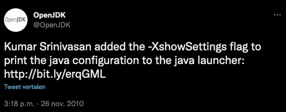

# 您运行的是什么 Java 版本？

> 原文：<https://medium.com/javarevisited/what-java-version-are-you-running-foojay-io-today-9b6a23a87558?source=collection_archive---------2----------------------->

有时，您需要检查您的计算机或服务器上安装了哪个 Java 版本，例如，当开始一个新项目或配置一个应用程序在服务器上运行时。

但是你知道有多种方法可以做到这一点，甚至可以很快获得比你想象的更多的信息吗？

让我们来看看…

# 在终端中读取 Java 版本

找到已安装版本的最简单方法可能是使用`java -version`终端命令:

```
$ java -version
openjdk version "19" 2022-09-20
OpenJDK Runtime Environment Zulu19.28+81-CA (build 19+36)
OpenJDK 64-Bit Server VM Zulu19.28+81-CA (build 19+36, mixed mode, sharing)
```

# 检查安装目录中的版本文件

上面的输出来自于`java`可执行文件从其安装目录下的文件中读取的信息。

让我们探索一下我们能在那里找到什么。

在我的机器上，当我使用 [SDKMAN](https://sdkman.io/) 在不同的 Java 版本之间切换时，我所有的版本都存储在这里:

```
$ ls -l /Users/frankdelporte/.sdkman/candidates/java/
total 0
drwxr-xr-x  15 frankdelporte  staff  480 Apr 17  2022 11.0.15-zulu
drwxr-xr-x  16 frankdelporte  staff  512 Apr 17  2022 17.0.3.fx-zulu
drwxr-xr-x  15 frankdelporte  staff  480 Mar 29  2022 18.0.1-zulu
drwxr-xr-x  15 frankdelporte  staff  480 Sep  7 18:36 19-zulu
drwxr-xr-x  18 frankdelporte  staff  576 Apr 18  2022 8.0.332-zulu
lrwxr-xr-x   1 frankdelporte  staff    7 Nov 21 21:09 current -> 19-zulu
```

在每个目录中，可以找到一个发布文件，它也向我们显示了版本信息，包括一些额外的信息。

```
$ cat /Users/frankdelporte/.sdkman/candidates/java/19-zulu/release
IMPLEMENTOR="Azul Systems, Inc."
IMPLEMENTOR_VERSION="Zulu19.28+81-CA"
JAVA_VERSION="19"
JAVA_VERSION_DATE="2022-09-20"
LIBC="default"
MODULES="java.base java.compiler ... jdk.unsupported jdk.unsupported.desktop jdk.xml.dom"
OS_ARCH="aarch64"
OS_NAME="Darwin"
SOURCE=".:git:3d665268e905"

$ cat /Users/frankdelporte/.sdkman/candidates/java/8.0.332-zulu//release
JAVA_VERSION="1.8.0_332"
OS_NAME="Darwin"
OS_VERSION="11.2"
OS_ARCH="aarch64"
SOURCE="git:f4b2b4c5882e"
```

# 使用 showSettings 获取更多信息

2010 年，OpenJDK 中增加了一个实验标志(用`X`表示)，以提供更多的配置信息:`-XshowSettings`。



这个标志可以用不同的参数调用，每个参数产生一个信息输出。

调用这个标志的最干净的方法是添加`-version`，否则您将得到很长的 Java 手动输出，因为没有发现要执行的应用程序代码。

# 读取系统属性

通过使用`-XshowSettings:properties`标志，显示了各种属性的长列表。

```
$ java -XshowSettings:properties -version
Property settings:
    file.encoding = UTF-8
    file.separator = /
    ftp.nonProxyHosts = local|*.local|169.254/16|*.169.254/16
    http.nonProxyHosts = local|*.local|169.254/16|*.169.254/16
    java.class.path =
    java.class.version = 63.0
    java.home = /Users/frankdelporte/.sdkman/candidates/java/19-zulu/zulu-19.jdk/Contents/Home
    java.io.tmpdir = /var/folders/np/6j1kls013kn2gpg_k6tz2lkr0000gn/T/
    java.library.path = /Users/frankdelporte/Library/Java/Extensions
        /Library/Java/Extensions
        /Network/Library/Java/Extensions
        /System/Library/Java/Extensions
        /usr/lib/java
        .
    java.runtime.name = OpenJDK Runtime Environment
    java.runtime.version = 19+36
    java.specification.name = Java Platform API Specification
    java.specification.vendor = Oracle Corporation
    java.specification.version = 19
    java.vendor = Azul Systems, Inc.
    java.vendor.url = http://www.azul.com/
    java.vendor.url.bug = http://www.azul.com/support/
    java.vendor.version = Zulu19.28+81-CA
    java.version = 19
    java.version.date = 2022-09-20
    java.vm.compressedOopsMode = Zero based
    java.vm.info = mixed mode, sharing
    java.vm.name = OpenJDK 64-Bit Server VM
    java.vm.specification.name = Java Virtual Machine Specification
    java.vm.specification.vendor = Oracle Corporation
    java.vm.specification.version = 19
    java.vm.vendor = Azul Systems, Inc.
    java.vm.version = 19+36
    jdk.debug = release
    line.separator = \n
    native.encoding = UTF-8
    os.arch = aarch64
    os.name = Mac OS X
    os.version = 13.0.1
    path.separator = :
    socksNonProxyHosts = local|*.local|169.254/16|*.169.254/16
    stderr.encoding = UTF-8
    stdout.encoding = UTF-8
    sun.arch.data.model = 64
    sun.boot.library.path = /Users/frankdelporte/.sdkman/candidates/java/19-zulu/zulu-19.jdk/Contents/Home/lib
    sun.cpu.endian = little
    sun.io.unicode.encoding = UnicodeBig
    sun.java.launcher = SUN_STANDARD
    sun.jnu.encoding = UTF-8
    sun.management.compiler = HotSpot 64-Bit Tiered Compilers
    user.country = BE
    user.dir = /Users/frankdelporte
    user.home = /Users/frankdelporte
    user.language = en
    user.name = frankdelporte

openjdk version "19" 2022-09-20
OpenJDK Runtime Environment Zulu19.28+81-CA (build 19+36)
OpenJDK 64-Bit Server VM Zulu19.28+81-CA (build 19+36, mixed mode, sharing)
```

如果你曾经遇到过不支持的 [Java 版本 59](http://www.java67.com/2016/06/unsupported-majorminor-version-520-in-java-eclipse-linux.html) (类似)的问题，你现在也会明白这个值是在哪里定义的，就在这个列表中的`java.class.version`。

它是 Java 用来定义版本的内部编号。

*   Java 版本>类版本
*   8 > 52
*   9 > 53
*   10 > 54
*   11 > 55
*   12 > 56
*   13 > 57
*   14 > 58
*   15 > 59
*   16 > 60
*   17 > 61
*   18 > 62
*   19 > 63

# 读取区域设置信息

如果你还不知道，我住在比利时，使用英语作为我的计算机语言，正如你在使用`-XshowSettings:locale`旗时看到的:

```
$ java -XshowSettings:locale -version
Locale settings:
    default locale = English (Belgium)
    default display locale = English (Belgium)
    default format locale = English (Belgium)
    available locales = , af, af_NA, af_ZA, af_ZA_#Latn, agq, agq_CM, agq_CM_#Latn,
        ak, ak_GH, ak_GH_#Latn, am, am_ET, am_ET_#Ethi, ar, ar_001,
        ar_AE, ar_BH, ar_DJ, ar_DZ, ar_EG, ar_EG_#Arab, ar_EH, ar_ER,
        ...
        zh_MO_#Hant, zh_SG, zh_SG_#Hans, zh_TW, zh_TW_#Hant, zh__#Hans, zh__#Hant, zu,
        zu_ZA, zu_ZA_#Latn

openjdk version "19" 2022-09-20
OpenJDK Runtime Environment Zulu19.28+81-CA (build 19+36)
OpenJDK 64-Bit Server VM Zulu19.28+81-CA (build 19+36, mixed mode, sharing)
```

# 读取虚拟机设置

使用`-XshowSettings:vm`标志，显示了一些关于 [Java 虚拟机的信息。](https://javarevisited.blogspot.com/2011/12/jre-jvm-jdk-jit-in-java-programming.html)

正如您在第二个例子中看到的，最大堆内存大小可以用`-Xmx`标志来定义。

```
$ java -XshowSettings:vm -version
VM settings:
    Max. Heap Size (Estimated): 8.00G
    Using VM: OpenJDK 64-Bit Server VM

openjdk version "19" 2022-09-20
OpenJDK Runtime Environment Zulu19.28+81-CA (build 19+36)
OpenJDK 64-Bit Server VM Zulu19.28+81-CA (build 19+36, mixed mode, sharing)

$ java -XshowSettings:vm -Xmx512M -version
VM settings:
    Max. Heap Size: 512.00M
    Using VM: OpenJDK 64-Bit Server VM

openjdk version "19" 2022-09-20
OpenJDK Runtime Environment Zulu19.28+81-CA (build 19+36)
OpenJDK 64-Bit Server VM Zulu19.28+81-CA (build 19+36, mixed mode, sharing)
```

# 同时阅读

如果您想在一次调用中获得上述所有信息，请使用`-XshowSettings:all`标志。

# 结论

在`java -version`旁边，我们也可以使用`java -XshowSettings:all -version`来获得更多关于我们的 Java 环境的信息。

*原载于 2022 年 12 月 15 日*[*https://foojay . io*](https://foojay.io/today/what-java-version-are-you-running-lets-take-a-look-under-the-hood-of-the-jdk/)*。*