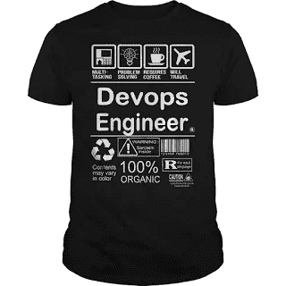

# 2023 年，高级技术开发人员的下一步是什么？项目经理、技术架构师还是 DevOps 工程师？

> 原文：<https://medium.com/javarevisited/what-next-for-senior-developers-in-tech-project-manager-technical-architect-or-a-devops-engineer-b532a80c9ba1?source=collection_archive---------0----------------------->

## 是时候考虑职业生涯的下一个层次了。

照片由[布伦丹·丘奇](https://unsplash.com/@bdchu614?utm_source=medium&utm_medium=referral)在 [Unsplash](https://unsplash.com?utm_source=medium&utm_medium=referral) 上拍摄

如果你是一名经验丰富的开发人员或高级 Java 程序员，就像拥有超过 5 到 8 年经验的人一样，并且想知道如何才能更上一层楼，那么你来对地方了。在这篇文章中，我将分享**五个职业选择**，像你这样有经验的 Java 开发人员可以选择这些选择，让你的职业生涯更上一层楼。

除了成为项目经理，这是许多高级程序员选择的道路，现在还有其他技术和更好的职业机会。这对于缺乏人员管理技能并且喜欢[编码](http://www.java67.com/2016/02/5-books-to-improve-coding-skills-of.html)、[开发](https://javarevisited.blogspot.com/2018/04/top-5-java-frameworks-to-learn-in-2018_27.html#axzz5DmwFLA1K)和保持动手的程序员来说尤其重要。

> 对你来说，选择正确的职业选择很重要，这取决于你的个人技能，因为成为一名项目经理或在没有这些技能的情况下进入人员管理有时会令人沮丧，主要是因为你不想在你可以轻松完成开发人员的工作时感到沮丧。

人员管理也是一项非常不同的技能，你需要与更高和更低的级别密切合作，就像你需要定期与企业、高管和其他更高的管理人员交谈，以制定交付计划。但是，您还需要与开发人员、QA 和其他资源合作来完成这项工作。这并不容易，尤其是如果你必须管理一个大团队。

另一方面，一条更技术性的职业道路，比如成为一名 [DevOps 专家](https://hackernoon.com/the-2018-devops-roadmap-31588d8670cb?gi=8829080e6d7d)、一名 [Scrum 大师](https://javarevisited.blogspot.com/2018/10/top-5-carrer-options-for-experienced-java-programmers.html)或者一名[软件架构师](http://javarevisited.blogspot.sg/2018/02/5-must-read-books-to-become-software-architect-solution.html)对于那些总是想保持动手和接近技术的程序员来说更好。

> 对一个有经验和熟练的程序员有很多需求，你永远不要认为如果你继续做多年的编码，你就会过时和失去市场。

许多组织，如投资银行，也在推动这种技术职业道路，在这里你可以通过保持技术和擅长你的工作来获得高级职位，副总裁和执行董事。

# 2023 年经验丰富的开发人员的 6 个最佳职业选择

无论如何，在不浪费你更多时间的情况下，这里是我列出的一些最好的职业选择，一个有经验的 Java 开发人员可以追求这些选择，以使他的职业生涯更上一层楼。

## 1.解决方案架构师

解决方案架构师负责组织内一个或多个应用程序或服务的设计，通常是解决方案开发团队的一部分。

他们必须拥有技术和业务技能的平衡组合，并经常与企业架构师合作以获得战略方向。

解决方案架构师的工作是将功能分析师创建的需求转化为该解决方案的架构，并通过架构和设计工件对其进行描述。

为了成为一名有效的解决方案架构师，您应该对基础知识有很好的理解，比如数据结构和算法，以及系统设计和设计模式。

如果你想更新你的知识，那么我建议你从[数据结构和算法开始:使用 Java](https://click.linksynergy.com/fs-bin/click?id=JVFxdTr9V80&subid=0&offerid=323058.1&type=10&tmpid=14538&RD_PARM1=https%3A%2F%2Fwww.udemy.com%2Fdata-structures-and-algorithms-deep-dive-using-java%2F) 深入了解所有基本的数据结构和算法。

如果你需要课程，我也为高级程序员和开发人员记下了一些成为解决方案架构师 的 [**最佳课程。**](https://javarevisited.blogspot.com/2019/03/5-courses-programmers-can-join-to-learn.html#axzz5jKqbGRcg)

如果你喜欢书，那么你也可以看看我列出的 [**5 本解决方案架构师**](http://javarevisited.blogspot.sg/2018/02/5-must-read-books-to-become-software-architect-solution.html) 或者软件架构师必读的书。

## 2.DevOps 工程师

对于有经验的开发者来说，这又是一个新的机会。成为一名开发工程师没有正式的职业轨迹。

他们要么是对部署和网络操作感兴趣的开发人员，要么是对脚本和编码充满热情的系统管理员，并进入开发领域，在那里他们可以改进测试和部署的规划。

这意味着，如果您是一名经验丰富的 Java 程序员，对管理环境、自动化和改进整体结构充满热情，那么您可以成为一名 DevOps 工程师。

如果你正在寻找一些很棒的资源，那么使用管道和 Docker 与 Jenkins 一起学习 DevOps: CI/CD 是一个很好的入门课程，尤其是对于 Java 开发人员来说。

我还分享了，[2023 年 DevOps 开发者路线图](https://javarevisited.blogspot.com/2018/09/the-2018-devops-roadmap-your-guide-to-become-DevOps-Engineer.html)，这是 2023 年成为 DevOps 工程师的综合资源之一。

<https://javarevisited.blogspot.com/2018/09/the-2018-devops-roadmap-your-guide-to-become-DevOps-Engineer.html>  

## 3.Scrum 大师

如果你在敏捷环境中工作过，那么你肯定听说过 Scrum meetings 和 Scrum master。Scrum 大师的工作是每天召开一次 Scrum 会议，解决任何阻碍你前进的障碍。这需要一点点项目管理和协调技能。

与业务分析师或项目经理相比，这是一个相对较新的职业选择，但它在遵循[敏捷方法](https://pluralsight.pxf.io/c/1193463/424552/7490?u=https%3A%2F%2Fwww.pluralsight.com%2Fcourses%2Fagile-fundamentals)进行开发的公司中越来越受欢迎。

如果你对你的项目和业务领域有很好的经验，那么你也可以成为 Scrum 大师！但如果你不熟悉敏捷，建议你上 [**敏捷速成班:敏捷项目管理；敏捷交付**](https://click.linksynergy.com/deeplink?id=JVFxdTr9V80&mid=39197&murl=https%3A%2F%2Fwww.udemy.com%2Fcourse%2Fagile-crash-course%2F) 让自己熟悉 Sprint、Scrum、看板和其他敏捷方法和工具。

<https://click.linksynergy.com/deeplink?id=JVFxdTr9V80&mid=39197&murl=https%3A%2F%2Fwww.udemy.com%2Fcourse%2Fagile-crash-course%2F>  

你可以学习一些基本的 Scrum 技能或者获得一个 Scrum 认证来进一步提高你的机会。

## 4.项目管理人

项目经理负责项目的日常管理，必须有能力管理项目的六个方面，即范围、进度、财务、风险、质量和资源。

作为项目经理，你的工作是计划、预算、监督和记录你正在从事的特定项目的所有方面。项目经理可能会与上层管理人员密切合作

如果你是项目管理新手，正在努力获得对项目的控制权，我建议你从[**开始项目管理:项目管理一级**](https://click.linksynergy.com/fs-bin/click?id=JVFxdTr9V80&subid=0&offerid=323058.1&type=10&tmpid=14538&RD_PARM1=https%3A%2F%2Fwww.udemy.com%2Fbeginning-project-management-project-management-level-one%2F) 开始，这是了解项目管理基础知识的较好课程之一。

我向所有渴望成为项目经理的开发人员强烈推荐这门课程。如果你愿意，你还可以申请 [**PMP 认证**](https://javarevisited.blogspot.com/2019/09/top-5-courses-to-crack-pmp-project-management-professional-certification-exam.html) 成为一名认证项目经理，这对你快速的职业发展非常有用。

## 5.商业分析员

分析师参与业务系统或 IT 系统的设计或修改。分析师与业务涉众和主题专家互动，以便理解他们的问题和需求。

分析师还收集文档并分析业务需求和要求。如果你是商业分析新手，不知道你的角色是什么，我建议你看一下商业分析基础<https://click.linksynergy.com/fs-bin/click?id=JVFxdTr9V80&subid=0&offerid=323058.1&type=10&tmpid=14538&RD_PARM1=https%3A%2F%2Fwww.udemy.com%2Fbusiness-analysis-ba%2F>****s**，这是关于这个主题的较好的课程之一。**

**我向有抱负的业务分析师和将业务分析作为工作一部分的开发人员强烈推荐这门课程。**

****

## **6.开发商代言人**

**我看到许多高级开发人员还在扮演另一个角色，那就是开发倡导者。如果你对某项技术或产品充满热情，比如 IntelliJIDEA，那么你也可以成为一名开发者拥护者。这是一个专门的角色，作为公司和它的开发者社区之间的联系。**

**近年来，我看到许多高级开发人员选择了这个角色，因为这也给了他们一个机会来确立自己在特定工具或技术方面权威地位，并作为一个有影响力的人建立自己的在线档案。**

**所以，这个角色拥有两个世界的精华，如果你想成为开发者拥护者，我建议你在投入之前了解更多。如果你需要资源，Packt 的 [**开发者手册是一个很好的起点。作者不是别人，正是 Geertjan Wielenga，他是 NetBeans IDE(Java 开发人员最流行的 IDE 之一)的幕后人员。**](https://www.amazon.com/Developer-Advocate-Conversations-turning-passion/dp/1789138744?tag=javamysqlanta-20)**

**顺便说一下，整本书的标题是“开发者，倡导者！:关于将谈论技术的热情转化为职业的对话”，你可以猜猜它对你有什么帮助。**

****

**这就是有经验的 Java 程序员的一些职业选择，比如有 8 到 15 年经验的人。我知道，你们中的许多人不想进入人员管理的道路，而想继续亲自参与编码和目前正在做的任何事情。**

**如果是这样，那么你应该在[解决方案架构师](http://javarevisited.blogspot.sg/2018/02/5-must-read-books-to-become-software-architect-solution.html)和[开发运维工程师](https://javarevisited.blogspot.com/2018/09/the-2018-devops-roadmap-your-guide-to-become-DevOps-Engineer.html)之间做出选择。两者都是非常实际的角色，你将继续与技术打交道。**

**另一方面，如果你现在正考虑离开编码，并想在领导、人员和产品方面探索更多的选择，那么 scrum master、业务分析师和项目经理的角色非常适合你。**

**其他**文章你可能喜欢**探索
[2023 年 Java 开发者路线图](https://javarevisited.blogspot.com/2019/10/the-java-developer-roadmap.html)
[Java 和 Web 开发者应该学习的 10 件事](http://javarevisited.blogspot.sg/2017/12/10-things-java-programmers-should-learn.html#axzz53ENLS1RB)
[Java 开发者应该知道的 10 个测试工具](http://javarevisited.blogspot.sg/2018/01/10-unit-testing-and-integration-tools-for-java-programmers.html)
[5 个框架 Java 开发者应该学习的 5 门课程](http://javarevisited.blogspot.sg/2018/04/top-5-java-frameworks-to-learn-in-2018_27.html)
[学习 Java 中的大数据和 Apache Spark](http://javarevisited.blogspot.sg/2017/12/top-5-courses-to-learn-big-data-and.html)
[10 门课程学习 Java 开发者的 devo PS](https://javarevisited.blogspot.com/2018/09/10-devops-courses-for-experienced-java-developers.html)
<http://www.java67.com/2018/02/10-books-java-developers-should-read-in.html>
[Java 开发人员在日常工作中使用的 10 个工具](http://javarevisited.blogspot.sg/2017/03/10-tools-used-by-java-programming-Developers.html#axzz55lrMRnNC)
[成为更好的 Java 开发人员的 10 个技巧](https://javarevisited.blogspot.com/2018/05/10-tips-to-become-better-java-developer.html)**

**感谢阅读这篇文章！如果你喜欢这篇文章，那么请分享给你的朋友和同事。此外，如果您有任何问题或反馈，请在下面的评论中留言！**

## **您可能喜欢的其他媒体文章:**

**</javarevisited/what-java-programmers-should-learn-in-2020-648050533c83>  </javarevisited/top-10-programming-languages-you-can-learn-for-jobs-and-career-in-technology-491e611c22bc>  </javarevisited/these-are-the-highest-paying-tech-jobs-programmers-can-aim-to-increase-their-pay-c59e1eeb6904> **