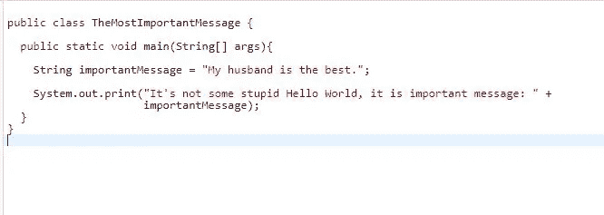

# 要成为合格的(JAVA)开发人员，需要学习什么

> 原文：<https://medium.com/javarevisited/what-to-learn-to-become-eligible-for-a-job-as-java-developer-41602010668b?source=collection_archive---------0----------------------->

由 [Unsplash](https://unsplash.com?utm_source=medium&utm_medium=referral) 上的[émile Perron](https://unsplash.com/@emilep?utm_source=medium&utm_medium=referral)拍摄的照片

*这篇文章将帮助那些一直在思考或者已经决定成为一名开发者的人。它基于我从一个完全不同的职业到一个开发者的道路。*

