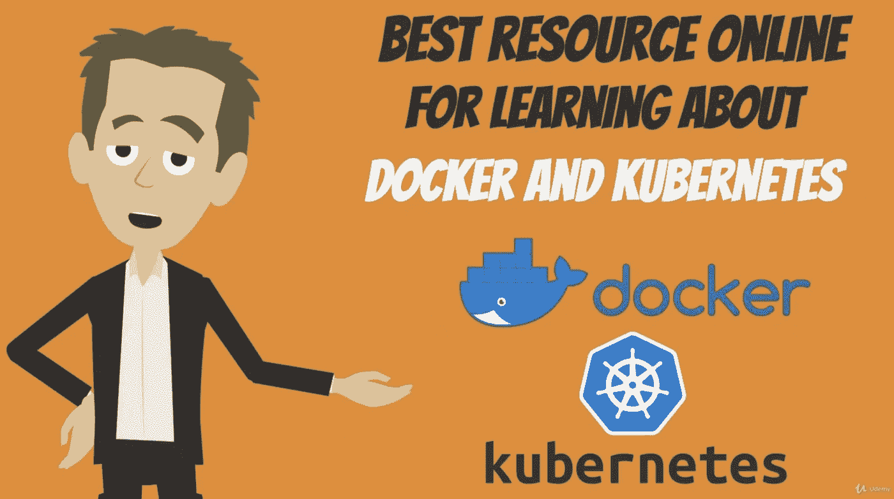

# 关于 Docker、Kubernetes、CI 和 CD 的任何信息

> 原文：<https://medium.com/javarevisited/whatever-you-need-to-learn-about-docker-kubernetes-ci-and-cd-57006d9d8be4?source=collection_archive---------0----------------------->

## 我的个人经验与一个伟大的在线课程

[Docker 和 Kubernetes:完全指南](https://www.udemy.com/course/docker-and-kubernetes-the-complete-guide/)

我将在 Docker 和 Kubernetes 上写一个伟大而全面的[在线课程](https://www.udemy.com/course/docker-and-kubernetes-the-complete-guide/)。如果你想学习 Docker，不管你是初学者还是对 Docker 有所了解，我都会向你推荐[这个课程](https://www.udemy.com/course/docker-and-kubernetes-the-complete-guide/)。大概 Docker 上还有其他一些不错的课程…