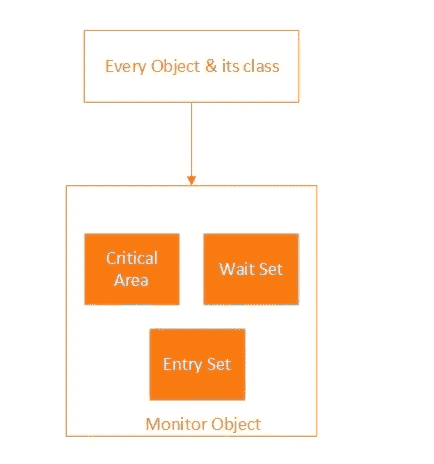

# Java 中的监视器是什么？

> 原文：<https://medium.com/javarevisited/whats-a-monitor-in-java-8f0ebecaea2a?source=collection_archive---------3----------------------->

在进入 Monitor 之前，我们需要了解两件事。

1.  互斥

> 当一个进程/线程正在执行它的临界区时，不允许其他进程执行它的临界区。(每个进程都有一个被称为“临界区”的代码段，在这个代码段中访问共享数据。)

2.同步

> 当线程试图通过协同工作来实现一个共同的目标时，这些线程之间需要合作。当他们专注于一个共同的目标时，他们需要同步。

**监视器用于实现互斥和同步**

## 了解显示器

[](https://javarevisited.blogspot.com/2014/07/top-50-java-multithreading-interview-questions-answers.html#axzz6hX6XfwBD)

> 不要把这个临界区和临界区混淆了。因为在这里，关键区域是在对象级别提到的，而不是在线程级别。共享数据被认为是一个关键领域。

每个对象及其类都与一个监视器相关联。需要防止并发访问的对象的实例变量包括与对象相关联的监视器的关键区域，并且需要防止并发访问的类的实例变量/静态变量包括在与类相关联的监视器的关键区域中。

*   这个关键区域有一把锁保护着，这把锁确保了互斥。
*   等待集还与用于提供线程间协调的监视器相关联。
*   一个条目集用于保存已经请求锁的线程，而锁还没有被它们获得。*

**显示器上的互斥是如何实现的？**

每个对象都与一个监视器相关联，这个监视器有一个**锁**，每个线程在访问共享变量时都可以使用这个**锁**来锁定或解锁对象。

显而易见，这意味着一次只有一个线程可以在监视器上持有**锁**。任何试图锁定该锁的其他线程都会被阻塞，直到它们可以获得该锁。

当一个新线程试图获取锁时，如果一个线程已经拥有该锁，那么该线程将等待条目集来获取该锁。

当获得锁的线程完成其临界区时，它将释放锁。所以下一个线程将获得锁，但是这个下一个线程是从条目集中获取的，并且将由 JVM 基于一些标准(比如 FIFO)来确定。

这里，我们实现的是互斥，因为我们给了一个线程对对象的独占访问，并且我们不允许任何其他线程进入它们的临界区。

使用监视器实现互斥的 java 代码示例

```
class Counter{private int count = 0;public void synchronized Increment() {int n = count;count = n+1;} //Here synchronized is used to indicate those things should be done sequentially.}
```

## 如何通过监视器实现协调/同步？

使用与监视器和“等待并通知”或“发信号并继续”机制相关联的等待集来实现同步。

当一个线程需要某些数据处于特定状态，而另一个线程负责让数据进入该状态时，例如生产者/消费者问题，同步非常重要

当一个线程调用与该对象相关的 wait()方法时，该线程被挂起并被添加到等待集合中，直到某个其他线程对同一对象调用 notify()或 notifyAll()。

[notify()方法](https://javarevisited.blogspot.com/2015/07/how-to-use-wait-notify-and-notifyall-in.html)用于唤醒特定对象的监视器的等待集中的线程。有两种方法通知等待的线程。

*   notify() →对于所有等待等待的线程，设置方法 notify()通知它们中的任何一个任意唤醒。选择唤醒哪个线程是不确定的，这取决于 JVM。
*   notifyAll() →这个方法只是唤醒所有正在等待集合中等待的线程。被唤醒的线程将无法继续，直到当前线程释放该对象上的锁。被唤醒的线程将以通常的方式与任何其他可能主动竞争同步的线程竞争。

## 在生产者-消费者问题中使用监视器实现同步的示例 java 代码

```
class Buffer {private char [] buffer;private int count = 0, in = 0, out = 0;Buffer(int size){buffer = new char[size];}public synchronized void Put(char c) {while(count == buffer.length){try { wait(); }catch (InterruptedException e) { }finally { }}System.out.println(“Producing “ + c + “ …”);buffer[in] = c;in = (in + 1) % buffer.length;count++;notify();}public synchronized char Get() {while (count == 0){try { wait(); }catch (InterruptedException e) { }finally { }}char c = buffer[out];out = (out + 1) % buffer.length;count — ;System.out.println(“Consuming “ + c + “ …”);notify();return c;}}
```

我在博客上分享了[我的 SO 答案](https://stackoverflow.com/questions/3362303/whats-a-monitor-in-java/64116702#64116702)。你可以在这里找到问题[。](https://stackoverflow.com/questions/3362303/whats-a-monitor-in-java)