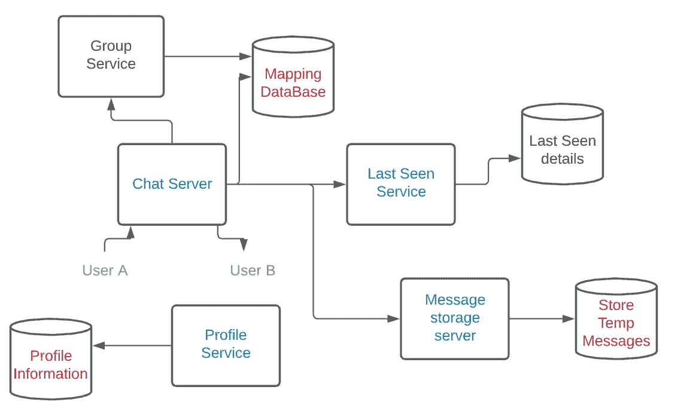
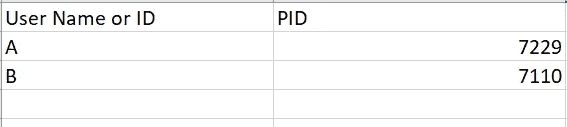
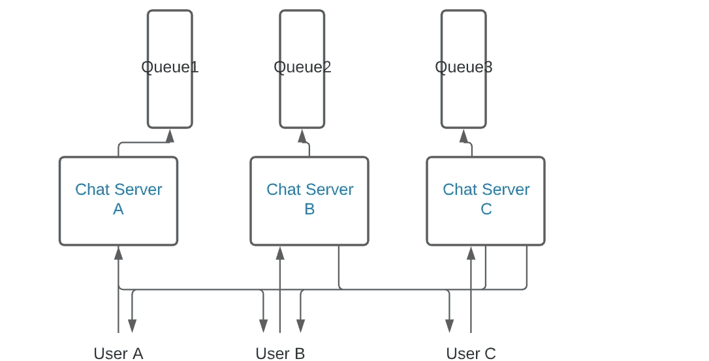
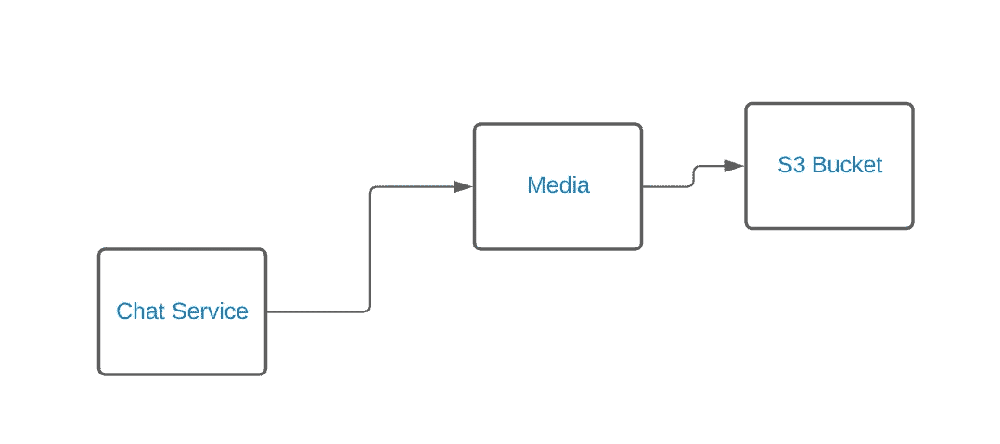

# WhatsApp 系统设计

> 原文：<https://medium.com/javarevisited/whatsapp-system-design-dd1cc2e6bfb4?source=collection_archive---------0----------------------->

在这篇博客中，我们将介绍一个聊天应用程序的设计，即 Whatsapp。

下面是架构图:

## **要求:**

1.  用户可以发送消息
2.  用户可以发送媒体(图像、视频、文件等)
3.  用户可以分组进行对话
4.  用户可以查看上次看到的内容
5.  即使接收者脱机，用户也可以发送消息\
6.  消息加密和调用(考虑到解释中涉及的复杂性，我们将跳过此功能)

**解说:**

**个人资料数据库**

存储用户的个人资料信息，如状态、个人资料图片、个人资料 ID 和联系方式。
为了存储个人资料图片，我们将使用 s3 存储桶，并在数据库中保存相应的链接。

**档案服务**

有多个端点，这有助于检索用户的详细信息。Get 调用检索配置文件信息，post/put 调用添加配置文件信息。

**聊天服务器**

WhatsApp 应用程序的主要核心服务器。我们将在下一节详细讨论这一点。

**映射数据库**

我们将不使用 HTTP 协议来发送消息，因为在 HTTP；为每个用户创建一个新的请求，一旦收到响应，我们就关闭连接。然而，我们不想浪费时间和资源来创建连接，因此我们将使用 websocket 协议，因为连接不会立即关闭。

> 映射数据库对这个应用程序至关重要。

让我们举一个例子来解释这个场景:

在上面的架构图中，我们使用了 2 个用户:UserA 和 UserB。假设用户 a 向用户 b 发送消息“嘿”。

一旦用户 a 与聊天服务器交互，就会为这个用户 a 创建一个新的进程(一个线程)。如果用户 b 在线，情况也是如此。然后，服务器找出接收者 userB 的名称，然后它进入数据库，找出 userB 的进程 id (pid ),以便将消息发送给 userB。如果用户 b 想要将消息发送给用户 a，则在映射数据库中搜索用户 a，一旦找到 pid，就将消息发送给该 pid，这里基本上就是用户 a。

因此，每当用户与系统对话时，就会创建一个新流程，并将详细信息存储在映射数据库中，类似于以下方式:

在真实的应用程序中，显然我们会有多个用户和服务器，如下所示:

我们还在每个服务器中包含了一个队列，这样队列就可以处理过量的消息，并且在向不同用户发送任何消息时都不会失败。

**群组服务**

对于创建的每个组，都会创建一个新的 groupId。然后，这个 groupId 将有一个到组中所有用户的映射。每当发送消息时，聊天服务首先找出接收者的类型(群组或单个用户)，如果是群组，则消息被委托给群组服务。然后，Group Service 调用 group db 来查找 groupId 和所有相应的 userIds，以便可以发送消息。

**最后看到的服务**

上次看到的服务使用上次看到的数据库，因此可以存储上次看到的信息。这是一个非常简单的服务，它只维护最后看到的时间细节。最好的方法是:每当用户打开 WhatsApp 并向聊天服务器发送任何与用户相关的请求时，聊天服务器都可以调用这个服务来更新时间细节。

**消息存储服务器&存储临时消息 DB**

我们需要一个消息存储服务器，因为当消息被发送给一个用户时，该用户可以离线。在这种情况下，我们将不得不保存消息，以便一旦用户点击服务器或重新联机，所有消息都可以被传递。出于安全目的，我们将加密信息存储在数据库中。实际上，整个架构使用加密的消息，然而为了保持文章简短，我们将跳过它。

**媒体类型消息**

对于媒体类型的消息，聊天服务获取消息并找出消息的类型。一旦消息类型被标记为媒体，它就被存储在 S3 桶中，这是一个对象存储服务。这些媒体的链接随后存储在 sql 或 nosql db 中，并映射到用户详细信息。我们可以使用 HTTP 协议来传输这些消息。

**结论**

由此我们对 WhatsApp messenger 的设计有了一个大致的了解。我还没有深入讨论使用哪种队列服务或哪种 db 类型的技术细节，因为这是一个需要研究和实现特定非功能目标的主题。如果您认为体系结构图中有可以改进的地方，请随意评论！

请关注更多关于全栈开发的文章。请通过 LinkedIn 联系我，或者给我发邮件到 vivek.sinless@gmail.com