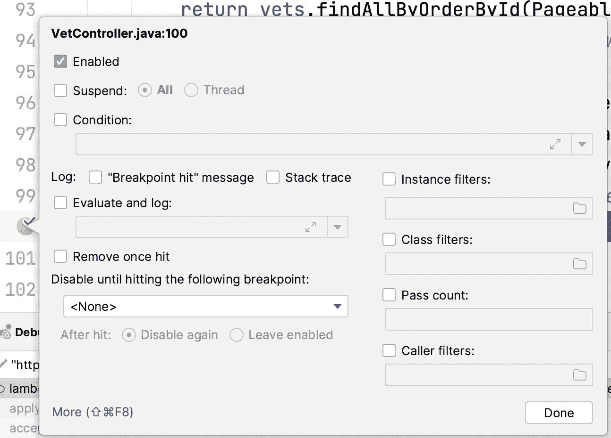
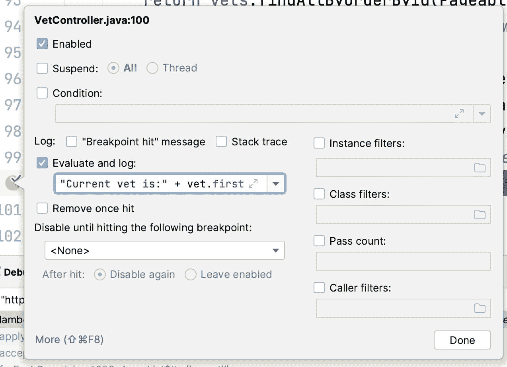

# 当断点没有中断时

> 原文：<https://medium.com/javarevisited/when-breakpoints-dont-break-72a33577a537?source=collection_archive---------7----------------------->


我在博客和视频中讨论了很多跟踪点。他们很精彩，但是我感觉不碎的细微差别有点失落。由于我们的调试习惯和我们对[调试](https://javarevisited.blogspot.com/2022/09/java-debugging-interview-questions.html)的先入为主的观念，这个神奇工具的真正威力被隐藏了。实现这些工具所需的心理转变确实很难。在处理“奇怪”的错误时，这种思维转变的回报是巨大的。尤其是在大型系统和并发相关的问题中。

在我们开始本周的帖子之前，我想请你帮个小忙。我的朋友尼古拉斯被推特暂停了[。他可以利用追随者和帮助。](https://twitter.com/debugagent/status/1577094628347588608?s=20&t=TgSSqDuqxtm86BVfjic-FQ)

说完这些，让我们回到基础。什么是不中断断点？

# 不间断断点

我不喜欢非中断断点这个术语。这是一种矛盾修饰法。在 Lightrun，我们使用术语“快照”,但它对于具有我们提供的上下文信息级别的东西更有意义。谷歌使用术语“捕获”,在这种特定情况下更有意义。

在下图中，我们可以看到一个未选中 suspend 选项的断点，它会变成一个不间断断点。注意，断点是用黄色而不是红色来显示状态的。这个断点实际上什么都不做，因为没有额外的设置。我会回到那个…

[](https://javarevisited.blogspot.com/2011/07/java-debugging-tutorial-example-tips.html)

当我们创建一个“正常的”断点时，它会产生暂停所有线程的副作用。调试器能够禁用该功能，并有效地创建不间断断点。为了完整性，它们还可以选择只挂起当前线程，这在调试多线程代码时很有帮助。

当我们不暂停当前线程时，我们不会得到暂停应用程序时得到的那种美妙的断点 UI。这个 UI 不实用，因为应用程序的状态已经改变了。所以我们不能利用这些信息。

请注意，开发人员的可观察性工具通过其不间断的断点捕获信息的快照，这就是为什么我认为 Lightrun 使用的术语“快照”是有意义的。而 [IDE](/javarevisited/7-best-courses-to-learn-intellij-idea-for-beginners-and-experienced-java-programmers-2e9aa9bb0c05) 没有那个能力。我认为这是有意义的，因为这样的行为不同于 IDEs 的默认行为，可能会让用户感到困惑。

我们在 IDE 监视区域看不到堆栈跟踪和变量值。我们需要找到不同的方法从这些断点中提取我们需要的信息。最常见的方法是跟踪点(又名日志点)。跟踪点让我们可以为每个断点添加一个日志，日志可以简单到“断点命中”，但也可以包括像`“Reached the method with variable: ” + variableValue`这样的表达式。我们可以在下面的截图中看到一个例子。

[](https://javarevisited.blogspot.com/2020/04/top-5-courses-to-learn-java-collections-and-streams.html)

# 超越跟踪点

痕迹是惊人的。如果您在调试时仍然使用 printlines，那么您应该花点时间重新考虑一下，并研究一下跟踪点。请注意，这不是日志记录的替代品。日志记录是永久且必要的。默认情况下，打印行调试和跟踪点是短暂的，它们需要消失。跟踪点无缝地完成这项工作，而我们经常忘记在代码中打印。

跟踪点的另一个重要好处是条件。用 print 语句添加一行代码“没什么大不了的”，但是用 if 语句添加代码会让我们走上不归路。跟踪点是断点，断点支持条件。我们可以定义一个条件跟踪点，只有在满足条件时才会打印。这大大减少了我们需要处理的噪音。

我们可以将跟踪点组合在一起，启用和禁用它们，而不是注释进出行。我们可以利用如此多的功能来使它们变得更加方便。

一个重要的特性是堆栈跟踪。我们可以检查对话框中的标志，每次点击跟踪点时，我们都可以看到路径。这会很快变得很吵。为了减少噪音，我们可以使用呼叫者过滤器来帮助我们处理额外的噪音。它们是一个相当大的特性，我将在以后的博客文章中介绍。

冰山一角是这样的，如果调用堆栈包含一个特定的方法(或者不包含它)，你可以跳过断点。过滤器的语法是最难的部分，因为它使用了格式为`packageName.className(paramTypes)returnValueType`的方法签名的 [JVM 内部](/javarevisited/7-best-courses-to-learn-jvm-garbage-collection-and-performance-tuning-for-experienced-java-331705180686)符号。它不使用空格或逗号。例如，这是一个用于`PrimeMain`类的主方法的排除过滤器:

```
-PrimeMain.main([Ljava/lang/String;)V
```

是的。我知道，很难读懂。如果有兴趣的话，我会试着在以后的帖子里写一写。在我即将出版的调试书籍中，我还有第二本书介绍这个特性。

# 禁用直到

不间断断点的一个很酷的特性是我们可以缩放它们。一个[正常断点](https://www.java67.com/2018/01/how-to-remote-debug-java-application-in-Eclipse.html)是痛苦。你添加它，你的应用程序停止。所以你需要反复按下继续键。有了不间断，你就不再有那个问题，你可以把它们分散开来。这是一个很酷的例子。

假设我们有一个流程以一种奇怪的方式失败了，但是只有当用户通过方法 x 到达时，当流程通过不同的路径到达时，事情照常工作。我可以添加一个跟踪点，但是当我设置所有东西的时候，我得到了很多我不想要的噪音。因为这个过程经常被调用。

我可以向方法 x 添加一个不间断断点，然后在有问题的流程中，我可以在“禁用，直到遇到下面的断点”组合框中选择不间断断点。这将删除额外的日志/暂停，直到我们真正准备好断点。酷的事情是，我们可以自动禁用断点后，再次命中，以保持噪音最小。

我不能做的一件事是轻易地改变状态。我希望有一个工具来计算一个方法被调用的次数或执行一个方法的持续时间(以毫秒计)。这对于 println 调试来说并不难，但是据我所知，对于跟踪点来说是不可能的。在一个跟踪点中设置一个变量为当前时间，并在第二个跟踪点中打印 current time 和变量之间的差异，这将是一件非常棒的事情。

# 最后

调试器中有许多隐藏的宝石。近年来，跟踪点得到了更多的关注。我信任 VS 代码。他们使得在 IDE UI 中添加登录点变得非常容易。它们没有不间断断点的其他功能。但他们帮助推动了对这一功能的认识。

除了追踪点之外，我们还可以做很多事情。我希望您在下一次调试会话中记住这一点。