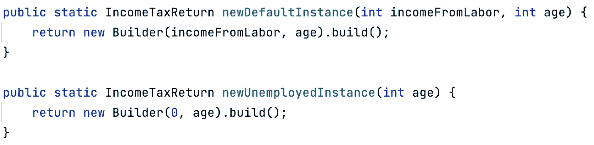

# 当构造函数不为你做的时候，使用构造函数

> 原文：<https://medium.com/javarevisited/when-constructors-arent-doing-it-for-you-use-a-builder-11559fa41e39?source=collection_archive---------1----------------------->

我相信是在 2016 年左右，我第一次读《有效的 Java》这本书的时候，我就被吸引住了[1]。它也是我读的第一批编程书籍之一，从那以后，我再也没有找到一本像它那样有价值的书。在这篇文章中，我想谈谈书中的一个技巧，我发现它非常有用。

由[托卢·奥卢博德](https://unsplash.com/@toluobde?utm_source=medium&utm_medium=referral)在 [Unsplash](https://unsplash.com?utm_source=medium&utm_medium=referral) 上拍摄的照片

**TL；当你觉得需要创建多个或长构造函数时，考虑使用[构建器模式](http://javarevisited.blogspot.sg/2012/06/builder-design-pattern-in-java-example.html)。它将简化你的代码，增加可读性，并允许不变性。**

## 什么时候用？

如果您需要创建一个具有许多可能的参数、组合等的对象，那么这种模式非常有用。请继续阅读，了解它是如何工作的。

## 基本想法

假设我们想要模拟一个**纳税申报表**。想想我们在这里可以有多少个字段。最直接的方法是创建一个构造函数，见下面的例子。

不使用构建器的 IncomeTaxReturn.java。

所以这里我们有一个长构造函数，当实例化时，很难阅读和理解哪个参数对应什么值。如果我们以后想要添加一个新的字段，这也是有问题的。或者我们想模拟不同的组合。

显然还有其他方法可以做到这一点，可能使用多个构造函数，或者 setters，或者容器对象。但是让我向您展示如何使用**构建器**来实现这一点。

## 确定必填字段

关于这个例子，我们可以注意到的一点是，大多数人可能只需要指定劳动收入和他们的年龄。因此，假设这两个字段是必需的，其余的是可选的。这意味着我们希望在构造函数中输入劳动收入和一个人的年龄，但是其他字段应该在之后指定。

## 不变性增益

现在，我们不想使用 setters，为什么？因为这意味着我们可能有尚未完全构造(语义上)的对象，例如当涉及到[多线程](/javarevisited/6-multithreading-and-concurrency-books-every-java-programmer-should-read-b6a08d2aae54)时这是有问题的。因此，我们希望对我们的纳税申报单实施*不变性*。

## 使用构建器模式

这种情况下的构建器看起来像这样。

为了简洁起见，我删除了一些字段，但请记住，我们在这里解决的问题如上所述。

使用生成器模式的 IncomeTaxReturn.java。

关于这个例子，你能注意到什么？

*   纳税申报表只有最终字段，其中的可选值已在构建器中指定。
*   创建任何类型的复杂报税组合都非常容易。
*   我们还可以在不影响当前用户的情况下添加新的字段。
*   由于有一个私有构造函数，不使用构建器就无法创建纳税申报单。

这也使得代码易于阅读，因为所有的特殊字段现在都有了名称。

用法示例。

我考虑过在这里结束这篇文章，但是决定稍微谈一谈另一个简单但是非常强大的技术。

## 静态工厂方法

如前所述，构造函数有一些缺点，比如没有名字。使用 [*静态工厂方法*](http://javarevisited.blogspot.sg/2017/02/5-difference-between-constructor-and-factory-method-in-java.html#axzz4tUeeQOAU) 我们可以解决这个问题，使我们的代码更具可读性。

假设大多数人只需要报告他们的劳动收入和年龄，我们可以使用静态工厂来帮助，如下例所示。

静态工厂方法示例。

这很不自然，但是很有用，因为它允许本质上命名一个构造函数。它还允许你用相同的类型参数拥有[多个构造函数。换句话说，下面的例子不能编译。](https://javarevisited.blogspot.com/2012/12/what-is-constructor-in-java-example-chainning-overloading.html)

无法编译的虚拟示例。

但是这个会。

静态工厂方法的虚拟示例。

我们也可以反复返回同一个实例或者一个子类。我相信它们比构造函数更灵活，然而，由于它们是一个方法，在代码中可能不容易找到，所以在命名它们时要考虑这一点。

**参考文献**

[1]有效 Java 作者约书亚·布洛赫
[https://www . oreilly . com/library/view/Effective-Java/9780134686097/](https://www.oreilly.com/library/view/effective-java/9780134686097/)