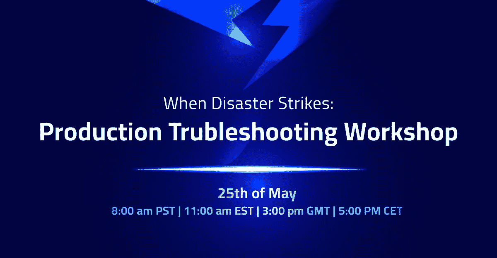
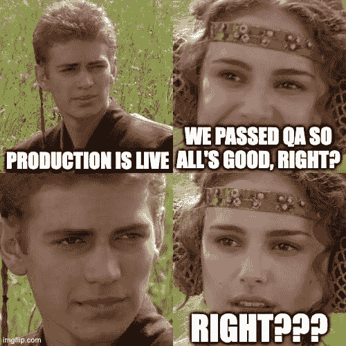

# 灾难来袭时:生产故障排除

> 原文：<https://medium.com/javarevisited/when-disaster-strikes-production-troubleshooting-8b15b5a78cc1?source=collection_archive---------1----------------------->

汤姆·格兰诺和[本人](https://twitter.com/debugagent/)有幸成为[弗拉德·米哈尔恰的](https://twitter.com/vlad_mihalcea)在线公司已经有一段时间了。因此，我们决定[一起开一个研讨会](https://go.lightrun.com/production-troubelshooting-masterclass)讨论我们在这个过程中学到的很多东西。这个研讨会是非常非正式的，只是一群人聊天，炫耀我们可以用工具做什么。

为了庆祝这一点，我想我应该写下一些我们过去讨论过的技巧，让你对加入我们的研讨会有所了解，这本身也是一个有用的工具。

# 问题是

在开始之前，我想花点时间谈谈生产和开发人员在生产环境中的角色。作为一名黑客，我经常做任何事情。这对小公司来说没问题，但随着公司的发展，我们会增加流程。

生产不会像以前那样被烧毁。感谢 staging，QA，CI/CD 和 [DevOps](/javarevisited/13-best-courses-to-learn-devops-for-senior-developers-in-2020-a2997ff7c33c) 对我这样的人进行控制…

所以我们把这些东西都准备好了。我们通过了质量保证和测试，一切都很完美。对吗？

嗯……不完全是。

当然可以。[现代 DevOps](/javarevisited/top-5-online-courses-to-become-a-devops-engineer-in-2020-764f5e60c2b) 极大地改变了生产质量、监控和性能。毫无疑问。但是 bug 是不可避免的。那些溜进来的是最坏的害虫。它们很难被发现，而且通常只会大规模发生。

一些问题，比如性能问题。只有在生产数据库中才会被注意到。试运行或开发环境无法完全复制现代复杂部署。基础设施即代码(IaC)在这方面很有帮助，但即使有这样的解决方案，生产的规模也是不同的。

# 这是唯一真正重要的地方

所有非生产性的东西都已就位，以方便生产。就是这样。我们可以有最好的和最广泛的测试。100%覆盖我们的本地环境。但是当我们的系统在生产中运行时，行为就不同了。我们不能完全控制它。

膝跳反应是“更多的测试”。我经常看到这种情况。如果我们对此有一个测试就好了…解决方案是想出我们可能犯的每一个错误，并为此建立一个测试。这太疯狂了。如果我们知道错误，我们就可以避免它。认为不同的团队成员会有这种洞察力的想法也是错误的。人们会犯类似的错误，虽然我们可以用这种方法消除一些错误。更多的测试产生更多的问题… [CI/CD](/javarevisited/7-best-courses-to-learn-jenkins-and-ci-cd-for-devops-engineers-and-software-developers-df2de8fe38f3) 变得更慢，导致生产部署时间更长。

这意味着当我们有生产缺陷时。由于冗余测试，修复时间会更长。这意味着我们需要经历的整个 CI 质量流程将需要更长的时间。这也意味着我们需要在 CI 资源上投入更多资金…

# 记录

[日志](https://javarevisited.blogspot.com/2011/05/top-10-tips-on-logging-in-java.html)解决了一些问题。它是任何服务器基础设施的重要组成部分。但是问题与我们在测试中遇到的问题相似。

当我们写日志时，我们不知道什么是重要的。那么在生产中我们可能会发现它不见了。过度日志是相反方向的一个巨大问题。它可以:

*   破坏性能和缓存
*   因日志保留而产生巨额成本
*   由于冗长难懂，使得[调试](https://javarevisited.blogspot.com/2011/07/java-debugging-tutorial-example-tips.html)更加困难

它可能仍然缺少我们需要的信息…

我最近在 reddit 的一个帖子里也发表了这样的评论:

“我公司的一个团队在几天时间里意外地在 Azure Log Analytics 上浪费了大约 100k。他们将日志记录的详细程度设置到了一个迄今为止还没有测试过的水平，并且加入了一些额外的副本。当他们在 Slack 上宣布他们的错误时，我了解到，是的，的确有日志记录过多这种事情。”—全螺纹[此处](https://www.reddit.com/r/devops/comments/udgohy/there_is_no_such_thing_as_too_much_logging_or_is/)。

还是那句话，[日志](https://javarevisited.blogspot.com/2016/06/why-use-log4j-logging-vs.html)很棒。但并没有解决核心问题。

# 灵活

我们的开发团队需要快速响应。我们需要对问题做出快速反应。当然，我们需要首先尝试并阻止它们…但是像生活中的大多数事情一样，收益递减规律在这里也是有效的。测试、日志等都有限制。

为此，我们需要尽快全面了解这个 bug。根据直觉进行局部复制的过程充其量是有问题的。我们需要一种观察问题的方法。

这并不新鲜。有很多解决方案可以解决生产中的问题，例如，APM 工具为我们提供了对生产绩效的宝贵见解。他们不会取代侧写员。它们提供了一个重要的数据点:我们的客户使用的应用程序有多快！

但是这些工具中的大多数都是面向开发的。有道理。开发人员是负责生产的人，所以监控工具自然是为他们设计的。但是 DevOps 不应该负责修复 R&D bug，甚至不应该负责理解它们……这里有一个脱节。

# 输入开发者可观察性

开发人员可观察性是针对开发人员的可观察性的支柱，而不是针对 [DevOps](/javarevisited/7-free-google-cloud-devops-engineer-certification-courses-f0046ac39f7e) 。有了这个领域的工具，我们可以立即获得符合我们需求的反馈，减少发现问题的麻烦。在这些工具之前，如果生产中不存在日志，并且我们不了解问题…我们必须用“更多日志”重新部署我们的产品，并祈祷好运…

# 在实践和研讨会中…

我解释问题的时间比解释解决方案的时间要长。我倾向于认为，这是因为一旦我们“明白”了，解决方案就显而易见了。主要是细节问题。

就像我们都知道的:细节决定成败…

开发人员可观察性[工具](/javarevisited/10-essential-tools-data-scientists-should-learn-in-2022-acbae6558643)对于习惯于使用调试器和[ide](/javarevisited/7-best-courses-to-learn-intellij-idea-for-beginners-and-experienced-java-programmers-2e9aa9bb0c05)的开发人员来说可能非常熟悉。但是它们还是有很大的不同。断点就是一个例子。

# 现在是快照了

我们都知道这种训练。在不起作用的代码中设置一个断点，然后单步执行，直到找到问题。这在我们的流程中根深蒂固，以至于我们很少停下来思考这个问题。

但是，如果我们在生产环境中这样做，服务器将在等待我们跨越时被卡住。这可能会影响服务器中的所有用户，我甚至不会讨论安全性/稳定性的影响(你还不如拿把锤子把服务器拆了。有那么差)。

快照做断点做的一切。它们可以是有条件的，比如条件断点。它们包含堆栈跟踪，您可以单击堆栈中的元素。每一帧都包括该特定帧中变量的值。但问题是:他们不会停下来。

所以你没有“跨过”这个选项。这一部分是不可避免的，因为我们没有停止。你需要重新思考调试错误的过程。

# currentTimeMillis()

我喜欢侧写师。但是当我需要真正理解一个方法的成本时，我会去找我信任的老`currentTimeMillis()`调用。没有其他方法可以在小代码块上获得准确/一致的性能指标。

但正如我之前所说。生产才是最重要的。我不能只是在代码上贴满微度量，然后再检查。

所以开发者可观察性工具增加了测量事物的能力。计算到达一行代码的次数。或者字面上执行相当于`currentTimeMillis()`方法 tictoc 测量。

# 在那里见

"只有退潮时，你才会发现谁在裸泳。"—沃伦·巴菲特

我喜欢这句话。我们需要时刻做好准备。我们需要快速行动，做好最坏的打算。但是我们也需要实用性。我们不是原创，有常见的 bug，我们会左右逢源。我们可能会更快地注意到它们，但错误并不是原创的。

在研讨会中，我们将关注一些最常见的错误，并演示如何使用开发人员可观察性来跟踪它们。我们将给出现实世界中的例子，说明我们在过去和工作中遇到的失败和问题。我对此感到非常兴奋，希望能在[见到大家](https://go.lightrun.com/production-troubelshooting-masterclass)！