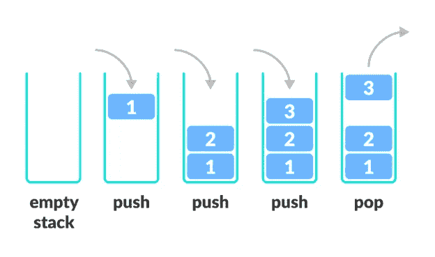

# 何时使用堆栈数据结构

> 原文：<https://medium.com/javarevisited/when-to-use-stack-data-structure-9ac3dfa4d10?source=collection_archive---------1----------------------->


德尔祖利亚·扎扎在 [Unsplash](https://unsplash.com?utm_source=medium&utm_medium=referral) 上拍摄的照片

> 一个**栈**是一个抽象的数据类型，由一个预定义的容量组成。它允许以特定的顺序添加和删除元素。当每次添加一个元素时，它都进入堆栈的顶部。堆栈使所有数据只能在一端操作。因此，唯一可以移除的元素是堆栈顶部的元素，并且在给定时间只能读取或移除一个项目。

上述特性使它成为一种后进先出的数据结构。这里，最后插入的元素首先被访问。在堆栈术语中，插入操作称为 **PUSH，**而移除操作称为 **POP** 。当堆栈完全充满时，称其处于**溢出**状态，如果完全为空，称其处于**下溢**状态。

[](https://javarevisited.blogspot.com/2017/03/difference-between-stack-and-queue-data-structure-in-java.html#axzz5dxZIUUxy)

https://www.programiz.com

# **堆栈的主要操作**

当我们讨论栈的操作时，它们包括下面两个基本操作。

```
 **push()** — Inserting an element to the stack **pop()** — Removing an element from the stack
```

为了有效地使用堆栈，我们还需要检查堆栈的状态。为此，堆栈中增加了以下功能。

```
**peek()** — get the top element of the stack, without removing the element.**isFull()** — check if the stack is full**isEmpty()** — check if the stack is empty
```

## 算法

```
1\. A pointer called **TOP** is used to keep track of the top element in the stack.
2\. When initializing, The value of TOP is -1\. So that we can check if the stack is empty by comparing **TOP == -1**.
3\. When pushing an element, we **increase the value of TOP** and **place the new element** in the **position pointed to by TOP.** 4\. On popping an element, we **return the element pointed to by TOP** and **reduce the value of TOP**.
5\. Before pushing, we check if the stack is already full.
6\. Before popping, we check if the stack is already empty
```

# **用 Java 实现堆栈**

> 尝试自己的堆栈实现，并使用下面的代码检查您的实现。

# 堆栈错误

堆栈可能会出现两种问题:

## *1。下溢*

当试图弹出空堆栈时。从一个空的集合中删除一些东西是没有意义的。堆栈下溢是一个常见错误——应该使用对 ***isEmpty*** 的调用来防止它。

## *2。溢出*

当试图将一个项目压入满栈时。栈的一些实现指定了特定的有限大小。堆栈溢出最常见的原因可能是递归“走得太远了”

# 堆栈操作的运行时复杂性

对于所有标准的堆栈操作(push、pop、isEmpty、size)，最坏情况下的运行时复杂度可以是 O(1)。因为这些操作需要持续的时间。很明显，大小和是一个空常数时间运算。push 和 pop 也是 O(1 ),因为它们只处理数据结构的一端——栈顶。

# 堆栈在问题解决中的应用

*平衡括号*

我们的代码编辑器使用堆栈来检查我们是否正确地结束了所有的括号，甚至美化代码。下面的代码是一个检查平衡括号的例子。

*回溯*

当计算必须以相反的顺序返回时，堆栈特别有用。这在人工智能应用中经常发生:游戏、逻辑程序、定理证明器等。

*想象走过一个迷宫。每当你有多个移动方向的选项时，按下除其中一个选项之外的所有选项*

*扔到堆栈上，然后往你没推的方向走。当你走进一个死胡同时，后退到你的最后一个选项(即弹出堆栈)并从那里继续前进。*

*激活记录*

每次在程序中调用一个函数时，该函数的所有参数和局部变量都被推送到堆栈中进行存储。当函数退出时，只需将堆栈弹出到函数调用前的位置，就可以回收所有的内存。

*反一字*

把所有的字母堆成一堆，然后取出来。由于堆栈的后进先出顺序，您将得到逆序的字母。

*在编译器中*

编译器使用堆栈通过将表达式转换为前缀或后缀形式来计算像 2+4/5 *(7–9)这样的表达式的值。

*在浏览器中*

浏览器中的后退按钮会将您之前访问过的所有 URL 保存在一个堆栈中。每次你访问一个新的页面，它都会被添加到堆栈的顶部。当您按下“后退”按钮时，当前 URL 将从堆栈中删除，并访问以前的 URL。

# **了解有关 Stack ADT 的更多信息**

[数据结构和算法—堆栈—教程点](https://www.tutorialspoint.com/data_structures_algorithms/stack_algorithm.htm) t

[DS 堆栈—Java 端口](https://www.javatpoint.com/data-structure-stack) t

# 资源

[堆栈数据结构| Studytonight](https://www.studytonight.com/data-structures/stack-data-structure)

[Python、Java 和 C/c++(programiz.com)的栈数据结构及实现](https://www.programiz.com/dsa/stack)

[CS 367–3—堆栈(wisc.edu)](http://pages.cs.wisc.edu/~siff/CS367/Notes/stacks.html)

[数据结构和算法—堆栈—教程点](https://www.tutorialspoint.com/data_structures_algorithms/stack_algorithm.htm)

Java 程序员必备的 6 种数据结构