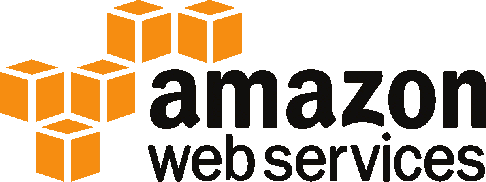

# 从哪里开始学习 AWS(亚马逊网络服务)？

> 原文：<https://medium.com/javarevisited/where-can-i-learn-aws-amazon-web-services-from-fe6eb0348?source=collection_archive---------1----------------------->

最近有人问我一个问题:“作为初学者，我可以从哪里开始学习 AWS(亚马逊网络服务)？

你可以从很多资源中学习 AWS 以下是我所知道的 6 种不同的方法:

1.  [AWS 自定进度实验室](https://aws.amazon.com/training/self-paced-labs/) :
    💡个人实验:学习单个 AWS 服务。
    💡Quest Labs:学习相关 AWS 服务的多个实验室。
2.  使用以下 [AWS 免费层](https://aws.amazon.com/free)选项，体验 60 多种服务:
    💡终身免费。
    💡注册后 12 个月免费。
    💡服务激活日期后的短期报价。
3.  阅读并跟读:
    💡 [AWS 文档](https://docs.aws.amazon.com/index.html)
    💡 [AWS 白皮书](https://aws.amazon.com/whitepapers/?whitepapers-main.sort-by=item.additionalFields.sortDate&whitepapers-main.sort-order=desc)
    💡 [AWS 博客](https://aws.amazon.com/blogs/aws/)
    💡 [AWS 内幕](https://awsinsider.net/Home.aspx)
    💡 [AWS 工具和库](https://github.com/donnemartin/awesome-aws)
    💡 [AWS 架构良好的框架](https://wa.aws.amazon.com/index.en.html)
    💡 [AWS 架构良好的实验室](https://wellarchitectedlabs.com/)
    💡[云那](https://blog.cloudthat.com/)云那
    💡[用 AWS 云开发套件构建 app](https://egghead.io/courses/build-an-app-with-the-aws-cloud-development-kit)
    💡[学 AWS](https://github.com/dwyl/learn-amazon-web-services) 学 💡[打开 AWS 指南](https://github.com/open-guides/og-aws)💡 [Github AWS 样本](https://github.com/aws-samples)
4.  观察:
    💡 [AWS 网络服务](https://www.youtube.com/channel/UCd6MoB9NC6uYN2grvUNT-Zg)
    💡 [AWS 培训中心](https://www.youtube.com/channel/UC1Yf7IBfhSNFTIyb7v83o_g)
    💡[领英学习](http://linkedin-learning.pxf.io/c/1193463/449670/8005?u=https%3A%2F%2Fwww.linkedin.com%2Flearning%2Fpaths%2Fbecome-an-aws-cloud-practitioner)
5.  课程:
    💡 [AWS 培训](https://pages.awscloud.com/digital-learning-training-certification.html)
    💡[领英学习](http://linkedin-learning.pxf.io/c/1193463/449670/8005?u=https%3A%2F%2Fwww.linkedin.com%2Flearning%2Fpaths%2Fbecome-an-aws-cloud-practitioner)
    💡[一片云宗师](https://acloud.guru/aws-cloud-training)
    💡[Udemy](https://click.linksynergy.com/deeplink?id=JVFxdTr9V80&mid=39197&murl=https%3A%2F%2Fwww.udemy.com%2Fcourse%2Faws-certified-associate-architect-developer-sysops-admin%2F)💡[Coursera](https://click.linksynergy.com/deeplink?id=JVFxdTr9V80&mid=40328&murl=https%3A%2F%2Fwww.coursera.org%2Fspecializations%2Faws-fundamentals)💡[云学院](https://cloudacademy.com/library/amazon-web-services)云学院
    💡qwiklab
6.  [AWS 认证](https://aws.amazon.com/certification/) :
    💡 [AWS 学习路径](https://aws.amazon.com/training/learning-paths/)
    💡 [Whiz Labs](https://shrsl.com/25qj6)
    💡[准备资源清单](https://gist.github.com/leonardofed/bbf6459ad154ad5215d354f3825435dc)
    💡[样本考试](https://github.com/Rome84/AWS-EXAMS)

希望这有所帮助，玩得开心！

在推特[上关注 NMTechBytes](https://twitter.com/anumsarmadmalik)获取我的每日技术信息:)

## 您可能感兴趣的其他 AWS 文章

 [## 我最喜欢的 2020 年 AWS 解决方案架构师助理认证课程

### 大家好，你们在准备 AWS 认证解决方案架构师助理考试吗？或者你想成为亚马逊网站…

medium.com](/javarevisited/top-5-aws-training-courses-to-crack-amazon-web-service-solutions-architect-associate-certification-3f4affa8f660)  [## 2020 年学习 Docker、Kubernetes 和 AWS 的 15 大在线课程

### 大家好，你可能听说过 Docker 和 Kubernetes 周围的嗡嗡声。他们从根本上改变了发展…

medium.com](/javarevisited/top-15-online-courses-to-learn-docker-kubernetes-and-aws-for-fullstack-developers-and-devops-d8cc4f16e773)  [## 我最喜欢的学习亚马逊网络服务(AWS)和云计算的初学者课程

### 大家好，如果你想学习亚马逊网络服务，俗称 AWS，并寻找一些优秀的资源…

medium.com](/javarevisited/top-10-courses-to-learn-amazon-web-services-aws-cloud-in-2020-best-and-free-317f10d7c21d) 

注意:我在亚马逊工作，但我所有的文章都反映了我自己的观点。