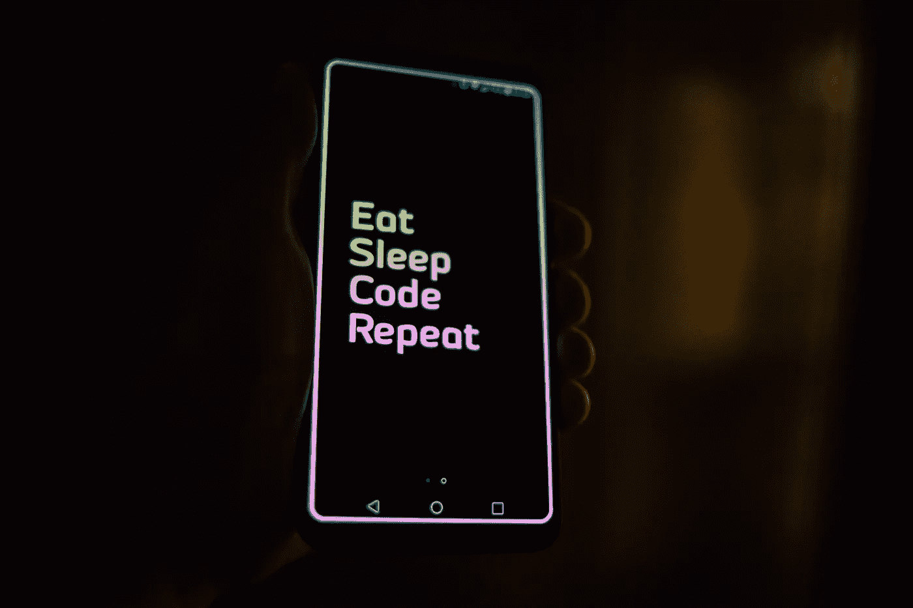
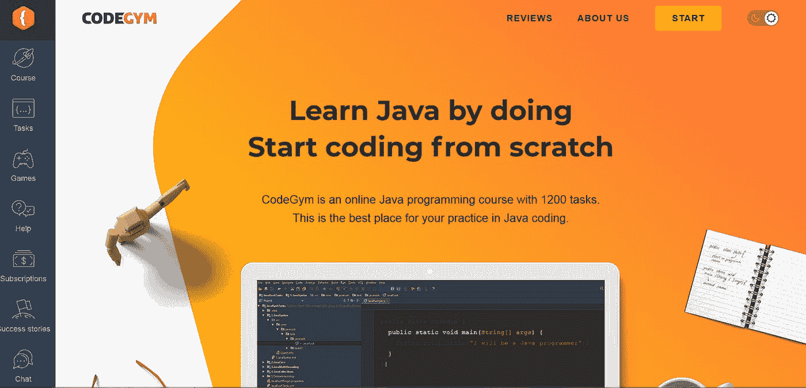
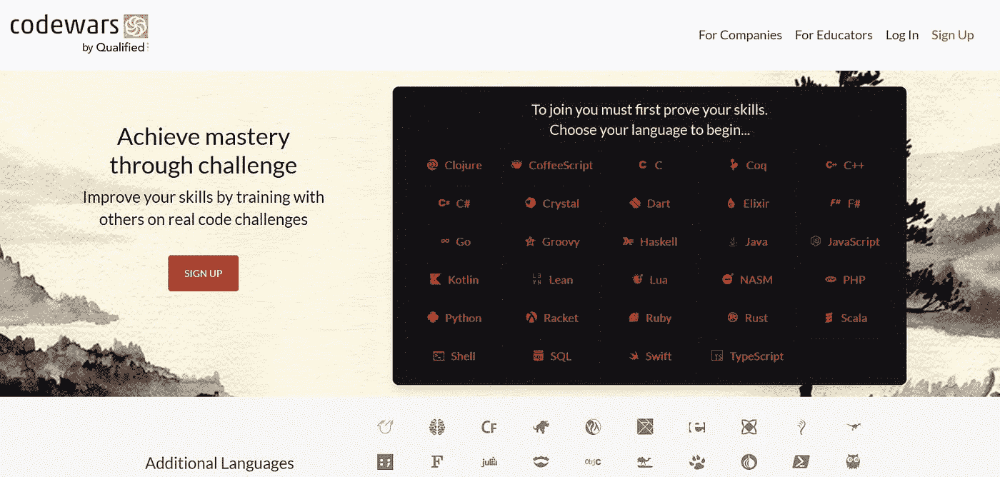
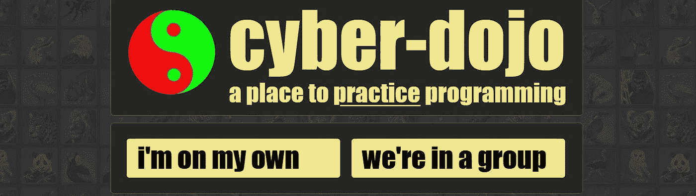
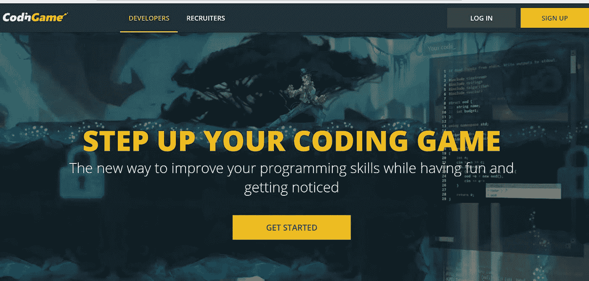
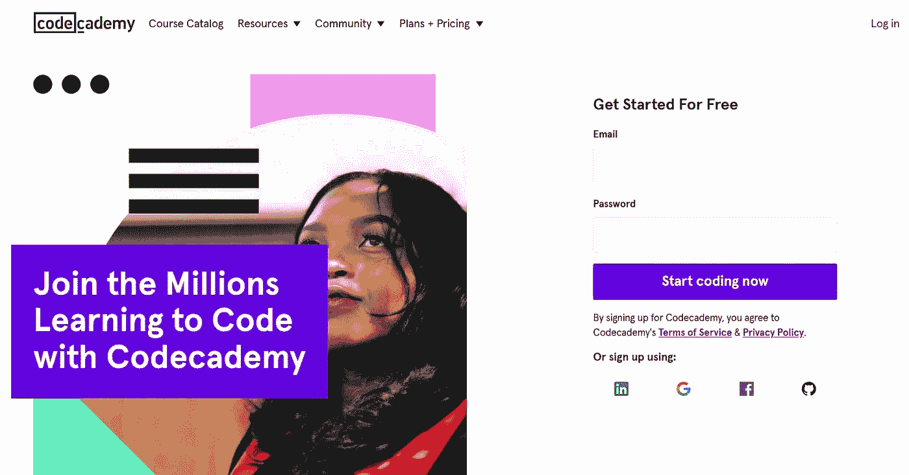

# 从哪里获得 Java 的日常编码实践

> 原文：<https://medium.com/javarevisited/where-to-get-daily-coding-practice-in-java-21e877485248?source=collection_archive---------1----------------------->

罗曼·辛克维奇在 [Unsplash](https://unsplash.com/s/photos/code?utm_source=unsplash&utm_medium=referral&utm_content=creditCopyText) 上拍摄的照片

你做得越多，你逐渐得到的结果就越好。这个常识也适用于 Java 编程。不阅读和盯着屏幕只会让你键入你自己的代码。

定期练习会教会你很多很棒的东西:解决问题的方法、复杂的技术、你永远想不到的算法等等。编码挑战和任务会带你通过这些关卡。

有了多种选择，有时仍然很难决定从哪里获得 Java[的日常编码实践。作为一名经验丰富的导师和高级 Java 开发人员，我已经查阅了许多资源。有些真的很不错，我强烈建议你去看一看。](/javarevisited/top-5-java-online-courses-for-beginners-best-of-lot-1e1e240a758)

这里列出了我最喜欢的地方，你可以在那里进行日常的 Java 编码练习。

# Java 实践平台

## CodeGym

价格:

*   免费零水平，免费游戏部分(+进入论坛和帮助部分)
*   高级—30 美元/月
*   高级专业版—50 美元/月

在一个遥远的星系…不，这不是另一个星球大战系列。但与上下文有些相似。你发现自己在一个未来的现实中，一个银河团队必须被拯救。他们被挤压到野蛮机器人居住的星球上。回家的唯一方法是教其中一个机器人编 Java，把飞船从石头堆里拉出来。通过全部四个 10 级任务的人将拯救飞船并帮助人类返回地球。你准备好接受一点宇宙挑战了吗？

[课程](https://codegym.cc/)是作为游戏制作的，体验起来很有趣。宇航员教你编码，并解释 Java 是如何工作的。有超过 1200 项任务需要使用即时检查选项来完成。此外，学习者可以在一个特殊的部分寻求帮助，或者与充满活力、友好的 CodeGym 社区分享成果。这门课程非常适合没有编程经验的人。在支持性和娱乐性的环境中迈出 Java 的第一步比仅仅做枯燥的教科书练习有趣得多，不是吗？

## 代码战争

价格:

*   自由的
*   9.99 美元/月访问更多教程

在这里，您会发现一种更东方化的 Java 学习过程。这些挑战是由愿意教授各种技术的用户创造的。这些任务被称为“形”，意思是空手道和一些武术领域的训练练习。因此，学习者通过学习形来征服 Java 的复杂性，并在 Java 方面变得越来越开明。或者由他们选择其他技术。大约有 20 种语言可供选择，还有 12 种处于测试阶段。这些任务可以直接在浏览器中解决。社区总是渴望帮助新手代码战士取得成功。

当解决任务时，学习者获得荣誉和进入更复杂的水平。一步一步地，你和其他学习者一起掌握编码，从前辈那里获得智慧，并把它传递下去。

这个项目有很强的社区基础，但也有足够的节制。总是可以和其他学员一起检查你的解决方案。最后，你可以创造自己的形！就像他们说的，当你教别人的时候，你自己最终明白了一切。成为一名真正的爪哇武士。

## 赛博道场

价格:

*   免费用于非商业用途
*   接受捐赠

[赛博道场](https://cyber-dojo.org/creator/home)是团体练习的绝佳选择。不过，这需要对编程有一些基本的理解。这些任务可以单独解决，也可以与合作伙伴一起解决。学生也可以参加小组会议。这个项目的目标不是在游戏中获得胜利，而是获得经验。你写代码，看看你做的对不对。三个彩色标记有助于了解你的进展情况。红色表示测试失败。琥珀色 1 表示语法错误。绿色表示一切都很好。

在 Cyber-dojo 上，你可以练习 [30 种编程语言](/hackernoon/10-best-programming-languages-to-learn-in-2019-e5b05af4a972)和一些相关的测试框架。我当然更喜欢 Java。但是万一你想得到别的东西，这是一个很好的机会。该平台免费供个人使用。但是这些公司可能需要获得许可证。该项目是由同名基金会创建的，它使用来自许可的所有资金来帮助向世界各地的儿童传播软件知识。例如，为马拉维的 63 所学校购买电脑。

## 厨师长

价格:免费

[CodeChef](https://www.codechef.com/) 讲的是友谊赛。这是一个你可以真正赢得一些东西的地方。每个月都有三场有奖竞赛。获胜者的名字公开地显示在首页上。不准作弊！而且 CodeChef 平台上还有定期的外部大赛。

至于学习过程，学生从初级水平到更高级的挑战。排名系统基于用户完成各种任务所获得的分数。人们可以通过相关标签选择任务来训练特定的技能。标签列表很大。它包括最流行的编程问题，以及提出要解决的问题的作者的名字。你甚至可以选择其中你最喜欢的一个。你也可以根据难度选择任务。如果事情变得太困难，你可以在论坛上寻求帮助和讨论任务。

通过每月一次的“烹饪比赛”(这是电话比赛的方式)，你可以根据你的掌握程度参加比赛。划分是基于用户评级的。诀窍是你不能参加比你分数低的组别。所以你要和你这个级别的选手公平竞争。不是你能轻易克服的。

## 编码游戏

价格:

*   349.00 美元/月
*   一年订阅费每月 249 美元

这就是我所说的“一站式服务”。首先，你可以[通过创建各种谜题和游戏以有趣的方式](/javarevisited/7-best-coding-course-to-learn-programming-with-zero-experience-in-2020-52f7d0d9cb80)学习编程。您可以加入一个已经存在的项目或开始一个新的项目。此外，如果你有一些肾上腺素，还有编码战斗可用。第二，有一个庞大而活跃的程序员社区。他们随时准备帮助你解决一些你可能难以解决的问题。只是来论坛或一个特殊的聊天部分。第三，也是我认为最重要的一点， [CodinGame](https://www.codingame.com/start) 是招聘人员经常出没的地方。他们观看比赛，并立即注意到有才华的人。所以，你很有可能在那里找到工作。

平台本身就很鲜明生动。边玩边学是最好的方法之一，同意吗？顺便说一句，你的成功不会被忽视。如果你成为顶级玩家之一，你会发现自己在排行榜上。至于技术栈，CodinGame 支持超过 25 种语言，包括一些罕见的语言。个人推荐用于 [Java](/javarevisited/10-free-courses-to-learn-java-in-2019-22d1f33a3915?source=collection_home---4------7-----------------------) 部分。但是你也可以尝试其他的选择。

## 代码集

价格:19.99 美元

这个教育平台的最大特点是组织良好的结构(当然，除了质量)。找到你需要的东西很容易。一个非常详细的技术、专业领域或职业道路的目录可以让你很快通过。

你可以选择 14 种编程语言或科目，如[“网络开发”](/better-programming/my-5-favorite-courses-to-learn-web-development-in-2019-a5e74167f8b2)或[“数据科学”](/javarevisited/my-favorite-data-science-and-machine-learning-courses-from-coursera-udemy-and-pluralsight-eafc73acc73f)。代码基础有单独的课程。Codecademy 包括许多组织有序的课程，有些甚至有官方认证选项。

一个不错的好处是:你可以请内部社区的专家来审查你的代码。世界各地[都有各种 Codecademy 分会](https://community.codecademy.com/)。你可以在网上见面，也可以亲自见面(只要有可能)。加入现有的章节或创建自己的章节。

今年，该平台为专业级别推出了一个新的更好的定价计划，优惠幅度超过 35%。这是一个方便的选择，如果你想从一开始就打它。还有脆脆的“小抄”来帮助你快速通过基础。这个是 Java 的。

# 包裹

有了这个每天练习 Java 的好地方的简短列表，你的选择范围就变得很窄了。你不必在永无止境的网上冲浪来寻找你完美的 Java 练习工具。这里已经为你准备好了。

要么你更喜欢走武士之路，要么选择 Java 冠军之路，要么玩游戏——只要你真的做了什么，每个选项都不错。每天一点一点。当然，不要犹豫向社区寻求帮助。每一个探索，每一个解决的任务，每一个问题，以及它的答案都会让你离成为一名 Java 专业人士的主要目标更近一步。所以振作起来，马上开始，继续前进！