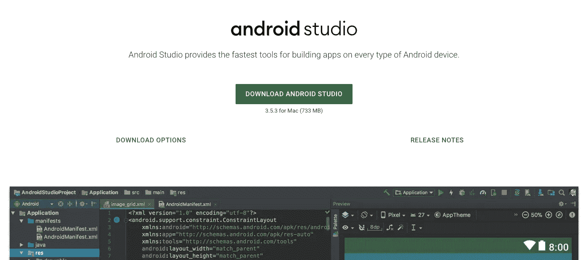

# Android 应用开发去哪里学 Java

> 原文：<https://medium.com/javarevisited/where-to-learn-java-for-android-app-development-16804c5d8ded?source=collection_archive---------0----------------------->

Android 是最受欢迎的移动操作系统(并不是说有太多的 Android 操作系统)，用于手机、平板电脑、手表和电视等各种设备。

作为一名 Android 开发者，你想让自己的收入暴涨吗？还是你有很多 app 的想法，却不知道从何下手？

Android 应用程序开发技能集将为您打开许多大门，然而，在您开始为 Android 编写应用程序之前，您需要学习 Java 编程语言！

# 开始使用课程计划

所以你有了一个杀手级应用的好主意，你准备把它变成现实，并投放市场。显然，你已经迫不及待地开始获得你的第一次下载，评论和利润…

然而，只有一个问题:你不知道从哪里或如何开始！

1.  从面向对象编程的基础开始。
2.  学习 Java 的基础知识:数据类型、循环性等。这个大概一周就能搞定。
3.  现在接受训练。接触一些简单的问题，并尝试创建一个程序来解决它们。
4.  最后，从图形界面的基础开始。
5.  了解关于 JVM 的更多信息。还有关于栈和堆。
6.  了解 Android 的发展。然后，最后，你可以开始任何你想要的！

# 第一步:下载 Android Studio

在大多数语言中，编程需要一个叫做 IDE 或“集成开发环境”的软件。Android 最常见的开发环境是 Android Studio，直接来自 Google 本身。[你可以在这里得到它](http://developer.android.com/sdk/index.html?gclid=Cj0KEQiAm-CyBRDx65nBhcmVtbIBEiQA7zm8lWCaBd9n9KYYunFXxXsQCPojBVHk5eIH4p9CWM1eLfUaAmd28P8HAQ)。

# 步骤 2:配置 Android Studio

开始之前，你需要在电脑上安装 Java，以便使用 Android Studio。您将特别需要安装 Java 开发工具包(JDK)。你可以在这里找到 Java 开发工具包。只需下载并遵循简单的安装说明。

# 步骤 3:启动一个新的 Android Studio 项目

点击“启动新的 Android Studio 项目”,输入你的应用程序和“公司域名”的名称。它将用于以下列格式创建您的包名:

com.companyname.appname

该包将是一个编译文件或 APK(“Android 包文件”)，最终将被上传到谷歌 Play 商店。

# 第四步:创造实际的东西

应用程序一打开，目录树就会出现在左侧。它包含的所有文件和文件夹，以及带有“你好，世界！”字样的手机图像也会出现。

## 从哪里获得材料

下面是我最推荐的 3 本关于 Android 开发理论的书。

## 主管第一 Android 开发

这本书非常适合初学者或中级 Android 开发人员。它不会带你到一个高级水平，但是，它会帮助你理解基本原则。

## Java:初学者指南，第 6 版

为了学习如何使用 Android 或者更好地开发 Android，你需要掌握 Java 的基础知识，这本书是一个很好的起点。

## Android 编程:大型书呆子牧场指南

《大书呆子牧场指南》(Big Nerd Ranch Guide)是一本入门书籍，面向那些熟悉 Java 并希望了解更多 Android 开发知识的人。

如果你需要课程，也可以看看这个[面向 Java 开发者](https://javarevisited.blogspot.com/2017/12/top-5-android-online-training-courses-for-Java-developers.html)的 Android 培训课程列表。

<https://javarevisited.blogspot.com/2017/12/top-5-android-online-training-courses-for-Java-developers.html>  

# 实践是至关重要的

显然，对于一个初学者来说，解决许多小而简单的任务要比解决几个复杂的任务好得多。一个好的比例是 1 个困难任务对应 10-20 个简单任务。

从哪里可以得到任务？

这些年来，我发现了一些很棒的地方。以下是其中的一些:

[**Java re visited**](https://javarevisited.blogspot.com/)**——这是一个巨大的网站，有很好的文章、课程和有趣的问题要解决。每天用大量有用的教程和实践任务练习 Java。它还有一个 [Java 开发者路线图](https://javarevisited.blogspot.com/2019/10/the-java-developer-roadmap.html#123)来指导你。**

**<https://javarevisited.blogspot.com/2019/10/the-java-developer-roadmap.html#123>  

[**CodeGym**](https://codegym.cc/) 。我一发现 CodeGym。我想，“这正是我梦寐以求的。”网站每天都充满了提高技能的任务。我觉得每个层次大概有 1000 个问题。

你可以使用 CodeGym 的 IDE 浏览器来解决它们，或者使用 IntelliJ IDEA 的插件，这是目前最流行的 Java IDE。智能验证系统会检查您的代码，并在出现问题时给出一些建议。

[编码名称](https://www.codingame.com/)。这个网站的目标是那些已经了解编程语言(Java 和其他 22 种语言)基础的人。

Codewars 是一个网站，开发者可以在复杂任务的帮助下掌握代码。因此，这是一个适合中高级 Java 学生的好网站。

# 社区规则 z

你可以在[stack overflow](https://source.android.com/source/community)或者[code branch](https://coderanch.com/c/java)的 Java 部分问任何问题。

Reddit 还有至少三个大型社区，比如 [/r/learnprogramming](https://www.reddit.com/r/learnprogramming/) 、 [/r/java](https://www.reddit.com/r/java/) 和 [/r/learningjava](https://www.reddit.com/r/learnjava/) ，在这里你会找到学习 java 和一般编程的有用技巧。

如果您需要更具体的信息，例如如何在某些任务中改进代码的提示，请尝试专门的 [CodeGym 帮助部分](https://codegym.cc/help)，在那里您可以从其他学生和“编码教练”那里获得帮助，以解决您的任何问题。

最后，Oracle 有一个广泛的 Java 社区，对新手和有经验的开发者开放。

# 总结一下学习 Java 做 Android 应用开发

所以，你开始了。恭喜你！你现在可以利用其他程序员的经验，通过自学避免典型的错误。

今天就开始编码！不要害羞。做很多。每天练习。阅读理论，让 Java 为您工作，并充分受益于它所提供的一切。

其他 **Java 文章**你可能喜欢的探索者:
[2020 年 Java 开发者路线图](https://javarevisited.blogspot.com/2019/10/the-java-developer-roadmap.html)
[2020 年每个 Java 开发者都要学的 10 种工具](https://www.java67.com/2018/04/10-tools-java-developers-should-learn.html)
[2020 年 Spring Boot 要学的 5 门顶级课程](https://www.java67.com/2018/06/5-best-courses-to-learn-spring-boot-in.html)
[2020 年要学的 10 种编程语言](http://www.java67.com/2017/12/10-programming-languages-to-learn-in.html)
[2020 年 Java 开发者应该读的 10 本书](http://www.java67.com/2018/02/10-books-java-developers-should-read-in.html)
[10 个框架 Java 和 Web 应该知道](http://javarevisited.blogspot.sg/2018/01/10-frameworks-java-and-web-developers-should-learn.html)
[我最喜欢的免费课程深入学习 Java](/javarevisited/10-free-courses-to-learn-java-in-2019-22d1f33a3915)
[深入学习 Spring 框架的前 5 门课程](https://javarevisited.blogspot.com/2018/06/top-6-spring-framework-online-courses-Java-programmers.html)
[10 门免费课程学习 Maven、Jenkins、Docker 面向 Java 开发者的](/javarevisited/top-10-free-courses-to-learn-maven-jenkins-and-docker-for-java-developers-51fa7a1e66f6)

**P . S**。 —如果你是从 Java 开发者的角度寻找一些有用的技术来学习，也可以查看[**2020 年 Java 程序员应该学什么**](/javarevisited/what-java-programmers-should-learn-in-2020-648050533c83) 。

</javarevisited/what-java-programmers-should-learn-in-2020-648050533c83> **