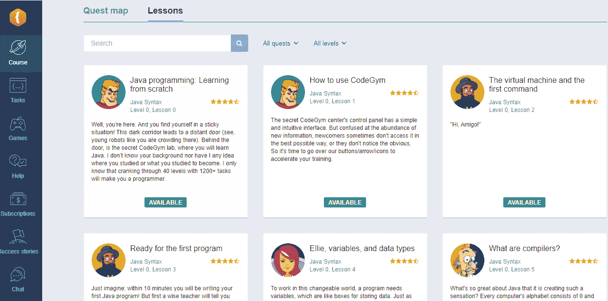
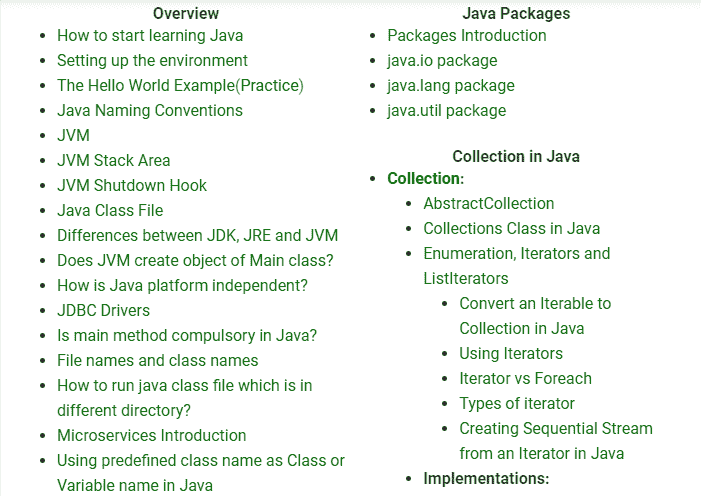
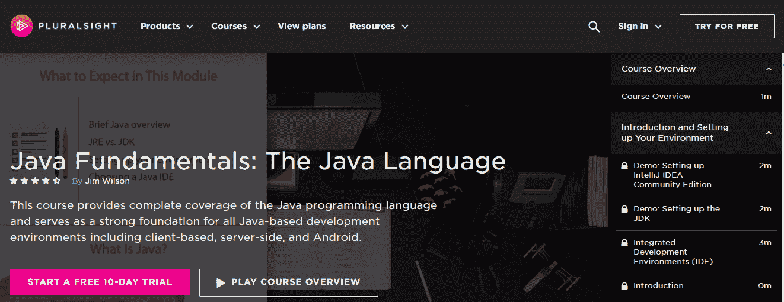

# Android 应用开发去哪里学 Java

> 原文：<https://medium.com/javarevisited/where-to-learn-java-for-android-app-development-fc76e471b3a1?source=collection_archive---------0----------------------->

乔纳森·肯珀在 [Unsplash](https://unsplash.com/s/photos/android?utm_source=unsplash&utm_medium=referral&utm_content=creditCopyText) 上拍摄的照片

Play Store 是安卓官方应用商店，目前拥有约 300 万个安卓应用。全球超过 80%的智能手机运行安卓系统。这些巨大的数字背后隐藏着一个明确的信息——[Android 应用开发](/javarevisited/top-5-courses-to-learn-android-for-java-programmers-667e03d995b4)将会把你的职业生涯推向新的高度。

除了给你带来高薪工作，成为一名 Android 应用程序开发人员还能让你释放你的创造力，解决全世界 Android 用户面临的实际问题。

学习 Java 对于 Android 应用程序开发来说至关重要。我已经做了多年的 Java 程序员，在这篇文章中，我分享了一个计划来帮助你以一种系统而有趣的方式学习 Java。

# Android 应用程序开发需要学习的主题

成为一名成功的 Android 开发者需要熟悉不同的知识领域。当你通过一步一步地学习所有的应用程序来避免不知所措时，你的应用程序想法将会得到最好的执行。我推荐下面的路线图，通过大量的练习来有效地利用你的时间。

# 核心 Java

这些是你在开始 Android 应用开发之前必须学习的基础知识。专注于[学习面向对象编程](/javarevisited/my-favorite-courses-to-learn-object-oriented-programming-and-design-in-2019-197bab351733?source=---------103------------------)，这样你就能把你的程序分成模块，写出可重用的代码。

对于寻找具有跨平台能力的健壮、易用的编码语言的程序员来说，Java 是一个普遍的选择。

你可以把它分成六个不同的部分，一次专注于学习一个部分:

*   句法
*   面向对象的程序设计(Object Oriented Programming)
*   [Java 集合](/javarevisited/50-java-collections-interview-questions-for-beginners-and-experienced-programmers-4d2c224cc5ab)
*   异常处理
*   输入/输出流
*   [Java 多线程](https://javarevisited.blogspot.com/2018/06/top-5-java-multithreading-and-concurrency-courses-experienced-programmers.html)

# 测试库

图书馆是节省时间的好地方。它们允许您调用预先编写的指令集并实现常用的功能，而不必从头开始编写代码。

像 JUnit 和 PowerMock Mockito 这样的测试库可以省去你编写长代码片段来对你的程序进行单元测试的麻烦。这些是特别推荐给测试驱动开发(TDD)的，在这种情况下，在实际编写应用程序代码之前创建测试会加快开发的速度。在你的职业生涯中，你会使用 [Java 测试库](https://javarevisited.blogspot.sg/2018/01/10-unit-testing-and-integration-tools-for-java-programmers.html)，我强烈建议你尽早习惯这些。

# Android SDK(软件开发工具包)

它是一个 Android 开发者的工具箱。这是你的 Android 应用程序开发旅程中唯一不变的，因为在你的职业生涯中，你可能会使用许多[编程语言](https://javarevisited.blogspot.com/2018/08/5-programming-language-every-programmer-learn.html)和 ide。

一旦您编写了用于开发 Android 应用程序的 Java 代码，您就需要一种方法来在 Android 设备上执行它，并利用 Android 操作系统的全部潜力。这就是 SDK 的用武之地——它是一个完整的包，包含文档、库、代码示例和可以集成到应用程序中的流程。

SDK 也有针对 Android 的模拟器，你可以调用它来查看你的代码在实际的 Android 设备上的表现。

# 结构化查询语言

即使是为 Android 编写入门级的 Java 程序，你也需要精通数据库。应用程序需要将数据存储在表中，并在需要时根据需要的条件检索数据。结构化查询语言( [SQL](/hackernoon/top-5-sql-and-database-courses-to-learn-online-48424533ac61) )是 Java 应用程序开发难题中的最后一块。SQL 有许多变体，但 SQLite 是 Android 设备上使用的一种。请特别关注它，因为它将为您构建 Java 编程生涯打下坚实的基础。

# 培训和实践

现在是时候将你学到的知识运用到实践中去，建立自信了。如果你对开始写代码没有足够的信心，那也没关系——实践是建立你的编程技能并测试它们的唯一途径。接一些小任务，然后编写程序来解决它们。不要让错误阻碍你，因为即使是最有经验的程序员也会犯错。从你的错误中学习，改正错误，然后继续解决更困难的问题。

在本文的后面，我提供了一些在线资源，您可以参考这些资源进行学习和实践。

# 开始构建 Android 应用程序

正如我前面提到的，Android 开发人员需要一套工具来开发、部署、测试、模拟和改进他的应用程序。我推荐以下内容，尤其是如果你是一个没有编程经验的初学者:

# 第一步:下载 Android Studio

您需要一个开发环境来构建应用程序。Android Studio 是谷歌推荐的官方 IDE。它提供了开发人员需要的一整套工具，例如 APK 分析器、可视化布局编辑器、快速仿真器、智能代码编辑器、实时分析器等等。[下载](https://developer.android.com/studio)它，你就准备好了你的 Android 开发工具箱。

# 步骤 2:配置 Android Studio

Android Studio 有一个简单易用的安装向导。只要按照安装说明，你会很快完成。我建议从默认设置开始——定制可以在以后进行。

请记住，拥有 Java 开发工具包是 Android Studio 的先决条件。如果您的系统中没有 JDK，请下载它并按照简单的安装说明进行操作。我会推荐 [OpenJDK](https://jdk.java.net/) ，尤其是如果你是初学者的话。

# 步骤 3:启动新的 Android 项目

所有的神奇都发生在 Android Studio 项目中。一个项目包含了所有你需要的组件，让你的 Android 应用程序的想法离开地面，启动和运行。您的工作空间、源代码、资产、测试代码以及其他相关的配置——所有的东西都被放置在一个项目中。

一旦你完成了你的开发过程，所有的项目内容都被打包成一个 APK (Android 应用包)。确保明智地选择项目名称，因为您的包名称(最终将进入 Google 的 Play Store)采用以下格式:

com.companyname.appname

# 步骤 4:创建您的 Android 应用程序

到目前为止，您已经完成了所有的基础工作——您已经掌握了使用 Java 制作第一个 Android 应用程序所需的技能和工具。是时候让你的创造力占据中心舞台了。Android Studio workspace 会显示你的目录结构，一部 Android 手机，虚拟屏幕上有“Hello World”字样。让你的[编程技能](https://javarevisited.blogspot.com/2020/04/5-essential-skills-to-crack-coding-interviews.html)为你的应用程序创意注入活力！

# Android 开发的顶级 Java 资源

既然你知道了*你需要学习什么*，是时候选择*从哪里*学习了。

# CodeGym

CodeGym 提供以实践为导向的 Java 课程，让学习变得愉快而有效。该网站建立在这样一个信念上，即如果得到正确的引导，每个人都可以成为程序员..其 Java 课程的 80%由动手练习组成，因此你在理论上所学的东西会立即付诸实践。有超过 1200 个任务按照难度增加的顺序组织，这样你就可以通过虚拟导师不断学习和监控你的进步。

# Java 访问

[javarestived](https://javarevisited.blogspot.com/)本身就是一本关于 Java 编程的百科全书。它有教程、文章、练习题和任务，为您提供探索 Java 浩瀚宇宙所需的一切。

除了系统地介绍 Java 的细微差别之外，该网站还讨论了对你的 Android 开发职业生涯有帮助的创新想法。它还为你提供了其他有用的在线资源，以便你继续学习。

# 代码集

[Codecademy](https://www.codecademy.com/catalog/language/java) 是一个知名的教育网站，面向寻找编程课程、教程、认证等的学习者。有超过 50 个 Java 和其他编程语言的讲座和测验来学习和测试你的知识。您甚至可以让社区专家来审查您的代码。

该网站让你创建自己的学习时间表，并通过解决问题来测试你的理解，这样你就永远不会生疏。

# [代码大战](https://www.codewars.com/?language=java)

它为您学习 Java 编程提供了一个不同的视角。它不是一个常规的辅导网站。而是为了你想脱离单调的教程，想挑战自我的时候。Codewars 有一个 Java(和许多其他编程语言)的赋值库，让你如胶似漆。您可以与经验丰富的开发人员交流，他们会详细分析您的代码，并提供全面的反馈，这样您可以学得更快。

# [GeeksforGeeks](https://www.geeksforgeeks.org/java/)

如果你不是一个很好的理论者，并且在举例时更好地掌握概念，这是为你量身定制的门户。GeeksforGeeks 是一个免费资源，涵盖了计算机科学的所有方面。它拥有一个精心设计的 Java 资源集合，并且全面覆盖了库、集合、列表、队列、 [OOP](/swlh/5-free-object-oriented-programming-online-courses-for-programmers-156afd0a3a73) 、地图等的概述。

# [通过 Pluralsight 学习 Java 基础知识](https://www.pluralsight.com/courses/java-fundamentals-language)

我遇到的许多学习者过于关注语法和库。他们试图记住这些，而不是专注于 Java 所基于的原则。Pluralsight 向您介绍了[设计模式](/javarevisited/7-best-online-courses-to-learn-object-oriented-design-pattern-in-java-749b6399af59)，帮助您在关注全局的同时进行编码。

一旦你完成了核心 Java 概念并准备好开始编码，请参加本课程。你将学习聪明的方法来编写程序，并根据它们的用途来组织你的对象。

# 我推荐给 Java 学习者的在线社区

编程既是科学，也是艺术。你肯定会遇到障碍——当你需要帮助的时候，不要觉得寻求帮助不好。Java 有一个遍布全球的非常有用和活跃的社区，在那里有经验的程序员会给你提供重要的反馈和解决方案。

以下是我强烈推荐的一些在线论坛:

[stack overflow 的 Java 部分](https://stackoverflow.com/questions/tagged/java)

[共分支](https://coderanch.com/)

Reddit

*   [/r/learn 编程](https://www.reddit.com/r/learnprogramming/)
*   [/r/java](https://www.reddit.com/r/java)
*   [/r/learningjava](https://www.reddit.com/r/learningjava)

[CodeGym](https://codegym.cc/forum)

[甲骨文 Java 社区](https://www.oracle.com/java/technologies/javacommunity.html)

[Java 论坛](https://www.java-forums.org/forum.php)

[DZone Java](https://dzone.com/java-jdk-development-tutorials-tools-news)

# 结论

现在你有了一个有组织的路线图来追求你学习 Java 和开发 Android 应用程序的目标。从今天开始，尽可能快地接触代码——这是取得进步的最好方式。不要对犯错误或寻求帮助感到害羞，因为今天的专家程序员曾经是拒绝放弃的初学者。